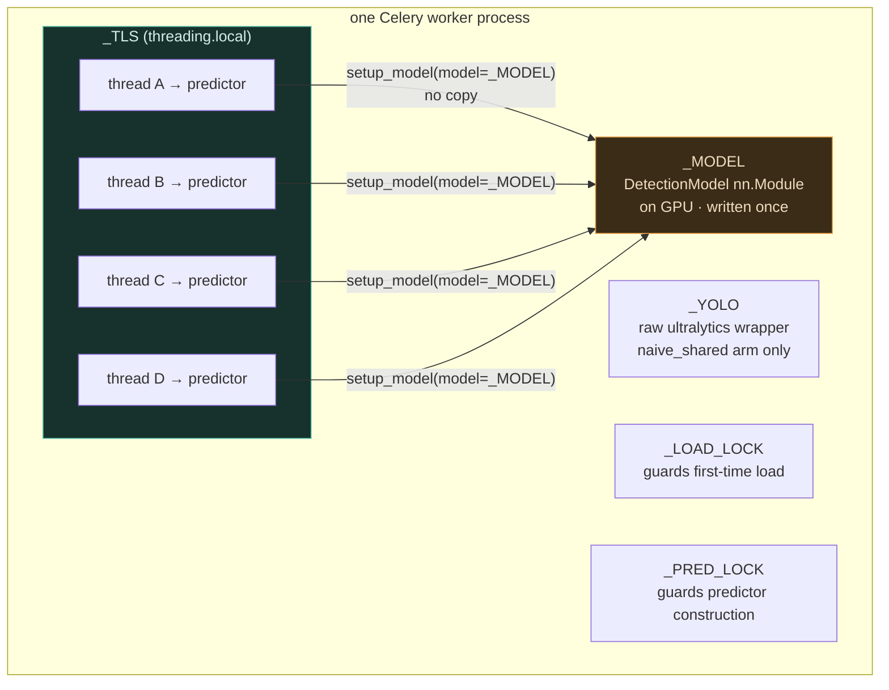
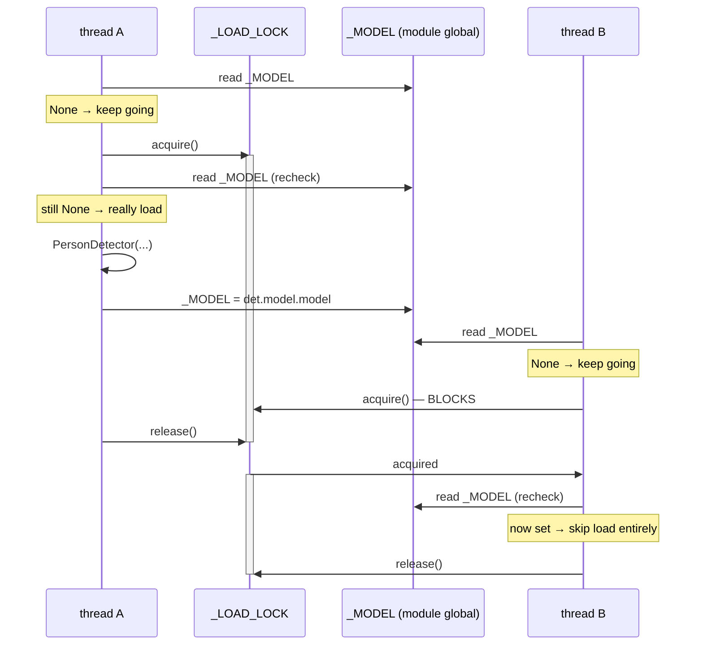
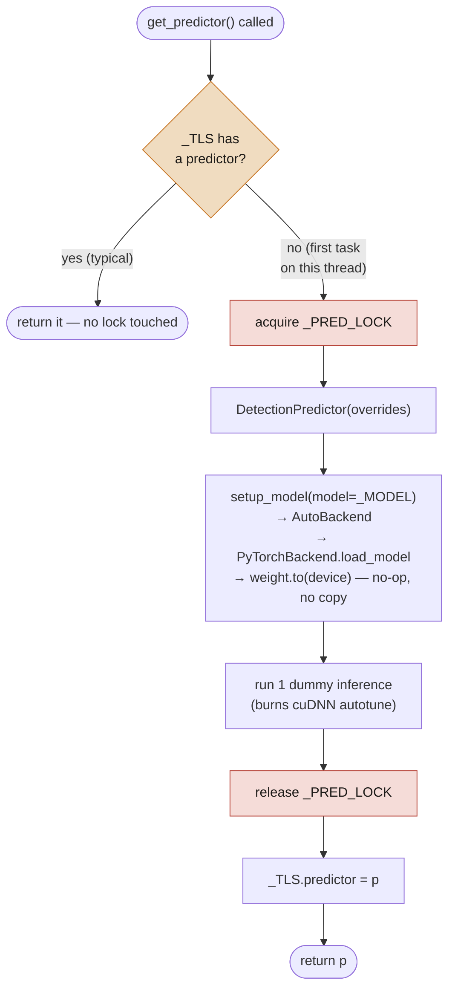
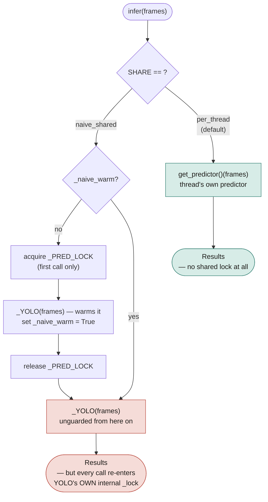
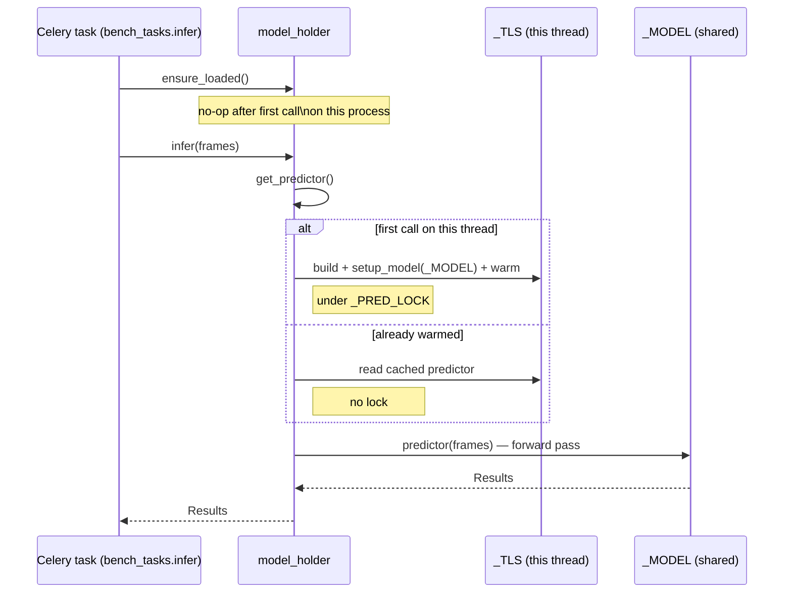

# model_holder.py — architecture

Traces actual execution: what runs, in what order, under which lock, on
which thread. Each diagram maps to specific lines in
[`benchmarks/celery_worker/model_holder.py`](../../../workspace/so.model-face-recognition/benchmarks/celery_worker/model_holder.py).

## Process state

What lives in this process, and who is allowed to touch it.



**The rule the whole file exists to enforce:** `_MODEL` is written exactly
once and read by everyone. `_TLS` is written by every thread, once each,
and never shared.

---

## `ensure_loaded()` — line 40

Called from `worker_process_init` (fires post-fork) and again at the top of
every task, because `solo`/`threads` pools never emit that signal.



Two checks, one lock (lines 48–52):

```python
if _MODEL is not None:      # cheap check, no lock — the common case after warmup
    return
with _LOAD_LOCK:
    if _MODEL is not None:  # someone else won the race while we waited
        return
    ...load...
```

Without the second check, two threads that both pass the first check would
both load the model — wasted GPU memory, and a `_MODEL` reassignment mid-use.

---

## `get_predictor()` — line 73

Runs on **every task**, every thread. Cheap after the first call.



**Why `_PRED_LOCK` exists at all** (comment at lines 31–35): `setup_model`
calls `BaseModel.fuse()`, guarded by `is_fused()`. That guard is safe for
**sequential** calls but not **concurrent** ones — two threads can both see
"not fused yet," both enter `fuse()`, and the second one crashes on
`delattr(m, "bn")` because the first already removed it. Observed while
building this harness, not theoretical.

Once a thread has its predictor cached in `_TLS`, it never touches the lock
again — inference itself is lock-free.

---

## `infer()` — line 97, the branch that is actually being measured



The `naive_shared` branch (lines 99–112) only serializes its **first** call
— after that it calls `_YOLO(frames)` directly, unguarded by our code. But
`_YOLO` is ultralytics' own `Model.__call__`, and internally **that** locks
around every single inference (`BasePredictor.stream_inference` wraps its
body in `self._lock` — see the module docstring at lines 7–15). So four
threads on `naive_shared` still queue up on every call, just on a lock we
didn't write and can't see from here.

The `per_thread` branch (line 113) never touches a shared lock after
warmup — each thread's predictor is entirely its own.

**What this predicts, and what was measured:**

| branch | expected | measured |
|---|---|---|
| `per_thread`, 4 threads | parallel inference | **167 fps** |
| `naive_shared`, 4 threads | serialized by ultralytics' internal lock | **65 fps** — slower than 1 thread (82 fps) |

---

## Putting it together — one task, start to finish



This is the path every one of the 1200 frames in a benchmark cell takes.
The only per-task cost after warmup is the forward pass itself — everything
above it (`ensure_loaded`, the `_TLS` lookup) is a few nanoseconds once the
process has run a handful of tasks.
