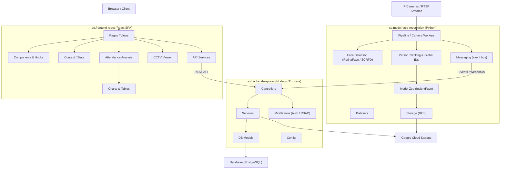

# Smart Office — Architecture

## Overview

Smart Office is a multi-component platform for employee attendance tracking and workspace monitoring using AI-powered face recognition. The system is composed of three distinct services:

| Service | Stack | Files | Symbols |
|---|---|---|---|
| **so.backend-express** | Node.js / Express REST API | 179 | 1,250 |
| **so.frontend-react** | React SPA | 575 | 2,676 |
| **so.model-face-recognition** | Python ML inference service | 253 | 1,605 |

The ML service processes camera streams in real time, detects and identifies faces, emits events via a messaging layer, and the backend ingests those events to maintain attendance records — which the React frontend then presents to users.

---

## System Architecture Diagram



---

## Functional Areas

### so.backend-express

| Module | Symbols | Cohesion | Responsibility |
|---|---|---|---|
| **Services** | 278 | 68% | Business logic: auth, attendance, face events, cleanup |
| **Controllers** | 163 | 90% | Route handlers for REST endpoints |
| **Middleware** | 79 | 70% | Auth (JWT), RBAC, request validation |
| **Migrations** | 41 | 70% | Database schema migrations |
| **Config** | 17 | 78% | Environment and app configuration |
| **Models** | 15 | 68% | ORM models |

### so.frontend-react

| Module | Symbols | Cohesion | Responsibility |
|---|---|---|---|
| **Pages** | 169 | 74% | Top-level route pages |
| **Views** | 102 | 80% | Sub-page view components |
| **Components** | 88 | 77% | Shared UI components |
| **Contexts** | 65 | 73% | Global state / context providers |
| **Cctv** | 52 | 84% | Live camera stream viewer |
| **Analysis** | 51 | 68% | Attendance analytics and reports |
| **Services** | 47 | 76% | HTTP client wrappers for backend API |
| **Charts** | 36 | 100% | Chart components (attendance, trends) |
| **Tables** | 35 | 87% | Tabular data display |
| **Settings** | 35 | 87% | Admin and user settings |
| **Hooks** | 22 | 92% | Custom React hooks |
| **Filters** | 21 | 80% | Search and filter UI logic |
| **SuperAdmin** | 24 | 97% | Super-admin management panel |
| **Insights** | 25 | 98% | Business analytics views |
| **Mobile** | 26 | 85% | Mobile-responsive layouts |

### so.model-face-recognition

| Module | Symbols | Cohesion | Responsibility |
|---|---|---|---|
| **Datasets** | 179 | 76% | Training/evaluation dataset management |
| **Person_tracking** | 95 | 77% | Multi-camera global identity assignment |
| **Metrics** | 62 | 74% | Detection and tracking evaluation |
| **Model_zoo** | 57 | 86% | Model loading, caching (InsightFace) |
| **Pipeline** | 52 | 78% | Camera worker loop, frame processing |
| **Mesh_numpy** | 38 | 78% | 3D face mesh utilities |
| **Workers** | 37 | 74% | Parallel processing workers |
| **Burst_helpers** | 36 | 75% | Burst-mode frame sampling |
| **Face_detection** | 34 | 81% | RetinaFace / SCRFD face detectors |
| **Messaging** | 32 | 87% | Event bus / pub-sub integration |
| **Storage** | 24 | 74% | GCS upload/download helpers |
| **Infrastructure** | 23 | 91% | Service bootstrap, health checks |
| **Video** | 19 | 94% | Video stream ingestion |

---

## Key Execution Flows

### 1. User Authentication (Backend)

JWT-based login flow resolves environment-specific signing secrets.

```
AuthService.login()
  → AuthService.signJwt()
    → jwt.signToken()
      → jwt.getDefaultInstance()
        → jwt.resolveJwtEnv()
```

**Files:** `src/services/AuthService.js`, `src/utils/jwt.js`

---

### 2. Create User from Unrecognized Face (Backend)

When the ML service emits an unrecognized-face event, the backend creates a new user record, then immediately triggers auto-cleanup of old unrecognized images from GCS to enforce retention policy.

```
UnrecognizedFaceController.createNewUserFromUnrecognized()
  → UnrecognizedFaceController.create()
    → UnrecognizedFaceController.triggerAutoCleanup()
      → UnrecognizedFaceCleanupService.cleanup()
        → UnrecognizedFaceCleanupService.cleanupByRetentionDays()
          → UnrecognizedFaceCleanupService.deleteImageFromGCS()
            → UnrecognizedFaceCleanupService.extractFilename()
```

**Files:** `src/controllers/UnrecognizedFaceController.js`, `src/services/UnrecognizedFaceCleanupService.js`

---

### 3. Attendance Analysis View (Frontend)

The analysis dashboard fetches and aggregates weekly hourly attendance data, converting raw attendance records into chart-ready datasets.

```
OverallAnalysisView (JSX)
  → useWeeklyHourlyData() [hook]
    → fetchWeeklyData()
      → chartDataGenerator.generateWeeklyHourlyAttendance()
        → chartDataGenerator.generateHourlyAttendance()
          → attendanceUtils.getAttendanceForDate()
```

**Files:** `src/demo/components/analysis/views/OverallAnalysisView.jsx`, `src/demo/hooks/analysis/useWeeklyHourlyData.js`, `src/demo/services/chartDataGenerator.js`, `src/demo/services/attendanceUtils.js`

---

### 4. Real-Time Camera Face Tracking (ML)

The camera worker continuously reads frames, runs detection, and assigns stable global identities across cameras using embedding-based re-identification.

```
camera_worker.run()
  → camera_worker._process_one_frame()
    → camera_engine.update_tracking()
      → global_track.assign_global_id()
        → global_track._create_new_global_track()
          → GlobalTrack (model object)
```

**Files:** `src/pipeline/camera_worker.py`, `src/pipeline/camera_engine.py`, `packages/lum-model-vision/src/lum_vision/person_tracking/global_track.py`, `packages/lum-model-vision/src/lum_vision/person_tracking/global_track_model.py`

---

### 5. Batch Global ID Assignment with Body Re-ID (ML)

Batch processing assigns cross-camera global identities by lazily downloading and initializing a body re-identification model (with SHA-1 integrity check) before extracting body embeddings.

```
global_track.batch_assign_global_ids()
  → global_track.assign_global_id()
    → global_track._maybe_update_embedding()
      → global_track._extract_body_embedding()
        → global_track._init_body_reid_model()
          → global_track._download_reid_weights()
            → insightface/utils/storage.download()
              → insightface/utils/download.download_file()
                → insightface/utils/download.check_sha1()
```

**Files:** `packages/lum-model-vision/src/lum_vision/person_tracking/global_track.py`, `modules/insightface/insightface/utils/storage.py`, `modules/insightface/insightface/utils/download.py`

---

## Data Flow Summary

```
IP Cameras
    │ RTSP frames
    ▼
so.model-face-recognition
    │ Face detected → identity assigned → event emitted
    ▼
so.backend-express
    │ Stores attendance records in PostgreSQL
    │ Stores unrecognized face crops in GCS
    │ Exposes REST API
    ▼
so.frontend-react
    │ Fetches attendance data, displays live CCTV, analytics
    ▼
Browser (HR / Admin / Security operators)
```
