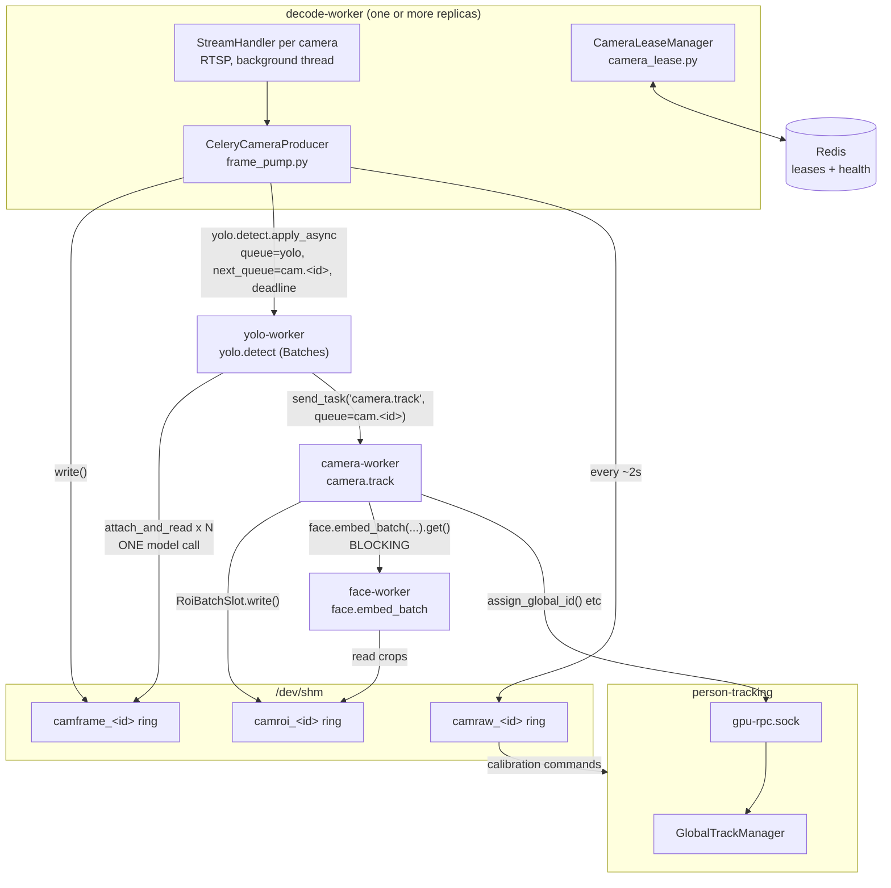

# Pipeline architecture (LSO-67 and its follow-ups)

> Companion to [`SERVICE_ARCHITECTURE.md`](./SERVICE_ARCHITECTURE.md), which is still correct on
> data model, Redis MDA contracts, and deployment — but stale on the hot path it describes in
> §2.3/§4.1. This doc replaces that hot-path description.
>
> For the same ground in plain language, see [`PIPELINE_OVERVIEW.md`](./PIPELINE_OVERVIEW.md).
> For what's still outstanding, see [`FOLLOW_UPS.md`](./FOLLOW_UPS.md).

## 1. What changed, in one sentence

Everything that used to be threads inside one process — RTSP decoding, YOLO, ArcFace, per-camera
tracking — now runs as separate processes, connected by shared memory (for pixels) and Celery
queues (for control messages), with exactly one Unix-socket RPC left for the one piece of state
that is genuinely shared across cameras.

## 2. Before → after

**Before:** one process. Each camera ran a thread that decoded its stream and called directly
into a shared in-process GPU batcher.

**After:** six processes, one host:

| Process | Celery queue | Pool | Owns |
|---|---|---|---|
| `person-tracking` | *(not a worker)* | — | `GlobalTrackManager`, serves `gpu-rpc.sock`; MDA commands (calibration, capture-frame); metrics dashboard |
| `decode-worker` | *(not a worker)* | — | RTSP decode + frame production, for whichever cameras it holds a lease on |
| `camera-worker-a` / `-b` | `cam.<id>` | `--pool=solo` | per-camera tracking, identity, logging (`camera_tasks.py`) |
| `yolo-worker` | `yolo` | `--pool=solo`, `--prefetch-multiplier=32` | YOLO person detection, batched across cameras |
| `face-worker` | `face` | `--pool=solo` | SCRFD + ArcFace |
| `celery-worker` | `embeddings`, `detections` | prefork | pre-migration async work (unchanged) |

Neither `person-tracking` nor `decode-worker` is a Celery worker: both hold long-lived state a
stateless-per-call task cannot (an RPC server; persistent RTSP connections). They *send* Celery
tasks and consume none.

`--pool=solo` on `camera-worker` is load-bearing — see §6.

## 3. Why pixels never cross the broker

Measured, not assumed, head-to-head on the same frames: shared memory costs **~3.05 ms/frame**
(producer copy-in + consumer copy-out, the same work either side of a Redis payload would also
have to do); a 720p frame through Redis, under this app's actual json+base64 serializer, costs
**~175 ms** — more than a YOLO inference pass itself — and even the cheapest broker alternative
(JPEG) costs **~19.8 ms**, ~6.5x shared memory's cost. At 6 cameras the Redis path would be over
a full CPU core spent packing pixels before any AI work started. Harness and full breakdown:
[`benchmarks/transport/`](../benchmarks/transport/README.md).

So every frame-carrying task payload is a *handle* (segment name + sequence number + shape); the
pixels live in `multiprocessing.shared_memory` blocks that producer and consumer map directly.
This is the single idea underlying [`frame_store.py`](../src/workers/frame_store.py).

Three independent shared-memory rings exist, one set per camera:

| Ring | Written by | Read by | Holds |
|---|---|---|---|
| `camframe_<id>` | `decode-worker` | `yolo-worker`, `camera-worker` | post-ROI, frame-skipped detection frames |
| `camraw_<id>` | `decode-worker` | `person-tracking` | full pre-ROI frames, written every ~2s for calibration |
| `camroi_<id>` | `camera-worker` | `face-worker` | person crops for face embedding |

Each is a ring of 24 segments, not a single slot: a depth-1 slot lost the write-to-execute race on
essentially every frame. (Started at 8; raised to 24 after live testing at full frame rate — no
sampling — showed the producer recycling segments faster than yolo-worker could read them,
`skipped_gone` climbing ~2-3/s. 24 segments held zero drops sustained at full frame rate.) Each
segment's header stamps `(instance_id, seq)` so a reader can tell it actually landed on the
generation it was told to read — see §7.

## 4. The frame's journey

**Producer → `yolo` (shared queue).** `CeleryCameraProducer` reads a frame, applies ROI, applies
frame-skip, writes to `camframe_<id>`, and enqueues `yolo.detect` on the **shared** `yolo` queue —
shared deliberately, because batching only pays off across cameras.

**`yolo.detect` → `cam.<id>` (pinned queue).** `yolo-worker` is a `celery-batches` `Batches`
task: it buffers arriving requests and flushes when 8 have collected or 10 ms elapses, whichever
first, then runs **one** model call over the whole batch. Each request's detections are forwarded
to that camera's own `cam.<id>` queue.

**`camera.track` → tracking.** Exactly one `camera-worker` consumes each `cam.<id>` queue, so a
camera's frames always reach the same process — which is what lets tracking keep per-camera
memory. It blocks once per recognition interval on `face.embed_batch`, and calls
`GlobalTrackManager` over the socket.

### Why per-camera queues, not one shared one

A shared queue round-robins across consumers, so one camera's frames land on several workers,
each with its own process-local tracker. Measured: the global track count climbed 33 → 45 and
never settled — the system believed there were more people in the building than there were.
Tracking has memory; frame *N* needs frame *N−1*'s conclusion. YOLO and face inference are
stateless, which is exactly why they can stay on shared queues and be batched freely.

## 5. One RPC socket

Only `GlobalTrackManager` is still reached by socket (`gpu-rpc.sock`,
[`global_track_rpc.py`](../src/workers/global_track_rpc.py)). The GPU-inference socket
(`gpu-worker-rpc.sock`) and its `GPUInferenceWorker` are **deleted** — batching moved into
`yolo-worker` itself, so nothing needs to broker it.

| | `global_track_rpc.py` | Celery (`yolo` / `cam.<id>` / `face`) |
|---|---|---|
| Direction | `camera-worker` → `person-tracking` | between worker processes |
| Transport | Unix socket | Redis broker + shared memory |
| Payload | small scalars, pickled | handles (no pixels) |
| Failure mode | falls back to a local negative-ID counter (real global IDs start at 1000) | task expires; frame is dropped rather than processed late |

Why it stays a socket rather than a queue: `assign_global_id` is a *blocking* question — the
caller cannot proceed without the answer — and an uncorrelated async reply can hand one person's
identity to another person's track. A socket is direct call-and-response, with nothing to
correlate. Measured p50 0.16 ms / p95 0.34 ms against a ~66 ms frame budget.

Why it stays in `person-tracking`: it does numpy similarity matching over the whole embedding
gallery, which does not decompose into Redis operations.

## 6. Concurrency assumptions (read before scaling anything)

- **`camera-worker` must stay `--pool=solo`, and each `cam.<id>` queue must have exactly one
  consumer.** `_CameraContext` is cached per `camera_id` per process and holds that camera's
  tracker state. Two consumers on one camera reintroduces the 33 → 45 divergence above. Moving a
  camera between workers means editing both services' `-Q` lists and restarting both — never
  letting the same `cam.<id>` appear in two.
- **`yolo-worker` needs `--prefetch-multiplier=32`.** `Batches` only acks after a flush, so the
  buffer can never exceed the prefetch count; at the app-wide default of 1, every batch is size 1
  and batching silently does nothing. This was shipped wrong once and caught via `avg_batch=0.00`
  plus a 33k-message backlog.
- **`decode-worker` replicas are interchangeable** and need no such care — cameras are claimed by
  Redis lease, and decoding has no memory to lose. Scale by replica count; size N+1 so one crash
  doesn't strand cameras.

## 7. Two failure modes shared memory forces you to handle

**Stale generation.** The producer keeps writing; a slow consumer's segment may be recycled before
it reads. Every read re-checks the header's `(instance_id, seq)` against the handle and returns
`None` on mismatch — a *discarded frame*, never wrong pixels. The header is re-checked again
*after* the copy, since the producer can recycle the segment mid-copy.

**Producer restart.** A restarted producer unlinks its segments and creates new ones under the
same names with a fresh `instance_id`. Consumers cache their mappings, and a same-size segment
looks identical — so without an explicit check the consumer serves the old, unlinked memory
forever and every read fails permanently. Observed live (`skipped_gone` ~40/s, essentially zero
frames processed) once `decode-worker` could restart independently of `yolo-worker`. An
instance-id mismatch now drops the cached mapping and re-attaches once.

## 8. Deadlines, not just `expires`

Every frame carries an explicit `deadline` (epoch seconds) in the task payload, checked in each
task body, *in addition to* Celery's own `expires`. Two reasons:

- `celery-batches`' `Batches` does not honour `expires` at all (no `revoked()` call anywhere in
  its strategy) — verified against the installed source and in the go/no-go spike.
- `expires` is evaluated on delivery, but a message can be delivered in time and then sit behind
  this worker's own in-flight blocking `face.embed_batch`. `acks_late` redeliveries after a crash
  also arrive carrying a long-stale deadline.

A frame is useful for about a second; after that the person has moved. Dropping stale frames is
what keeps the pipeline responsive under load rather than accumulating unbounded lag — Celery
queues, unlike the bounded in-process queues this replaced, will happily grow until memory runs
out.

## 9. Serialization gotcha

`task_serializer='json'` but `result_serializer='pickle'`
([`celery_app.py`](../src/workers/celery_app.py)). Face results carry numpy throughout
(`embedding`, `face_image`, and even `face_bbox`'s elements are `numpy.int64`) — JSON would reject
all of it, and not obviously (`face_bbox` *looks* like a plain list). Task *payloads* stay JSON
deliberately, so the broker stays inspectable during incidents. Pickle for results is safe only
because broker and every producer/consumer are internal.

Dataclass handles (`FrameHandle`, `RoiBatchHandle`) are `asdict()`'d at the send site and
rebuilt on the far side, rather than widening the global serializer config.

## 10. File map

| File | Role |
|---|---|
| [`src/decode_main.py`](../src/decode_main.py) | decode-worker daemon: lease claim/renew, stream + producer lifecycle |
| [`src/pipeline/camera_lease.py`](../src/pipeline/camera_lease.py) | `CameraLeaseManager` — per-camera ownership via Redis `SET NX EX` |
| [`src/pipeline/decode_metrics.py`](../src/pipeline/decode_metrics.py) | publishes stream health + raw-frame handle for `person-tracking` to read |
| [`src/pipeline/frame_pump.py`](../src/pipeline/frame_pump.py) | `CeleryCameraProducer` — read, ROI, frame-skip, shm write, enqueue |
| [`src/workers/frame_store.py`](../src/workers/frame_store.py) | all three shared-memory rings; the core transport primitive |
| [`src/workers/yolo_tasks.py`](../src/workers/yolo_tasks.py) | `yolo.detect`, the `Batches` task that does cross-camera batching |
| [`src/workers/camera_tasks.py`](../src/workers/camera_tasks.py) | `camera.track` — tracking, identity, logging; owns `_CameraContext` |
| [`src/workers/face_client.py`](../src/workers/face_client.py) | `FaceEmbedClient` — the blocking call into `face-worker` |
| [`src/workers/face_tasks.py`](../src/workers/face_tasks.py) | `face.embed_batch` — SCRFD + ArcFace |
| [`src/workers/global_track_rpc.py`](../src/workers/global_track_rpc.py) | the one remaining socket RPC |
| [`src/workers/global_track_adapter.py`](../src/workers/global_track_adapter.py) | `RemoteGlobalTrackManager`, its client-side wrapper |
| [`src/workers/celery_app.py`](../src/workers/celery_app.py) | queue routing and serializers |
| [`src/pipeline/engine.py`](../src/pipeline/engine.py) | `person-tracking`: identity state, MDA commands, metrics |
| [`compose.yml`](../compose.yml) | service definitions, pools, shared `/dev/shm` and socket volumes |
