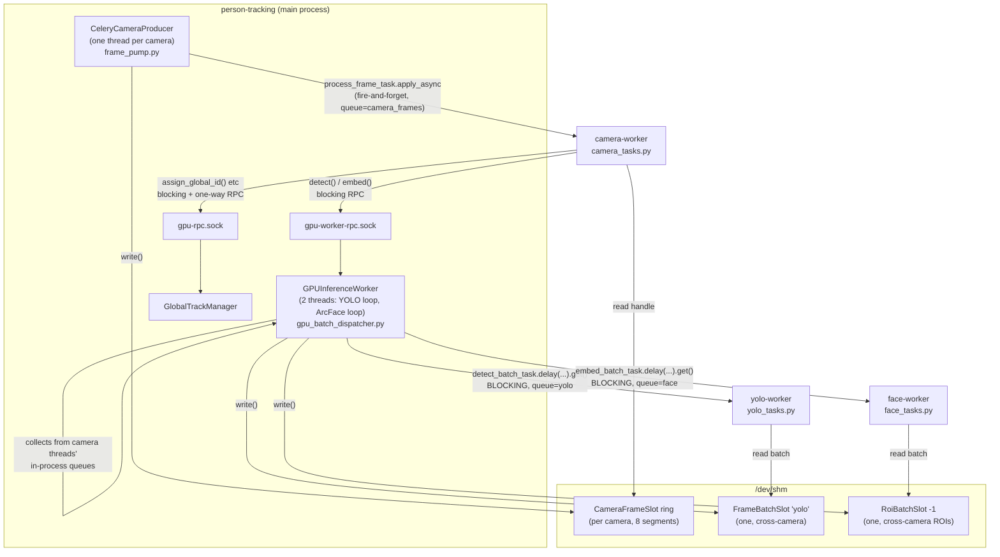
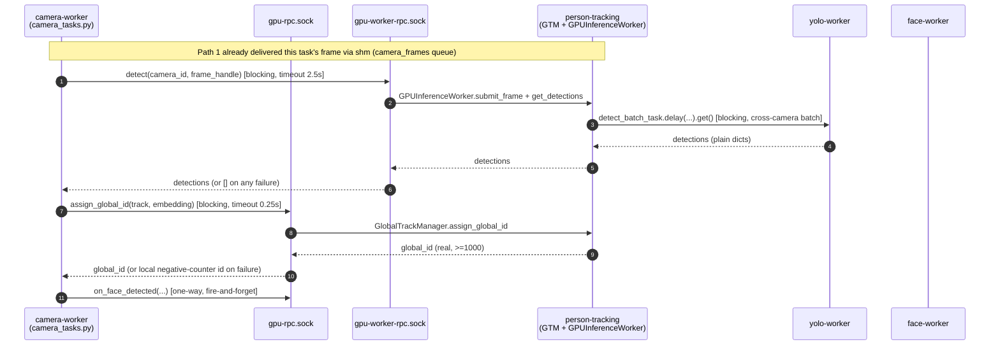

# GPU-on-Celery Migration (LSO-67)

> Companion to [`SERVICE_ARCHITECTURE.md`](./SERVICE_ARCHITECTURE.md), which is still correct on
> data model, Redis MDA contracts, and deployment — but stale on the hot path it describes in
> §2.3/§4.1. This doc replaces that hot-path description with what's actually running on
> `refactor/lso-67-camera-frame-store`.

## 1. What changed, in one sentence

GPU inference (YOLO, ArcFace, and the GlobalTrackManager it feeds) moved out of the main
process's threads into separate Celery worker processes, connected back by shared memory (for
frame pixels) and Unix-socket RPC (for blocking calls) instead of in-process queues.

## 2. Before → after

**Before:** one process. Each camera ran a `CameraWorker` thread that called directly into a
single shared `GPUInferenceWorker` in-process for YOLO/ArcFace batching.

**After:** five processes, one host:

| Process | Celery queue | Pool | Owns |
|---|---|---|---|
| `person-tracking` | *(not a worker)* | — | camera stream reads, `GPUInferenceWorker` batching, `GlobalTrackManager`, serves both RPC sockets |
| `camera-worker` | `camera_frames` | `--pool=solo` | per-camera tracking/identity/logging (`camera_tasks.py`) |
| `yolo-worker` | `yolo` | `--pool=solo` | YOLO person detection only |
| `face-worker` | `face` | `--pool=solo` | SCRFD + ArcFace only |
| `celery-worker` | `embeddings`, `detections` | prefork | pre-migration async work (unchanged) |

`--pool=solo` is load-bearing, not incidental — see §6.

## 3. Why not just serialize frames through Celery/Redis

Measured, not assumed: a 720p frame costs **~15.6 ms** through a Redis-backed payload — more
than a YOLO inference pass itself — versus **~0.3 ms** for a small control message (a handle).
So pixels never cross a Celery broker. Every frame-carrying task payload is a *handle*
(shared-memory segment name + sequence number); the pixels live in
`multiprocessing.shared_memory` blocks that producer and consumer map directly.

This is the single idea underlying `src/workers/frame_store.py`.

## 4. Two independent frame-feed paths — don't conflate them

There are **two** separate producer→shared-memory→Celery-task pipelines. They look similar but
serve different consumers and have different blocking semantics.

### Path 1 — camera → tracking/identity (`camera_frames` queue)

- **Producer:** `CeleryCameraProducer` ([`pipeline/frame_pump.py`](../src/pipeline/frame_pump.py)), one thread per camera, still living in the main process (it must own the persistent RTSP connection — a stateless Celery task can't hold that open).
- **Transport:** `CameraFrameSlot`, a per-camera ring of 8 shared-memory segments.
- **Dispatch:** `process_frame_task.apply_async(...)`, **fire-and-forget** — `expires=1.0s` bounds backlog instead of blocking. Waiting here would recreate the exact synchronous stall this migration exists to remove.
- **Consumer:** `camera-worker` service → `camera_tasks.py` → does tracking, identity resolution, logging, in its own process. Calls back into the main process over **two** RPC sockets (§5) for GPU inference and for `GlobalTrackManager`.

### Path 2 — camera → GPU inference (`yolo` / `face` queues)

This one **did not move out of the main process** — only the model call itself did.
`GPUInferenceWorker` ([`pipeline/gpu_batch_dispatcher.py`](../src/pipeline/gpu_batch_dispatcher.py)) still lives in
`person-tracking` and still owns:
- per-camera in-memory queues (unchanged from pre-migration)
- cross-camera batch collection — this is what makes a batched GPU call worth **~1.8x** over per-frame calls, and it's why this logic couldn't just move into a stateless task
- request/response correlation (sequence numbers, so a camera can tell a reply from an orphaned earlier one)

Feed sequence (`_run_yolo_batch`, [gpu_batch_dispatcher.py:448](../src/pipeline/gpu_batch_dispatcher.py#L448); ArcFace mirrors it via `_run_arcface_batch`):

1. Camera threads submit into `GPUInferenceWorker`'s in-process queues (as before).
2. `_yolo_loop` / `_arcface_loop` drain them every cycle (`_collect_frames` / `_collect_faces`).
3. The collected cross-camera batch is packed into **one shared shm slot** — `FrameBatchSlot("yolo")` or `RoiBatchSlot(-1)` — not per camera, since the whole point is one batched call.
4. `detect_batch_task.delay(handle=...)` — **blocking**: `async_result.get(timeout=...)`.
5. `yolo-worker` / `face-worker` reads the batch back out of shm, runs the model, returns plain dicts (no numpy for YOLO; ArcFace results carry numpy — see §7 on serializers).
6. Results are distributed back to each camera's out-queue, positionally aligned to `sorted(batch.keys())` — **this ordering is a hard contract**, not a convenience; a worker returning the wrong count is treated as a full-batch failure rather than trusted partially.

## 5. Three RPC surfaces — know which is which

| | `global_track_rpc.py` | `gpu_worker_rpc.py` | Celery (`yolo`/`face`/`camera_frames`) |
|---|---|---|---|
| Direction | `camera_tasks` process → main process | `camera_tasks` process → main process | main process ↔ worker processes |
| Transport | Unix socket (`gpu-rpc.sock`) | Unix socket (`gpu-worker-rpc.sock`) | Redis broker + shared memory |
| Talks to | `GlobalTrackManager` | `GPUInferenceWorker` | model-holding worker processes |
| Payload in | small scalars | `FrameHandle`/`RoiBatchHandle` (shm, no pixels) | `FrameBatchHandle` (shm, no pixels) |
| Payload out | small scalars, pickled | small dicts + one numpy field, pickled | plain dicts (YOLO) / numpy (ArcFace) |
| Why not merged | different real object, different method surface — only the wire framing (`rpc_framing.py`) is shared | — | batching only pays off cross-camera; a per-request Celery call would lose the ~1.8x |
| Failure mode | falls back to a local negative-ID counter (visually distinct: real global IDs start at 1000) | `detect()`→`[]`, `embed()`→`{}` — same as an in-process timeout already degraded to | task returns empty-per-frame rather than raising |

## 6. The `--pool=solo` assumption (read before scaling anything)

`camera-worker`, `yolo-worker`, and `face-worker` all run `--pool=solo` (single process, no
concurrency). This is not a default someone forgot to tune — two separate pieces of code depend
on it:

- **`camera_tasks.py`**'s `_CameraContext` is cached per `camera_id` **per worker process** and
  assumes whatever routes tasks to it keeps sending the same `camera_id` to the same process
  (sticky routing). More replicas would invalidate that cache assumption.
- **`gpu_batch_dispatcher.py`**'s `_await_response` (documented in commit `c4ffca6`) assumes **one
  outstanding request per camera at a time** — which holds only because exactly one
  `--pool=solo` camera-worker replica serves each camera serially. Its `got_seq > seq`
  early-return turns a two-waiter collision into a *permanent* loss of that reply, not a
  transient one.

**Do not raise replica counts on these three services without revisiting both of the above.**
Horizontal scaling here means partitioning cameras across hosts (§3.5 of
`SERVICE_ARCHITECTURE.md`), not adding replicas of these queues.

## 7. Serialization gotcha

Celery's `task_serializer='json'`, but `result_serializer='pickle'`
([`celery_app.py`](../src/workers/celery_app.py)). Face inference results carry numpy
throughout (`embedding`, `face_image`, and even `face_bbox`'s elements are `numpy.int64`) — JSON
would reject all of it, and not obviously (`face_bbox` *looks* like a plain list). Task
*payloads* stay JSON deliberately, so the broker stays inspectable during incidents. Pickle for
results is safe only because broker + every producer/consumer are internal — revisit if that
stops being true.

## 8. Known open issues (don't rediscover these)

Recorded in commit `c4ffca6` ("docs: record the races and limits this branch deliberately leaves
open") — read it in full before touching these areas:

1. **`entry_logger.reload_status`** races `AsyncLogger`'s DB thread on `person_status` /
   `person_last_camera`. A dict comprehension iterates a dict the other thread inserts into
   (`RuntimeError`, swallowed — looks like "status reloads quietly stopped"). Pre-dates the
   Celery work.
2. **`gpu_worker._await_response`**'s one-outstanding-request-per-camera assumption (§6 above).
3. **`compose.yml` is a dev harness, not the deployment.** `so.stack` runs only
   `person-tracking` and `celery-worker` — no camera/yolo/face worker, no `ipc:` sharing. This
   pipeline cannot run there until those are added with the shared IPC namespace and
   `rpc-sockets` volume.

## 9. File map for this migration

| File | Role |
|---|---|
| [`src/workers/frame_store.py`](../src/workers/frame_store.py) | shared-memory ring buffers + batch slots; the core transport primitive |
| [`src/pipeline/frame_pump.py`](../src/pipeline/frame_pump.py) | Path 1 producer (`CeleryCameraProducer`) |
| [`src/workers/camera_tasks.py`](../src/workers/camera_tasks.py) | Path 1 consumer; owns `_CameraContext`, calls both RPC sockets |
| [`src/pipeline/gpu_batch_dispatcher.py`](../src/pipeline/gpu_batch_dispatcher.py) | Path 2 producer/orchestrator (`GPUInferenceWorker`); no longer holds models |
| [`src/workers/yolo_tasks.py`](../src/workers/yolo_tasks.py) | Path 2 YOLO consumer |
| [`src/workers/face_tasks.py`](../src/workers/face_tasks.py) | Path 2 ArcFace consumer |
| [`src/workers/global_track_rpc.py`](../src/workers/global_track_rpc.py) | RPC to `GlobalTrackManager` |
| [`src/workers/gpu_worker_rpc.py`](../src/workers/gpu_worker_rpc.py) | RPC to `GPUInferenceWorker` |
| [`src/workers/rpc_framing.py`](../src/workers/rpc_framing.py) | shared wire framing for both RPC sockets |
| [`src/workers/global_track_adapter.py`](../src/workers/global_track_adapter.py) | `RemoteGlobalTrackManager`, the client-side wrapper `camera_tasks.py` uses |
| [`src/workers/celery_app.py`](../src/workers/celery_app.py) | queue routing, serializers — the routing table for all of the above |
| [`compose.yml`](../compose.yml) | the four worker service definitions, `--pool=solo`, shared `/dev/shm` and RPC-socket volumes |
