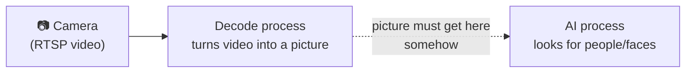
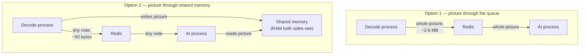
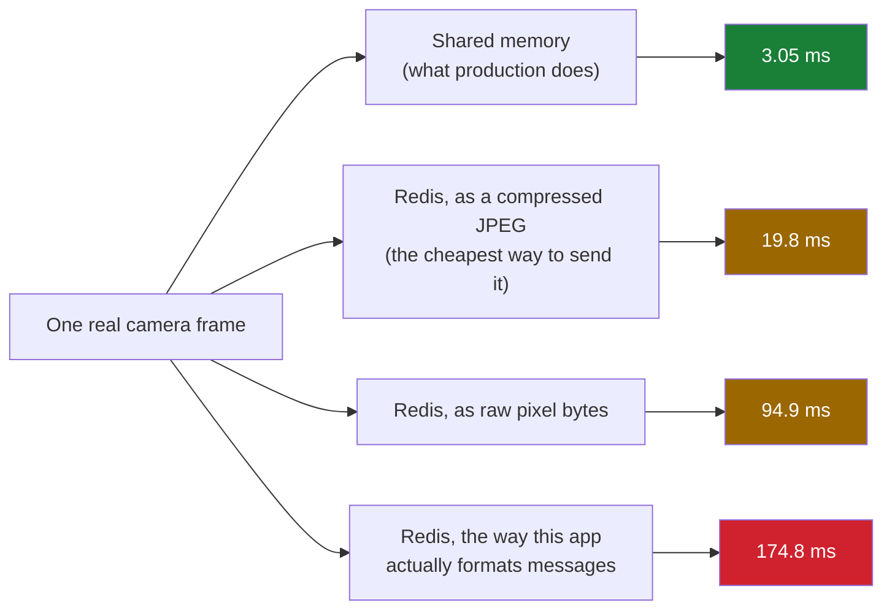
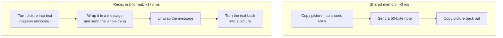

# Why camera frames travel through shared memory, not Redis

A plain-language walkthrough of one architectural decision and the benchmark that proves it.
No prior knowledge of this system assumed.

## The setup, in one picture

This app watches office cameras with two things happening in **separate processes**:

- One process pulls video from the camera and decodes each frame into a picture.
- Other processes (running AI models) need to look at that picture to find people and faces.

Separate processes cannot normally see each other's memory — a picture decoded in process A does
not just "exist" for process B to read. Something has to move it across.



Two ways to bridge that gap were on the table:

1. **Send the actual picture** through the message queue (Redis) that already connects these
   processes for small coordination messages.
2. **Put the picture in shared memory** — a piece of RAM both processes can directly point at —
   and send only a short note through the queue saying *where* to look.

## The two designs, side by side



Option 2 is what this app actually does. This document is about proving that choice was right —
not by assertion, but by measuring both options and comparing.


## What was measured, and where

A new, self-contained benchmark: **[`benchmarks/transport/`](../benchmarks/transport/)**

| file | what it does |
|---|---|
| [`bench_app.py`](../benchmarks/transport/bench_app.py) | sets up an isolated test version of the message queue, separate from the real one |
| [`bench_tasks.py`](../benchmarks/transport/bench_tasks.py) | the receiving side — six small jobs, one per way of sending a picture |
| [`run_bench.py`](../benchmarks/transport/run_bench.py) | the driver: sends 500 real pictures through each method, times every step, checks nothing got corrupted along the way |
| [`README.md`](../benchmarks/transport/README.md) | the full method and reasoning, for anyone who wants to re-run it |
| [`output/results.json`](../benchmarks/transport/output/results.json) | the actual numbers from the last run, with a timestamp and machine details |

It used 200 real video frames extracted from an actual camera recording — the same frames a real
camera would produce, not synthetic test data. Those frames aren't committed to the repo (image
and video files are gitignored to keep the repo small); they're generated on demand from
`cam1.mp4`, a recorded clip also excluded from git, by the neighboring benchmark's own corpus
step. See "How to check this yourself" below for what re-running this from a fresh clone
actually requires.

## The comparison it ran



Every one of these times includes the **whole trip**: preparing the picture to send, handing it
to the queue, the queue delivering it, and the receiving side unpacking it — not just one leg of
the journey.

### What's actually inside that 3.05 ms for shared memory

Splitting shared memory's number into its parts matters, because most of it isn't copying at all:

| step | time |
|---|---|
| Copy the picture **into** shared memory | 0.29 ms |
| Send the note through the queue, both directions | ~2.2 ms |
| Copy the picture **out of** shared memory | 0.29 ms |
| **Total** | **3.05 ms** |

The actual memory copying — the thing "shared memory" refers to — costs about **0.6 ms**. The
other ~2.2 ms is Redis/Celery overhead for delivering *any* message, no matter how small; the
50-byte note pays nearly all of that too. That overhead isn't a shared-memory cost — it's the
fixed price of using this queue at all, and every method on this page pays some version of it.

### Why the picture is "heavy" even though it's just a raw array, not a compressed image

The picture is stored as a plain grid of numbers (a NumPy array) — not a JPEG, no compression.
That's true on **both** sides of this comparison: the "raw pixels" and "this app's real format"
rows above send the exact same uncompressed array shared memory does. So the format is not
mismatched between the two options; a 720×1280 color picture is just large on its own —
**2.64 MB**, however you refer to it.

What makes sending it through Redis expensive is a separate problem: Redis's messages are text
(JSON), and raw binary bytes can't go into text directly. So the picture first has to be
translated into text-safe form (base64), which **inflates it another 33%** and is pure CPU work
that has nothing to do with the picture's actual content. Shared memory skips this translation
entirely — it copies the same raw bytes both options are working with, with no extra step.

## The result

| method | time per picture | how much slower than shared memory |
|---|---|---|
| **Shared memory** (what this app does) | **3.05 ms** | — |
| Redis, best-case (JPEG) | 19.8 ms | **6.5× slower** |
| Redis, raw pixels | 94.9 ms | 31× slower |
| Redis, this app's real message format | 174.8 ms | **57× slower** |

**Shared memory wins by 6.5× even against the cheapest possible way to use Redis, and by 57×
against how this app would actually have to format the message.** The original decision holds —
and now there's a number anyone can re-check by running the benchmark themselves.

## Why the gap is that big

It comes down to how much work each side does per picture:



Shared memory only ever copies raw bytes twice. Sending a picture through Redis has to move a
multi-megabyte message through the queue's own machinery — packing it into an envelope, handing
it to Redis, Redis relaying it, the receiving side noticing a reply exists — and that cost scales
with how big the message is. Translating the picture to text-safe form (base64) doesn't disappear
either: measured separately, it's a small piece of the total (~8 ms out of 175 ms), but it makes
the message itself 33% bigger, which makes everything downstream of it — the part that actually
dominates the cost — slower too. Shared memory sidesteps both: no size inflation, and nothing
resembling that message ever travels through the queue at all.

## One thing this does *not* claim

**It only holds when both processes are on the same computer.** Shared memory doesn't work
across machines — if this system ever needs to split across multiple computers, sending frames
between them would need a different answer than either option here. That question is
deliberately out of scope for this benchmark.

## How to check this yourself

On a machine that already has the 200-frame corpus (built from an earlier benchmark run), it's
just:

```bash
docker run --rm -d --name xportbench-redis -p 127.0.0.1:6401:6379 redis:7-alpine
PYTHONPATH=benchmarks .venv/bin/python benchmarks/transport/run_bench.py
docker rm -f xportbench-redis
```

**On a fresh clone, the corpus needs to be built first** — image and video files aren't
committed to the repo, so `cam1.mp4` and the extracted frames won't be there yet. The corpus
step needs *some* source recording at `cam1.mp4` in the repo root (any real 1280x720 clip works;
this isn't provided by the repo and has to be supplied separately). With that in place, run the
neighboring benchmark once to extract the 200 frames:

```bash
PYTHONPATH=benchmarks .venv/bin/python benchmarks/celery_worker/run_bench.py --cells 1
```

Without a source video, neither benchmark can run — this is a real gap for anyone starting from
a truly clean checkout, not just a missing instruction.

Full method, including how the timing was kept honest (checksums, shuffled test order, two full
runs compared against each other for consistency) is in
[`benchmarks/transport/README.md`](../benchmarks/transport/README.md).
