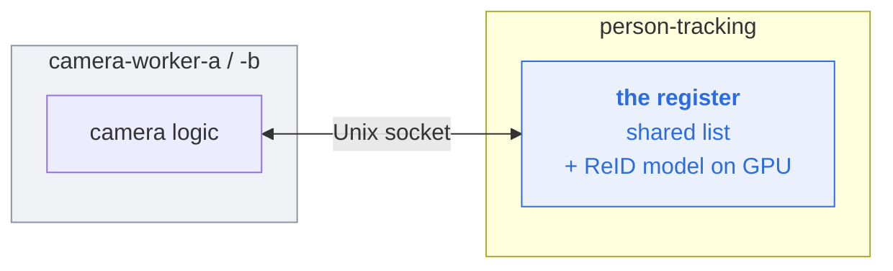
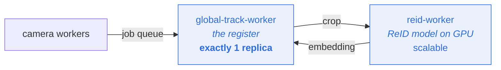

# Following one person across many cameras

**How global tracking works, and where it's going.**

---

## The problem

Alice walks past camera 1, which starts following her and calls her "person 4."
She walks past camera 2, which has never heard of her and calls her "person 7."
Without something in the middle, our records say two people were in the building.

**Global tracking is the job of noticing they're the same human.**

| | **Local ID** | **Global ID** |
|---|---|---|
| Who invents it | one camera, alone | the central register |
| Means | "the 4th person *this camera* followed" | "this specific human" |
| Reused later? | yes | no |

A camera follows people perfectly well using only local IDs. The global ID is a
label attached afterwards, for the records — **nothing about tracking waits on it.**
That fact is what makes everything below possible.

---

## How the register decides

The register (`GlobalTrackManager`) keeps a list of everyone believed to be in the
building. When a camera asks about someone, it compares two ways, in order:

1. **By face** — if the face model locked in a name, that name is the answer.
2. **By body appearance** — otherwise compare build, clothing, colour, using a
   model called ReID. Produces a similarity score.

Body appearance is a guess, so the settings are cautious
(`configs/global_tracking.yaml`): match only above **0.70** similarity, only
against people seen in the last **60 seconds**, only on crops at least **80×40**
pixels. The config says why: *prefer false negatives over false merges.* Two
records for one person is an annoyance; one record covering two people is
corrupted data.

---

## How it used to work

The register lives in one place for two reasons: it's **one shared list** (separate
copies would each invent their own IDs), and it holds the **ReID model on the GPU**
(expensive, loaded once).

Cameras used to reach it over a **Unix socket** — a private line between two
programs. Fast (~0.16 ms), but it only worked when both were on the same machine.
This has since been replaced — see "The current architecture" below.

### What we fixed

Originally every question went down that line and the camera **waited**. When
`person-tracking` got busy, calls timed out and people went unrecognised — in
production.

The camera makes ten kinds of call. Seven are **statements** ("face visible now",
"they left") whose return value was already ignored — those became fire-and-forget.
Two are questions answered from a small local cache the camera keeps. Only one still
waits:

| Call | How often | Waits? |
|---|---|---|
| The seven statements | constantly | **no** |
| "give me a global ID" | every frame, everyone | **no** — cached |
| "what was their ID?" | once, at exit | **no** — cached |
| "have we seen them before?" | once per person | **yes**, ~0.16 ms |

That last one decides whether to *merge* two tracks — an action, not a label — and
it fires at most once per person per visit (a locked identity is never re-locked).
Keeping it blocking is deliberate: the alternative means remembering "still deciding
about this person" and handling them walking off mid-decision, which is real
complexity added to the riskiest decision in the system.

**Done and shipped.** Nine of ten calls no longer block. The production problem is fixed.

---

## The current architecture: two workers

The socket was the last thing pinning `person-tracking` and the camera workers to
one machine. Removing it meant giving the register a queue instead — and Celery
only delivers to processes that consume a queue, which `person-tracking` (the main
app) does not.

So: **the register moved into its own Celery worker, and the ReID model into a
second one.**

Why two and not one: ReID is a stateless model (crop in, vector out) that can scale
to several replicas, while the register is one shared list that **must not**. Keeping
them separate lets each have the replica count it actually needs. It also matches
the "a Celery worker per model" direction already set for `yolo-worker` and
`face-worker`.

**`global-track-worker` must stay at exactly one replica.** A second copy would mint
duplicate global IDs — the exact problem global tracking exists to solve.

### Cost, honestly

The extra hop lands on a path where nothing is blocked (the "give me a global ID"
call is already asynchronous) and ReID only runs every 10th frame per person. Crops
travel through shared memory rather than the message broker, because a frame through
Redis was measured at ~15.6 ms — far more than the work itself.

---

## Status

| | |
|---|---|
| Stop waiting on "give me a global ID" | **done** |
| Read exit IDs from the local cache | **done** |
| Fix the recycled-local-ID false merge | **done** |
| `BodyReidExtractor` as a standalone model | **done** |
| ReID worker + client + transport | **done** |
| Register worker; delete the socket | **done** |
| Verified against live camera traffic | **done** (2026-09-08) |

### The live run

Brought the full stack up against real cameras and real people, not just the test
suite. Numbers pulled from Celery's own task counters after ~30 minutes:

| Task | Count |
|---|---|
| `globaltrack.assign_global_id` | 7,309 |
| `globaltrack.on_track_update` | 7,392 |
| `globaltrack.on_face_detected` | 1,946 |
| `globaltrack.on_face_not_visible` | 5,394 |
| `globaltrack.find_global_track_by_identity` (the merge decision) | 5 |
| `globaltrack.on_track_created` | 4 |
| `globaltrack.update_global_track_identity` / `reassign_local_track` | 2 / 2 |
| `reid.extract_batch` | 5 |

Several real people were tracked, face-recognised and logged to attendance
end to end — camera → `global-track-worker` → `reid-worker` → back — with the
dashboard gauge (`global_tracks`) reading live off Redis throughout. Fallback
rate: 2 timeouts total, both during a simultaneous restart of
`global-track-worker` and the two camera workers (the register was still
loading when the first calls arrived) — zero since, across thousands of calls.

**One real bug found by this run, not by the test suite**: `on_track_created`
passes `bbox` as a numpy array, and Celery task payloads are JSON
(`task_serializer='json'`) — `apply_async` raised
`EncodeError: Object of type ndarray is not JSON serializable`, caught and
merely logged by `call_one_way`'s own never-raise contract, so the call was
silently dropped. Fixed with a recursive `_json_safe()` normalizer in
`global_track_client.py`, applied to every argument on every call now, not
just the one that broke — plus 5 new regression tests. Confirmed zero
recurrences after the fix, across thousands of subsequent calls.

**Not covered by this run:** `reid-worker` itself was never restarted or killed
mid-flight (only `global-track-worker` and the camera workers were), so a
`reid-worker` crash/restart under live load is untested. Attendance, face
recognition and action-recognition initialization were spot-checked and
unaffected, but not the focus of this pass.

`person-tracking` also uses the register for three things, which move with it since
the register cannot exist in two places:

| What | Where it goes |
|---|---|
| Periodic validation (30s housekeeping) | runs inside `global-track-worker`, on its own timer |
| `global_tracks` dashboard gauge | worker publishes stats to Redis; `person-tracking` reads the key |
| Baseline summary on shutdown | `global-track-worker` logs its own, at its own exit |

The gauge follows the convention already used for per-stage latency
(`src/pipeline/infer_metrics.py`): workers publish, the engine reads back. Simpler
here, though — one publisher instead of N, so a single fixed key replaces the
per-process keys, and a live count replaces cumulative counters.

---

## Where to look

| What | File |
|---|---|
| The register — list, matching rules | `lum_vision/person_tracking/global_track.py` |
| The ReID model | `lum_vision/person_tracking/reid.py` |
| Matching thresholds | [configs/global_tracking.yaml](configs/global_tracking.yaml) |
| Camera-side stand-in for the register | [src/workers/global_track_adapter.py](src/workers/global_track_adapter.py) |
| The Celery client that replaced the socket | [src/workers/global_track_client.py](src/workers/global_track_client.py) |
| The register's Celery tasks | [src/workers/global_track_tasks.py](src/workers/global_track_tasks.py) |
| ReID worker's Celery tasks + client | [src/workers/reid_tasks.py](src/workers/reid_tasks.py), [src/workers/reid_client.py](src/workers/reid_client.py) |
| Where the merge decision is made | [src/pipeline/camera_engine.py:335](src/pipeline/camera_engine.py#L335) |
