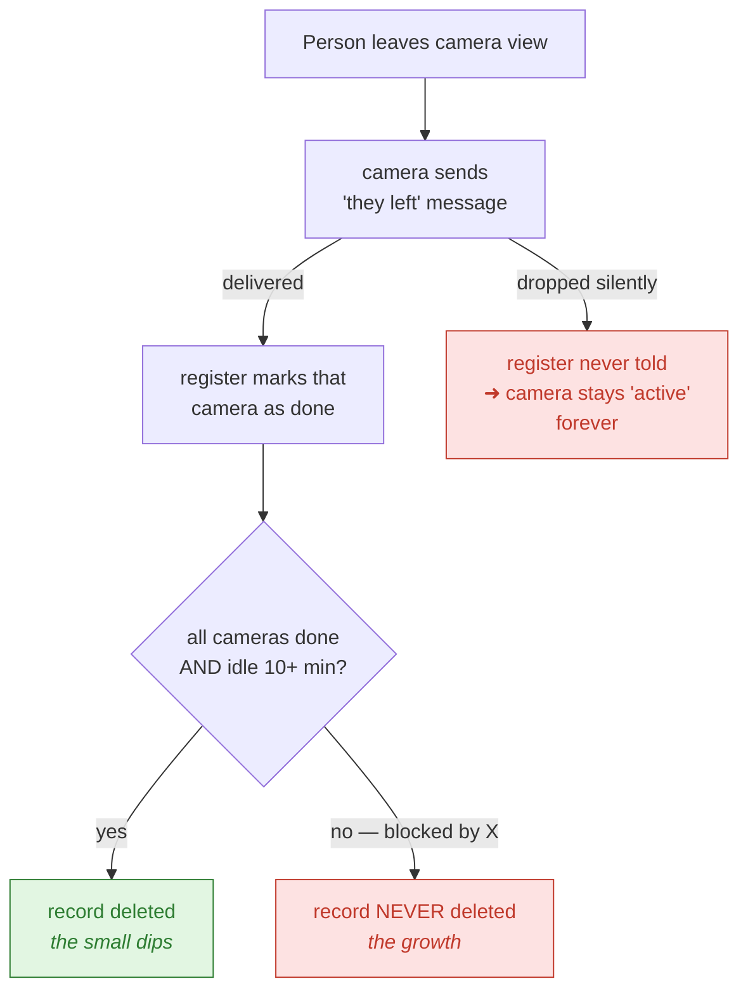

# Why `global_tracks` never stops growing

**A record can get stuck in memory forever. Here's how, and how to fix it.**

---

## The symptom

The dashboard on port 8865, panel **Pipeline State (over time)**, shows the
`global_tracks` line climbing steadily. It dips a little, now and then, but never
returns to where it started. Cleanup is clearly running — it just isn't enough.

It isn't a tuning problem. **Some records can never be deleted at all.**

---

## What the number means

`global_tracks` is how many people the system currently believes are in the
building. One entry per person. It should rise through the day and fall to near
zero overnight.

It's a live count of one dictionary — `len(GlobalTrackManager.global_tracks)` —
published to Redis every 2 seconds by the register worker and read back by the
dashboard.

---

## How a record is supposed to disappear

When someone walks out of a camera's view, that camera sends a **"they left"**
message to the register. The register marks that camera as done with them. Once
*every* camera has said that, and the person hasn't been seen for 10 minutes,
their record is deleted.

The 10-minute wait is deliberate: if they step out and come back, we want to
recognise them as the same person rather than mint a new record.



---

## The bug

That "they left" message is sent **fire-and-forget, with a one-second deadline**.

If the register is busy, or restarting, or the message broker hiccups for longer
than that one second, the broker throws the message away. And it does so *after*
the sender already considered it sent — so the sending code's error handling
never runs. **Nothing is logged. Nothing is counted. It is completely invisible.**

When that happens, the camera is never marked as done. And because deletion
requires *all* cameras to be marked done, that record can never be deleted — no
matter how old it gets, no matter how many hours pass.

That is the growth. The small dips are the exits whose message *did* arrive.

### Where it lives in code

| Thing | Location |
|---|---|
| The only code that deletes a record | `cleanup_inactive_global_tracks`, `global_track.py:1243` |
| The condition that blocks it | `all(not ct.active ...)`, `global_track.py:1263` |
| The only thing that clears that flag | `on_track_removed`, `global_track.py:949` |
| The one-second deadline | `DEFAULT_EXPIRES_S = 1.0`, [src/workers/global_track_client.py](../src/workers/global_track_client.py#L79) |
| The send that can vanish | `call_one_way`, [global_track_client.py:241](../src/workers/global_track_client.py#L241) |

The register class itself lives in the sibling repo `lum-model-vision`
(branch `feat/body-reid-extractor`), not here.

### A second, smaller leak

There's a lookup table (`local_to_global`) mapping each camera's private track
numbers to global records. It's also only cleaned up inside that same "they left"
handler. The deletion routine removes the record but **never cleans this table** —
so it leaks a little even when everything works correctly.

---

## The fix

Add a **backstop deletion rule**: if a record hasn't been seen for a set period,
delete it based on age alone, ignoring whether the cameras ever reported it as
done.

The existing 10-minute rule stays exactly as it is and still handles every normal
exit. The backstop only ever catches records that would otherwise be immortal.

A dropped message then costs us a *delayed* cleanup instead of a permanent leak.

### Why the backstop is set to 10 minutes, not longer

The record is only useful for re-identification for as long as it's still
inside the matching window — up to **5 minutes** (`matching.removal_window_sec`
in [configs/global_tracking.yaml](../configs/global_tracking.yaml)) after the
person disappears. Past that point it can never be matched against again, so
there's no reason to keep it around.

Going all the way down to the matching window's 1-minute counterpart
(`temporal_window_sec`) was tempting but wrong — that would delete records the
5-minute rematch path still needs, silently disabling it and splitting brief
exits into two identities. **10 minutes** — the same value as the normal
grace period — comfortably clears the 5-minute floor with margin, while
holding far less memory than an arbitrarily large number would.

The invariant that matters: **the backstop must stay at or above
`removal_window_sec`.** Anything below that trades a memory leak for duplicate
identities, which is the worse of the two failures.

### And make the failure visible

Right now we have no idea how often messages are being lost. The backstop should
log each forced deletion at warning level, naming the camera that never reported:

```
FORCE_ARCHIVE_TRACK | global_id=1042 duration=8134s stuck_active=[cam 3]
```

and expose a `force_archived` counter next to `global_tracks` on the dashboard. A
flat `global_tracks` with a rising `force_archived` tells us messages are being
dropped and roughly how often.

### Optional, secondary

The one-second deadline could be raised **for the "they left" message only** — it's
rare, safe to apply twice, and nothing is waiting on it. The per-frame messages
must keep their tight deadline, so a backed-up worker discards stale position data
rather than acting on minute-old information.

This only narrows the window. It does not close it. The backstop rule is the
actual fix.

---

## Why not something else

- **Put a timer on each camera's flag** — same information as the record's own
  "last seen" timestamp, but with more state to keep straight.
- **Have cameras periodically re-report who they're tracking** — correct, and it
  would repair state rather than just expire it, but it's a much larger change
  requiring work on the camera side. Worth considering later.

The backstop is a pure safety net: it cannot make the normal path any slower or
less correct, because it only ever fires long after the normal path has given up.

---

## How we'll know it worked

- `global_tracks` plateaus during the day and falls off overnight, instead of
  ratcheting upward.
- `FORCE_ARCHIVE_TRACK` warnings appear and name real cameras — confirming the
  leak was real and is now being caught.
- Restarting the register while cameras are streaming (the exact condition behind
  the two timeouts recorded in [GLOBAL_TRACKING.md](GLOBAL_TRACKING.md)) creates
  orphans that now clear themselves within the backstop window.

---

## Status

**Implemented (2026-09-09).**

- Backstop rule (`force_archive_after_inactive_min`, default 10 min) added to
  `cleanup_inactive_global_tracks` in `lum-model-vision`'s `global_track.py`,
  purging both `global_tracks` and the `local_to_global` lookup table via a
  shared `_purge_global_track` helper — closing the second, smaller leak too.
- `FORCE_ARCHIVE_TRACK` warning logging and a `force_archived` /
  `stuck_active_cameras` counter added to `GlobalTrackingMetrics`.
- `force_archived` and `local_to_global_entries` now published alongside
  `global_tracks` in the worker's Redis stats blob and exposed as dashboard
  gauges (`src/pipeline/engine.py`).
- `on_track_removed`'s Celery message expiry raised to 30s
  (`SO_GLOBALTRACK_REMOVED_EXPIRES_S`) — the secondary, optional narrowing
  described above — while every other one-way call keeps the original 1s.
- Tests added: `TestArchival` in `lum-model-vision`'s
  `tests/test_global_track_manager.py` (orphan force-archival, grace-window
  boundary, normal-path regression, `local_to_global` purge, the
  `removal_window_sec` invariant) and `ExpiryOverrideTests` in this repo's
  `tests/test_global_track_client.py`.
- Config default landed in
  [configs/global_tracking.yaml](../configs/global_tracking.yaml)
  (`force_archive_after_inactive_min: 10`).

Not yet done: watching `force_archived` against live camera traffic to confirm
how often `on_track_removed` messages are actually being dropped in
production, and updating `so.stack`'s pinned image once a release contains
this change.
