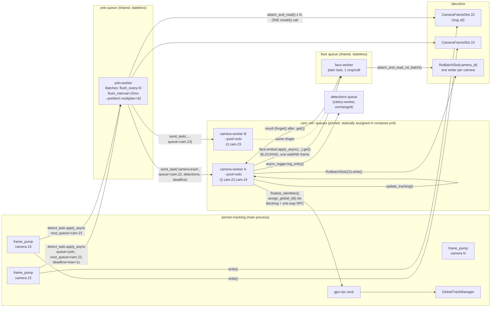
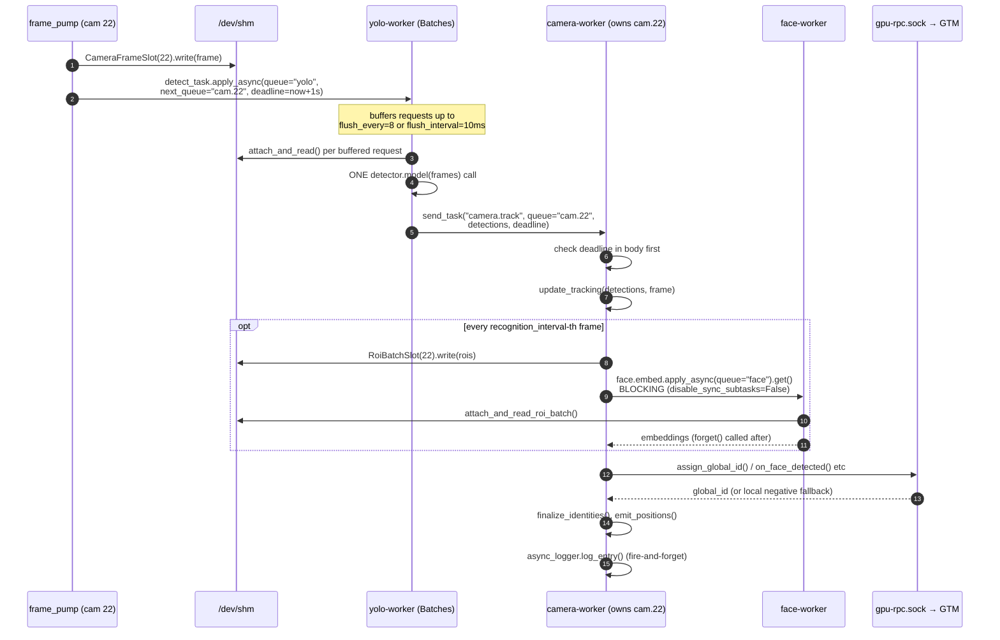
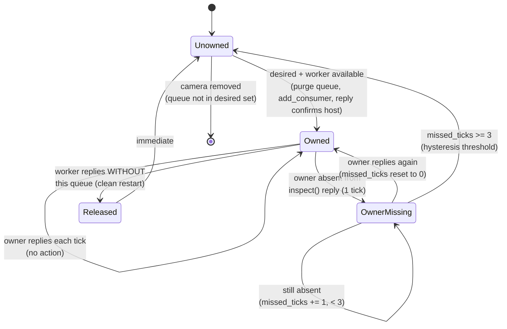

# LSO-67 follow-up: per-camera Celery queues + consumer-side batching ("option 7")

## Context

PR #98 moved per-camera work onto Celery but kept GPU batching in the main process behind a
Unix-socket RPC middleman (`GPUInferenceWorker` + `gpu_worker_rpc.py`). Measured on 10 live
cameras (tmp_plan.html, runs A/B/C, 2026-09-01):

- `camera-worker` is `--pool=solo` with one frame in flight, so the GPU collector's batch window
  always closes empty: **YOLO batch = 1.0, 41–43 ms/frame, GPU idle >95%** (A = B).
- Scaling camera-worker to 6 replicas got batch 1.6–1.7 / 25–29 ms, but Celery's round-robin
  spread one camera across six process-local trackers: **global_tracks 33 → 45 and growing** (C).

Fix = camera→worker **affinity** + **consumer-side batching**, done the Celery way: per-camera
queues (`cam.<id>`, exactly one consumer), `celery-batches` on the yolo worker, and the GPU RPC
layer deleted. Decisions already made with the user:

1. **Face leg stays synchronous inside the pinned camera task** (`face.embed(...).get()` against
   the stateless face pool). Each camera remains strictly frame-serial — no new ordering
   semantics in the 900-line `camera_engine.py`. Cross-camera parallelism (hence GPU batching)
   comes from several camera-worker processes owning different cameras.
2. **GlobalTrackManager stays in the main process behind the existing socket RPC**
   (`workers/global_track_rpc.py`, `workers/global_track_adapter.py`, their tests — untouched).
   Only the *GPU* RPC goes away.
3. **Affinity is static, not dynamic.** Revised after review — see below.

### Revision: static assignment, not a live reconciler

The original draft of this plan proposed a `CameraQueueReconciler`: a background thread polling
`control.inspect().active_queues()` every 30s, reassigning `cam.<id>` queues via
`add_consumer`/`cancel_consumer` with a hysteresis state machine to avoid double-ownership from a
missed control-plane broadcast. **That component is cut from the near-term plan.**

Why: it exists to solve exactly one problem — automatic camera failover within ~15–30s if a
camera-worker process dies — and it was, by a wide margin, the single highest-risk, highest-
complexity piece of the whole change: a new background thread, a hand-rolled state machine over
Celery's control-plane replies (which the plan itself flags as possibly unreliable under load),
a purge-before-assign race, and a whole new failure class (double ownership) that doesn't exist
in the system today. This runs production sites — an airport, a railway. At **10 cameras on a
single host**, with an operator who will notice and restart a dead container, that complexity
buys a failure window that a human already closes in about the same time by hand. Boring and
verifiable beats clever and self-healing when the self-healing part is the riskiest code being
added.

**Default design:** static `cam.<id>` → camera-worker assignment via `-Q` flags in `compose.yml`,
e.g. `camera-worker-a: -Q cam.22,cam.24`, `camera-worker-b: -Q cam.23`.
No reconciler thread, no `inspect()`/`add_consumer` reliability risk, no hysteresis to get right,
no double-ownership class to defend against. Rebalancing on a camera add/remove is "edit
`compose.yml`, restart the affected services" — a deploy, not a live system decision. This is a
plain loss of automatic failover, not a redesign: a dead camera-worker's cameras stay dark until
someone restarts it (systemd/compose `restart: unless-stopped` already does this for a crash,
just without re-homing to a different replica).

The dynamic reconciler design is **kept in full below (§Shelved)**, unreduced, as the thing to
build if operational reality shows static assignment isn't enough — e.g. camera-worker crashes
turn out to be frequent enough that manual restart is a real operational burden. Build it from
observed need, not from anticipated need.

## Target pipeline (per frame of camera C)

```
frame_pump (main proc)  --yolo queue-->  yolo-worker (Batches, flush 8 / 10 ms)
   writes CameraFrameSlot(C)                 attach_and_read() per request
   kwargs: frame_handle, frame_num,          ONE detector.model(frames)
           next_queue="cam.C", deadline      per request: send_task("camera.track", queue=next_queue)
                                                       |
                                                       v
                                   cam.C  -->  camera-worker (solo, owns cam.C [+ others])
                                               process_frame(handle, frame_num, detections)
                                                 update_tracking()
                                                 every Nth: RoiBatchSlot(C).write() ->
                                                   face.embed.apply_async(queue="face").get()   <- one wait
                                                 finalize_identities(); emit_positions(); log_entry()
```

Queues: shared stateless (`yolo`, `face`, `embeddings`, `detections`) and pinned (`cam.<id>`),
assigned **statically** at compose-time — see the revision note above. GTM RPC socket
`gpu-rpc.sock` remains the only socket.

### Diagram: processes and queues



No producer-side ownership flag is needed either: `frame_pump` for a given camera always exists
in the same process (`person-tracking`) regardless of which camera-worker consumes `cam.<id>`, so
there's nothing to gate — the queue's sole static consumer is always waiting for it.

### Diagram: per-frame sequence for one camera



## Verified constraints that shape the code (from installed Celery 5.4.0 / celery-batches 0.11)

- **Batches tasks do not honour `expires`** (no `revoked()` call in the Batches strategy) →
  carry an explicit `deadline` epoch kwarg on every hop and check it in the body.
- **Batches never stores results** → `ignore_result=True` on `yolo.detect`.
- **Batch size ≤ prefetch**: Batches acks after the flush, so with `worker_prefetch_multiplier=1`
  the buffer can never exceed 1 → yolo-worker must run `--prefetch-multiplier=32`.
- `apply_async(queue="cam.22")` needs no declaration (`task_create_missing_queues`) — a static
  `-Q` list per camera-worker in `compose.yml` is sufficient, no runtime queue management needed.
- `AsyncResult.get(disable_sync_subtasks=False)` is the sanctioned in-task wait.
- Task decorators' hardcoded `queue=` override `task_routes` → `camera.track` gets no static
  queue; routing is always via `apply_async(queue=...)`.
- `task_base.send_to_dlq` routes by task-name substring → keep names `yolo.detect`,
  `camera.track`, `face.embed`.
- celery-batches 0.11 requires `celery>=5.0,<5.7`, Python ≥3.9 — compatible.

## Changes by file

### `requirements.txt`
Add `celery-batches~=0.11` next to `celery~=5.4.0`. (All compose services share the image →
rebuild.)

### `src/workers/celery_app.py`
- `camera_queue_name(camera_id) -> f"cam.{camera_id}"`.
- `task_queues`: drop `camera_frames`. Keep `dlq.*`. (No `cam.control` marker queue — that was
  only needed to give a reconciler-managed worker a non-empty `-Q` to start with; a statically
  assigned `-Q cam.22,cam.24` already satisfies Celery's "must consume ≥1 queue" requirement.)
- `task_routes`: drop the two `camera` entries. Replace the comment at :83-89 with the new queue
  taxonomy (shared / pinned).
- `worker_prefetch_multiplier=1` stays global (keeps camera-workers serial).

### `src/pipeline/frame_pump.py` (`CeleryCameraProducer`)
- No ownership gate needed — static assignment means `cam.<id>`'s consumer always exists.
- Replace `process_frame_task.apply_async(...)` (:146-153) with
  `detect_task.apply_async(kwargs={camera_id, frame_handle: asdict(handle), frame_num,
  next_queue: camera_queue_name(id), deadline: time.time()+_TASK_EXPIRES_S}, queue="yolo",
  expires=_TASK_EXPIRES_S)`.

### `src/workers/yolo_tasks.py`
- `@celery.task(base=Batches, name="yolo.detect", queue="yolo", ignore_result=True,
  flush_every=SO_YOLO_FLUSH_EVERY (8), flush_interval=SO_YOLO_FLUSH_INTERVAL_S (0.010))`
  `def detect_task(requests: List[SimpleRequest])` → thin wrapper over a pure
  `run_detect_batch(requests, detector, dispatch, now=time.time)`:
  1. per request: read `req.kwargs`; skip if `deadline` past; `frame = attach_and_read(FrameHandle(**fh))`,
     skip if `None` (camera task would get `None` too).
  2. one `detector.model(frames, conf, iou, verbose=False, device)` over survivors; on exception
     every survivor gets `[]`.
  3. per request: `dispatch(kwargs={camera_id, frame_handle, frame_num, detections, deadline},
     queue=next_queue, expires=deadline-now)`; skip if remaining ≤ 0. Default `dispatch` =
     `celery.send_task("camera.track", **kw)` (no import of camera_tasks).
- Keep `_parse_yolo_result` and the `SO_WORKER_PRELOAD` guard. Delete `FrameBatchHandle` use.
- `_BatchStats`: one INFO line per 100 batches (`avg_batch`, `avg_ms`, `skipped_expired`,
  `skipped_gone`) — the e2e check greps this.

### `src/workers/camera_tasks.py`
- `@celery.task(name="camera.track", ignore_result=True)` (no `queue=`)
  `def track_task(camera_id, frame_handle, frame_num, detections, deadline=None)` →
  **check `deadline` in the body first** (Celery's `expires` is evaluated on delivery; a message
  can be delivered in time and then sit behind a blocked face `.get()`, and `acks_late` zombies
  redelivered after Redis `visibility_timeout` arrive with an old `deadline`) → then
  `_context_for(camera_id).process_frame(FrameHandle(**frame_handle), frame_num, detections)`.
- **Context eviction is not needed for the static design.** With `cam.<id>` permanently pinned
  to one camera-worker in `compose.yml`, a camera never migrates between processes at runtime, so
  the local-track-id-collision problem the original (dynamic) draft solved with idle-eviction +
  reseeded counters doesn't arise — `_CameraContext`'s existing per-process, per-camera lifetime
  is unchanged from PR #98. (Revisit only if/when §Shelved's dynamic reassignment is built.)
- `_CameraContext.process_frame(handle, frame_num, detections)`: remove the
  `gpu_worker_client.detect` call (:223-225); replace `gpu_worker_client.embed` (:239-241) with
  `self.face_client.embed(camera_id=..., roi_batch_handle=roi_handle)` (same shape → test fakes
  barely change).
- `__init__`: `self.face_client = FaceEmbedClient()` (+ `on_fallback` warning) replaces
  `GpuWorkerRpcClient` (:105, :109-111); drop the import (:40). Rewrite docstring :10-15/:24-27
  (detections arrive in the payload; affinity guaranteed by static `-Q` assignment in compose.yml).

### New `src/workers/face_client.py` — `FaceEmbedClient`
`embed(camera_id, roi_batch_handle) -> Dict[int, Dict]`:
`embed_task.apply_async(kwargs={"handle": asdict(handle)}, queue="face", expires=2.0)` →
`r.get(timeout=2.5, disable_sync_subtasks=False)`; `finally: r.forget()` (mandatory — ~70 KiB
pickles at ~15/s would otherwise sit in Redis DB 1 for `result_expires=3600`). Any exception →
`{}` + warning + `on_fallback()`. Length check vs `handle.rois` (ported from
`gpu_batch_dispatcher._run_arcface_batch` :574-581) and positional→`{track_id: result}` mapping
(ported from `_arcface_loop` :378-381), exposed as `embeddings_by_track()` for tests.

### `src/workers/face_tasks.py`
**Plain task, not Batches** — SCRFD has no batch path and ArcFace must stay one crop per call
(LSO-117), so cross-request batching gains nothing on the GPU and would add flush latency to a
leg the camera worker blocks on, plus manual `mark_as_done`. Rename to `name="face.embed"`, add
`track_started=False`. Fix docstring :11-13.

### `src/pipeline/engine.py`
- Remove `GPUInferenceWorker` (:33, :154-162), `GpuWorkerRpcServer` (:169-172), their
  `start()` (:299, :303) and `stop()` in `_cleanup` (:902, :905). Keep `GpuRpcServer` (GTM).
- No reconciler, no new thread, no change to `reload_camera_configs`'s queue-related behavior —
  static assignment means the engine has nothing to do with `cam.<id>` ownership at runtime.
  Adding or removing a camera is still a `reload_camera_configs` DB-driven event as today; if the
  new camera's queue isn't yet assigned to any camera-worker's `-Q` list, that's a `compose.yml`
  + restart, tracked as an operational step, not a code path.
- Update docstrings :1-8, :39-43. `main._warm_up_models` unchanged.

### `src/workers/frame_store.py`
- Delete `BatchedFrameHandle`, `FrameBatchHandle`, `FrameBatchSlot`, `attach_and_read_frame_batch`
  (:636-898) and `tests/test_frame_store.py::FrameBatchSlotTests`.
- The instance-unique-ROI-slot-name fix from the original draft is **not needed** for static
  assignment — it existed solely to survive a camera migrating between camera-worker replicas,
  which can't happen here (§Shelved needs it if dynamic reassignment is ever built).
- Reword the `_LOCAL_SLOTS` (:77-87) and `RoiBatchSlot` docstrings that mention `GPUInferenceWorker`.

### Deletions
`src/pipeline/gpu_batch_dispatcher.py`, `src/workers/gpu_worker_rpc.py`,
`tests/test_gpu_worker.py`, `tests/test_gpu_worker_rpc.py`;
`MetricsCollector.record_stale_response/get_stale_responses/_stale_responses`
(`src/infrastructure/metrics_collector.py` :176-187 + any dashboard/snapshot reference).
Keep `record_yolo_ms/record_arcface_ms` as API without callers (follow-up: worker-side timings via
a Redis hash). `rpc_framing.py` stays (GTM RPC); fix its docstring.

### `compose.yml`
- person-tracking healthcheck (:92) → connect only `/run/lumiohub/gpu-rpc.sock`; comments
  :67-71, :324-327 → "one socket".
- camera-worker: **replaced by named per-worker services**, each with a static `-Q` list, e.g.
  ```yaml
  camera-worker-a:
    command: celery -A workers.celery_app worker -Q cam.22,cam.24 -l warning --pool=solo
    <<: *camera-worker-common   # rpc-sockets (GTM) + frame-shm mounts, resources, healthcheck
  camera-worker-b:
    command: celery -A workers.celery_app worker -Q cam.23 -l warning --pool=solo
    <<: *camera-worker-common
  ```
  (or one `camera-worker` service templated per camera via a small `SO_CAMERA_QUEUES_<n>` env
  block — either is fine; the point is the mapping lives in compose, not in running code). Replace
  the "never scale" comment (:184-196) with: "each `cam.<id>` is statically assigned to exactly
  one service below; to move a camera, edit its `-Q` list here and restart both affected
  services — do not run two services with the same queue in their `-Q` list."
- yolo-worker: `... -Q yolo -l warning --pool=solo --prefetch-multiplier=32` (+ why).
- face-worker unchanged.

## Backpressure / timeouts
- shm ring: 8 writes ≈ 1.07 s at 7.5 det-fps; frame is read twice (yolo, then camera task) →
  whole yolo→cam hop must finish inside the producer's `deadline = now + 1.0`; hop-2 `expires`
  = remaining budget, so no message outlives its pixels.
- Face leg: task `expires=2.0` < `.get(timeout=2.5)` (same ordering rationale as
  `gpu_worker_rpc.py:68-75`). While a camera task blocks, its queue's frames expire at 1 s →
  bounded lag, never backlog.
- Capacity: per camera-worker ≈ 1/(15 ms track + ~20 ms amortised face) ≈ 28 fps; 10 cams × 7.5
  = 75 fps → ≥3 workers, run 4. (Run C needed 6 because the camera worker, not the GPU, was the
  bottleneck.)

## Rollout — small, each green (`PYTHONPATH=src python -m pytest tests/`)

Two required measurements gate this plan **before any implementation code is written**. Both are
go/no-go, not formalities — a bad result changes the plan, not just a footnote.

### Step −1 (required, before the spike): single-process baseline latency

Runs A/B/C (tmp_plan.html) all measure *broken variants of the Celery design itself* — none of
them answers "how fast was the pipeline before any of this Celery work existed." This plan adds
two more network hops to the hot path (`frame_pump→yolo`, `yolo→camera-worker`, plus the
already-live `camera-worker→face` RPC) in exchange for GPU throughput; without a true baseline
there's no way to tell whether the added hops cost more in per-frame *latency* than batching wins
back in *throughput* — a design can win on one and lose on the other.

**Action**: check out the pre-Celery, single-process code (before LSO-67's first commit, or the
`dev` branch this whole migration forked from) and measure end-to-end per-frame latency
(frame-read → identity-resolved) on the same 10-camera dev rig used for runs A/B/C, same
methodology (30 min, sampled at minutes 10/20/30). Record it as **Run 0** alongside the existing
table. This number is the actual regression/improvement baseline for step 6's end-to-end check —
"beats run A" is not the bar; "acceptable relative to the original monolith" is.

### Step 0 (spike, done — result: **GO**): celery-batches under load

With the reconciler cut, the only architecturally uncertain piece left was whether
`celery-batches` actually batches the way this design needs on `--pool=solo`. Resolved with a
real synthetic spike (`benchmarks/celery_batches_spike/`, full writeup and reproduction steps in
its README) before writing any of steps 1–5 — 10 simulated cameras at 7.5 Hz against a real
Celery worker process and a throwaway Redis, not a thought experiment.

**Results:**
- Batch size mean **2.17** (histogram `{1: 2, 2: 798, 3: 170}`) — matches/beats run C's 1.6–1.7,
  without run C's tracker-affinity corruption (affinity here comes from the separate static
  `-Q` assignment, not from concurrency).
- `unacked` returns to `0` after the run; queue length `0` — acks correct under
  `task_acks_late=True`.
- Past-deadline requests correctly skipped, both in steady state and after a `kill -9` mid-batch
  + Redis redelivery (11 confirmed skipped in that run, none reprocessed as fresh).
- **Correction to the plan's own assumption, found by the spike**: the 10 ms `flush_interval`
  timer is *not* the primary batching mechanism at this load. `_do_flush` runs inline on the
  worker's single `--pool=solo` loop, so batching is actually a side effect of the worker being
  busy inside the (real ~20-40 ms) model call — requests pile up in the buffer while the previous
  flush is running, and drain the instant it returns. Confirmed by isolating the effect: with the
  simulated model call set to 0 ms, batch size collapses to exactly 1.0 and the timer's own
  granularity (~11-14 ms) becomes visible as the only remaining mechanism. **No action needed for
  the real design** — 10 cameras / 7.5 Hz / real YOLO latency lands in the useful range without
  tuning — but if camera count grows significantly, re-run this spike at the new load before
  assuming the same batch sizes hold; the mechanism scales with load-relative-to-model-latency,
  not `flush_every` alone. Noted in `docs/CELERY_MIGRATION.md` §5 candidate content for step 6.

No fallback needed — proceeding with `celery-batches` as planned.

1. `build: add celery-batches~=0.11` (+ spike script, findings and the go/no-go decision in the
   commit body — including Run 0's baseline number).
2. `refactor(camera_tasks): process_frame takes detections` — task still computes detections via
   the existing RPC internally and passes them in; tests adapted. Stack still runs.
3. `feat(workers): synchronous face leg via FaceEmbedClient` — replaces `gpu_worker_client.embed`.
4. `feat(pipeline): yolo.detect Batches task → camera.track on statically-assigned per-camera
   queues` — the switch: producer → `yolo`, yolo forwards to `next_queue`, compose.yml gets named
   per-worker services with static `-Q` lists. End-to-end verification (including the Run 0
   latency comparison) happens here.
5. `chore: delete GPU RPC middleman` — dispatcher, `gpu_worker_rpc`, frame batch slots,
   stale-response metrics, healthcheck, tests, comments.
6. `docs: update CELERY_MIGRATION.md + PIPELINE_OVERVIEW.md` (§2 table, §4 Path 2 → batching in
   yolo-worker + `deadline`, §5 one RPC surface, §6 solo/one-replica rule → static-assignment
   invariant + sizing, §8 drop issue #2, §9 file map; PIPELINE_OVERVIEW §2/§3/§5/§6/§7/§8). Note
   in the PR that `SERVICE_ARCHITECTURE.md` / lumiohub-docs still describe the monolith (out of
   scope), and that dynamic reassignment (§Shelved) was considered and deferred, with why.

## Tests

Delete: `test_gpu_worker.py`, `test_gpu_worker_rpc.py`, `FrameBatchSlotTests`.
Adapt: `test_camera_tasks.py` (`FakeFaceClient`, `process_frame(handle, n, detections)`; the two
"runs detection every call" tests become "detections reach `update_tracking`, counter advances"),
`test_camera_producer.py` (patch `workers.yolo_tasks.detect_task`; assert `queue=="yolo"`,
`next_queue=="cam.1"`, `deadline` ≈ now+1, `expires`),
`test_celery_serialization.py` (payload with `detections`, `next_queue`, `deadline`),
`test_face_tasks.py` (name only).
Add: `test_yolo_tasks.py` (construct `SimpleRequest(...)` objects over real `CameraFrameSlot`s,
fake detector + recording `dispatch`: one `model()` call for N requests, per-index alignment,
gone frame skipped, expired skipped, model exception → `[]` forwarded, `expires` ≈ remaining,
`next_queue` default), `test_face_client.py` (fake `AsyncResult`: mapping, length mismatch → `{}`,
timeout → `{}` + `on_fallback` + `forget` still called, `disable_sync_subtasks=False`,
`queue="face"`), `test_celery_app.py` (`camera.track` has no static queue; DLQ key mapping for
`yolo.detect`/`camera.track`/`face.embed`).

## End-to-end verification (dev stack, `compose.sh`, 10 cameras, 30 min)
`docker compose build` (requirements changed) → up with the statically-assigned camera-worker
services. Check: `celery -A workers.celery_app inspect active_queues` lists every `cam.<id>`
exactly once, on the service its `compose.yml` entry says it should be on; yolo-worker INFO
`avg_batch` > 1 (target 2–4) and `avg_ms` below the 41–43 ms baseline; `global_tracks` gauge stays
in the 8–13 band; zero "is gone"/seq warnings and zero face timeouts in camera-worker logs;
`redis-cli -n 1 dbsize` flat (forget works); `redis-cli -n 0 llen cam.<id>` ≈ 0. **End-to-end
per-frame latency measured against Run 0's single-process baseline**, not just against A/B/C —
this is the number that answers "did the extra hops cost more than batching won back." Record the
full table (Run 0 + A/B/C + this run) in the doc this PR updates.

`docker compose kill` one camera-worker to confirm the accepted trade-off: its cameras go dark
(no auto-reassignment — by design, see the revision note) until it's manually restarted; this is
a smoke test of the *documented* behavior, not a search for a bug.

## End-to-end run results (so.stack, real infra, 6/10 real cameras, 2026-09-03)

Ran against the actual `so.stack` deployment (not the dev stack) — real RTSP cameras via
MediaMTX, real Postgres/Redis, real GPU. 6 of the 10 configured cameras connected at engine
startup (29, 36, 37, 38, 39, 40 — cameras 30/31/32/33 did not come up in this run; not
investigated, likely an RTSP-source availability issue unrelated to this design). All 10 cameras'
`cam.<id>` queues are still statically assigned to `camera-worker-a` per `.env`.

**Deployment bug found and fixed during this run**: the `so.stack/compose.yml` diff applied for
this test initially omitted `--prefetch-multiplier=32` on `yolo-worker` (an editing mistake, not
a design gap — this repo's own `compose.yml` had it correctly). Symptom was unambiguous and
matches exactly what §4's "Verified constraints" predicts: `avg_batch=0.00`, the `yolo` Redis
queue growing unbounded (33k+ messages within minutes), and 100% of requests arriving already
past their `deadline`. Confirms in production the same failure mode the spike characterized in
isolation. Fixed by adding the flag and recreating the service; the queue drained from 33k to
~50 within seconds of the fix landing — no manual purge needed, exactly as the deadline mechanism
is supposed to behave.

**Steady state, 10-minute observation window post-fix:**

| metric | value | vs. spike (synthetic, 10 sim. cameras) |
|---|---|---|
| yolo-worker container | healthy, stable | — |
| `yolo` Redis queue depth | 57, not growing | — |
| `cam.<id>` queue depths | 0 | — |
| `avg_batch` | **0.42**, stable | 2.17 |
| `avg_ms` (model call) | 12.3 ms | — |
| `skipped_expired` | flat (93,163, no longer climbing) | 0 in spike's steady state |
| `skipped_gone` | climbing steadily, ~200/s | 0 in spike's steady state |
| Pipeline correctness | **working** — real identity locks, real activity detection, real GCS uploads, real attendance events reaching celery-worker | — |

**Reading this**: the deployment is stable and functionally correct end-to-end — this is not a
regression from the old design, and nothing is crashing or backing up. But real batch sizes are
well below the spike's synthetic measurement, and most detection requests are being read as
`None` (`attach_and_read` returning "gone") — the shared-memory ring (`_RING_SIZE=8`) is being
recycled by the producer faster than yolo-worker's single `--pool=solo` process reads each
request, at this camera count and real frame rate. The system degrades exactly as designed (a
camera ages one frame, per `frame_store.py`'s documented contract) rather than failing, but the
GPU-batching win this design exists to capture is not being realized at the observed rate.

This is the one open finding from real infrastructure that the synthetic spike could not surface
— the spike's fake detector had zero real inference variance and ran against a synthetic,
perfectly-paced producer; real cameras produce frames on their own schedule, and real YOLO
inference competes for the same GPU as everything else running on this host. Per the earlier
"keep monitoring, don't tune yet" decision, no fix has been applied for this. Two candidate
directions, not yet evaluated: (1) a second `yolo-worker` replica — `yolo` is a shared, stateless
queue, so this is safe by the design's own rules, unlike `cam.<id>`; (2) increase `_RING_SIZE`
(frame_store.py) to give requests more generations of grace before being recycled. Whichever is
tried, re-measure `avg_batch`/`skipped_gone` the same way before assuming it worked.

## Risks / open items
- Batches: body exceptions are swallowed and messages acked (no retry/DLQ for frames — fine),
  so a bug silently drops a whole batch; the per-100 stats line + `skipped_*` counters are the
  visibility. Flower shows `yolo.detect` stuck in RECEIVED (cosmetic).
- 10 ms flush timer granularity — resolved by the step 0 spike before any other code is written;
  if it doesn't hold, the plan uses the named threads-pool fallback instead.
- **No automatic failover.** A crashed camera-worker's cameras stay dark until someone restarts
  it — accepted trade-off for cutting the reconciler; revisit if this proves operationally
  painful (see §Shelved).
- ArcFace ms/face may rise with several camera-workers hitting one face-worker (run C saw
  32–37 ms vs 22–23); knob = a second stateless face-worker replica.
- GPU latency metrics (`record_yolo_ms/…`) lose their caller — dashboard gauges go blank until a
  follow-up publishes worker-side timings.

---

## Shelved: dynamic queue reassignment via reconciler

Kept in full, not summarized, as the design to build **if** operational reality shows static
assignment isn't enough — e.g. camera-worker crashes turn out to be frequent enough that manual
restart is a real burden, not a hypothetical. Do not build this speculatively; build it from
observed need. If it is picked up later, everything below still applies as originally designed
and reviewed.

### Diagram: queue reconciliation state machine (per camera queue)



This is the diagram form of the design's core safety property: a queue only ever has **zero or
one** owner at a time, and the only two ways to lose an owner are an *immediate, confirmed*
release (worker replied without the queue) or *three consecutive missed ticks* (never a single
miss, since a busy `--pool=solo` worker can legitimately miss one broadcast mid-`face.embed`).

### `src/pipeline/queue_reconciler.py` — `CameraQueueReconciler`
`reconcile() -> Dict[camera_id, Optional[hostname]]`, idempotent, **runs on its own daemon
thread** (`inspect()` blocks for the full broadcast timeout; it must not stall the engine tick):
1. `control.inspect(timeout=2.0).active_queues()`; `None` → warn (rate-limited), keep the
   previous assignment untouched (no workers replied ≠ no workers exist).
2. camera-workers = hosts consuming `cam.control`; others ignored.
3. `owners[q] = sorted(hosts)` for consumed `cam.*` (minus marker); `desired = {cam.<id>}`.
4. **Hysteresis — the core safety rule.** A `--pool=solo` worker answers control broadcasts on
   the same loop that runs tasks, so a worker mid-`face.embed(...).get()` (≤2.5 s) or simply busy
   can miss one `inspect`. Treat "host absent from the reply" as *unknown*, not *gone*: keep a
   per-host `missed_ticks` counter; a queue whose last-known owner is absent is only considered
   unowned once that owner has missed ≥ `SO_RECONCILE_MISS_TICKS` (3) consecutive ticks. A host
   that *replied* without a queue it used to own (worker restarted → only `cam.control`) is
   released immediately. Never `add_consumer` a queue whose last-known owner is merely absent.
5. Fix violations in order: duplicate owners (both replied) → `cancel_consumer(q,
   destination=owners[1:])`; owned-not-desired → cancel; desired-unowned → pick the camera-worker
   with fewest `cam.*` (tie by hostname; optional `SO_CAMERA_MAX_PER_WORKER` cap), **purge the
   queue first** (`conn.default_channel.queue_purge(q)`), then `add_consumer(q,
   destination=[host], reply=True)` — owned only if the reply names the host. Never move an owned
   queue for balance (throws away tracker state).
6. Publish the assignment to the engine through a lock-protected dict; log diffs only.

Cadence: 30 s steady state, 5 s while any desired queue is unowned — and that *is* the normal
cold-start path: camera-workers `depends_on` person-tracking's healthcheck, which only passes
after `run()` binds the GTM socket, so the first reconcile always finds zero workers and
producers drop frames (counted) until the 5 s ticks pick the workers up.

### What comes back if this is built

- **`src/pipeline/frame_pump.py`**: `self.owned: bool = False`, set by the engine; gate the write
  and enqueue on it (`metrics.record_drop(camera_id)` when not owned) — Redis lists have no TTL,
  so an unowned `cam.<id>` queue would otherwise grow unbounded.
- **`src/workers/camera_tasks.py`**: context eviction becomes necessary again — a camera can now
  migrate worker→worker→worker, so `_CameraContext` needs `last_used` tracking, eviction after
  `SO_CAMERA_CONTEXT_IDLE_S` (30 s) idle, and `ctx.close()` stopping `AsyncLogger` + action-worker
  threads. The rebuilt tracker must not reuse local track ids that collide with what the interim
  owner registered in GTM (`(camera_id, local_track_id)`-keyed) — seed `PersonTracker`'s counter
  from an epoch, or call `global_track_manager.on_track_removed` for every old local id in
  `close()`. Check `lum_vision.person_tracking.tracker.PersonTracker.__init__` for which it
  supports.
- **`src/workers/frame_store.py`**: ROI slot names must become instance-unique
  (`camroi_{camera_id}_{instance_id:x}`, reader derives the name from
  `handle.camera_id + handle.instance_id`) — otherwise a worker that loses and regains a camera
  writes into segments a different replica recreated under the same name, and every embed for
  that camera silently returns `{}` forever.
- **`src/pipeline/engine.py`**: `self._queue_reconciler = CameraQueueReconciler(control=celery.control,
  camera_ids=self._camera_ids)`; `run()` starts its thread before producers, stops it in
  `_cleanup`; each tick sets producers' `owned` from the latest assignment;
  `reload_camera_configs` calls `reconciler.wake()`. `_cleanup` does **not** cancel consumers
  (keeps assignments warm across engine reinit).
- **`compose.yml`**: camera-worker services go back to a marker queue
  (`-Q cam.control`) plus `deploy: replicas: N`, since the reconciler — not a static `-Q` list —
  now owns the mapping.

### Additional risks specific to this design (on top of the ones above)
- Hysteresis trades failover speed for safety: a crashed camera-worker's cameras are dark for
  ~3 × 5 s before reassignment — better than "stays dark forever," worse than instant.
- Context eviction after 30 s idle means a camera that is merely paused (stream down) rebuilds
  its context on resume — a fresh tracker, same as a worker restart today.
- Hostname collisions between camera-workers would double-own a queue; compose replicas are
  unique by default — document as a deployment invariant, not just an assumption.
- `add_consumer`/`inspect()` reliability under load was never verified end-to-end in this design
  — if this is picked up, treat that as its own spike before trusting the hysteresis numbers.
