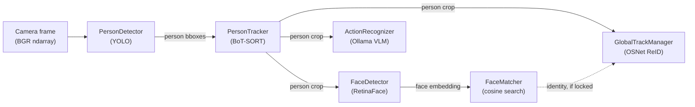

# Smart Office — Models

> What each ML model in the pipeline actually takes in and gives back, for engineers who need
> to work with the models but don't need the full internal architecture. For component diagrams,
> sequence diagrams and deployment topology, see [`SERVICE_ARCHITECTURE.md`](./SERVICE_ARCHITECTURE.md).
> For where the models sit relative to the rest of the codebase, see
> [`SERVICE_ARCHITECTURE.md §2`](./SERVICE_ARCHITECTURE.md#2-component-architecture).

All models live in the external [`lum-model-vision`](https://github.com/lumiohub-ai/lum-model-vision)
package (`lum_vision`), pinned in `requirements.txt` and built via `ModelFactory`
(`lum_vision/factory.py`). This service (`so.model-face-recognition`) owns the pipeline that
feeds frames into them and does something with what comes out — it holds no model weights or
inference code of its own.

---

## 1. Pipeline order

For every camera frame, the models run in this order. Not every model runs on every frame —
see the interval knobs in [§3](#3-configuration-knobs).



- **PersonDetector → PersonTracker**: every detection interval (`pipeline.detection_interval`).
- **PersonTracker → FaceDetector/FaceMatcher**: every recognition interval
  (`pipeline.recognition_interval`), only for confirmed tracks.
- **PersonTracker → GlobalTrackManager**: every frame for active tracks (body embedding itself
  only re-extracted every `embeddings.extract_interval_frames`).
- **PersonTracker → ActionRecognizer**: only if `action_recognition.enabled`, gated by
  `check_interval_seconds` per track, and runs synchronously off the hot path (see
  [`SERVICE_ARCHITECTURE.md §2.3`](./SERVICE_ARCHITECTURE.md#23-key-design-patterns)).

---

## 2. Models

### 2.1 PersonDetector — person detection

| | |
|---|---|
| **Backend** | Ultralytics YOLO26 (default, NMS-free) or YOLOv8 |
| **Class** | `lum_vision.person_tracking.detector.PersonDetector` |
| **Weights** | `yolo26{n,s,m,l,x}.pt` / `yolov8{n,s,m,l,x}.pt`, downloaded into `weights_dir` on first use |
| **Config** | `person_detection_model` (`yolo26`/`yolov8`), `person_model_size` (`n`/`s`/`m`/`l`/`x`, default `s`), `person_detection_threshold` (default `0.5`) |

**Input:** one BGR `np.ndarray` frame (or a batch of frames — `so.model-face-recognition`'s
`GPUInferenceWorker` always calls it as a batch across cameras, see
`src/pipeline/gpu_worker.py::_run_yolo_batch`). Internally resized to 640×640 (`input_size`).

**Output:** list of detections (one list per input frame if batched), each a dict:

```python
{
  "bbox": [x1, y1, x2, y2],   # pixel coords in the input frame
  "confidence": 0.87,
  "keypoints": None,          # (17, 2) COCO keypoints if use_pose=True, else None — unused here
  "person_id": 3,             # index within this frame's detections, not a track id
}
```

Only class `0` (person) is kept; other COCO classes are filtered out at the call site
(`gpu_worker.py::_parse_yolo_result`).

---

### 2.2 PersonTracker — multi-object tracking

| | |
|---|---|
| **Backend** | BoT-SORT (default, via the `humblebeeintel/yolo_tracking` fork), ByteTrack/OC-SORT selectable via `tracker_type` |
| **Class** | `lum_vision.person_tracking.tracker.PersonTracker` |
| **Config** | `max_age` (frames, default `120`), `min_hits` (default `3`), `iou_threshold` (default `0.3`), `with_reid` (default `True`) |

**Input:** `update(detections, frame)` — the `PersonDetector` output list for one camera's
current frame, plus the raw frame (BoT-SORT uses appearance features from the frame itself, not
just boxes).

**Output:** `(active_tracks, removed_tracks)`, both lists of dicts:

```python
{
  "track_id": 42,              # stable across frames (globally unique if global_id_generator set)
  "bbox": [x1, y1, x2, y2],
  "confidence": 0.87,
  "keypoints": None,
  "frame_num": 1035,
  "track_age": 0,               # frames since last real detection
  "track_hits": 12,
}
```

`removed_tracks` additionally carries `total_frames` / `total_hits` — the track's lifetime
summary at removal, used to trigger `GlobalTrackManager.on_track_removed`.

Only **confirmed** tracks (`hits >= min_hits`) with a detection **this frame** (`age == 0`) are
returned in `active_tracks` — this is what prevents ghost boxes from lingering after a person
leaves frame.

---

### 2.3 FaceDetector — face detection + embedding

| | |
|---|---|
| **Backend** | InsightFace `buffalo_l` (RetinaFace for detection, ArcFace for the embedding) |
| **Class** | `lum_vision.face_detection.detector.FaceDetector` |
| **Config** | `face_model_name` (default `buffalo_l`), `face_detection_padding` (default `20%`), `gpu_id` |

**Input:** a cropped **person ROI**, not the full frame — `so.model-face-recognition` crops the
`PersonTracker` bbox first and hands the crop to `detect()`/`extract_face_features()`
(`gpu_worker.py::_run_arcface_batch`). BGR `np.ndarray`.

Internally the image is padded (border-replicate, `face_detection_padding`%) before detection to
catch faces near the crop edge, then coordinates are translated back to the input crop's space —
callers never see or need to compensate for the padding.

**Output** (`extract_face_features`, one dict per detected face — usually 0 or 1 given the input
is already a single-person crop):

```python
{
  "bbox": [x1, y1, x2, y2, confidence, 0],  # in ROI-crop coordinates
  "embedding": np.ndarray,                   # 512-d, L2-normalized ArcFace embedding
  "landmarks": np.ndarray,                   # (5, 2) — left eye, right eye, nose, left mouth, right mouth
}
```

`detect()` (the lower-level call used directly in this repo) returns InsightFace `Face` objects
with the same data as attributes (`.bbox`, `.embedding`, `.kps`, `.det_score`) instead of dicts.

---

### 2.4 FaceMatcher — identity lookup

| | |
|---|---|
| **Class** | `lum_vision.face_detection.matcher.FaceMatcher` |
| **Config** | `match_threshold` (cosine similarity, default `0.3`) |
| **Data source** | any `EmbeddingProvider` (`get_all_embeddings() -> (names, embeddings)`) — this repo backs it with the pgvector store (`face_embeddings` table) |

**Input:** one or more 512-d ArcFace embeddings from `FaceDetector`, shape `(n_faces, 512)`.

**Output:**
- `compute_similarities(embs)` → `(n_faces, n_known_identities)` cosine similarity matrix.
- `get_best_match(similarities)` → `(best_db_index, best_similarity)`. The caller compares
  `best_similarity` against `match_threshold` itself — `FaceMatcher` doesn't apply the cutoff.

A match above threshold resolves to a `user_id` (via `db_names[best_db_index]`), which the
pipeline then feeds into `GlobalTrackManager` as a locked identity (§2.5) and into
`EntryLogger` for attendance (see [`SERVICE_ARCHITECTURE.md §4.1`](./SERVICE_ARCHITECTURE.md#41-per-frame-inference-loop-hot-path)).

---

### 2.5 GlobalTrackManager — cross-camera re-identification

| | |
|---|---|
| **Backend** | OSNet `osnet_x0_25_msmt17` (body ReID), via `boxmot`'s `ReidAutoBackend` |
| **Class** | `lum_vision.person_tracking.global_track.GlobalTrackManager` |
| **Config** (`global_tracking.yaml` / `enable_global_tracking`) | `matching.threshold` (default `0.70`), `temporal_window_sec` (default `60`), `min_reentry_gap_sec` (default `10`), `crop_quality.*` (min height/width/area/aspect-ratio gates) |

**Input:** `assign_global_id(camera_id, local_track_id, person_crop, face_embedding=None,
detection_confidence, frame_num, identity=None, identity_locked=False)`. `person_crop` is the
same person-bbox crop fed to `FaceDetector`; `identity`/`identity_locked` come from
`FaceMatcher` when a face was recognized this frame.

**Output:** a single `int` — the **global track ID**, stable across cameras for the same
physical person. First call for a new local track either matches an existing global track or
mints a new one (`global_id_counter`, starting at `1000` to stay visually distinct from local
track IDs).

**Matching priority** (see `assign_global_id` body):
1. **Locked face identity** — if the same `identity` string already has an active global track,
   reuse it outright (skips body ReID entirely).
2. **Body ReID cosine similarity** — extracts a 512-ish-d OSNet embedding from `person_crop`
   (`_extract_body_embedding`), gates on crop quality, then requires
   `similarity >= matching.threshold` against candidate tracks in the temporal window. Ties are
   broken conservatively: no match above threshold ⇒ mint a **new** global ID rather than risk
   merging two different people (false negatives are preferred over false merges).

Embeddings are kept as a top-K + exponential-moving-average "prototype" per global track
(`embeddings.top_k_size`, `embeddings.prototype_alpha`), not a full history.

---

### 2.6 ActionRecognizer — activity classification

| | |
|---|---|
| **Backend** | Ollama-hosted `gemma3:4b` (vision-language model) |
| **Class** | `lum_vision.action_recognition.recognizer.ActionRecognizer` |
| **Config** | `action_recognition.enabled` (default off), `SO_OLLAMA_API_URL`, `SO_OLLAMA_MODEL`, `check_interval_seconds` (default `30`), `inference_timeout` (default `60`s — a cold model load alone costs ~28s), `actions:` map (name → `{description, backend_type}`) |

**Input:** `recognize(image, metadata=None)` — a person-crop BGR `np.ndarray`, JPEG-encoded and
base64-embedded into a single Ollama `generate()` call. The action set (e.g. `sleeping`,
`using_phone`, `working`, `talking`) is defined entirely in config, not hardcoded — the prompt
and the JSON response schema are both built from `actions:` at startup.

**Output:** an `ActionResult`, or `None` on inference failure/timeout:

```python
ActionResult(
    action="using_phone",        # or None if the model picked "none" / matched nothing
    activity_type="phone",       # action mapped through the configured backend_type
    raw_output='{"action": "using_phone"}',
    inference_time=1.42,         # seconds
    metadata={...},              # whatever the caller passed in
)
```

This call is **synchronous and blocking** — it runs on its own thread pool
(`src/pipeline/action_worker.py`), never on the hot per-frame path.

---

## 3. Configuration knobs

Full precedence rules are in [`SERVICE_ARCHITECTURE.md §6.1`](./SERVICE_ARCHITECTURE.md#61-configuration-sources-precedence-top-wins).
The ones that most directly change model behavior:

| Key | Default | Effect |
|---|---|---|
| `person_detection_threshold` | `0.5` | YOLO confidence floor — lower catches more people, more false positives |
| `person_detection_model` | `yolo26` | `yolo26` (NMS-free, faster) or `yolov8` |
| `person_model_size` | `s` | `n`/`s`/`m`/`l`/`x` — accuracy vs. speed tradeoff |
| `match_threshold` | `0.3` | Cosine similarity floor for a face match (`FaceMatcher`) |
| `face_detection_padding` | `20%` | Border padding before face detection, catches faces near crop edges |
| `pipeline.detection_interval` | `2` | Run YOLO every N frames |
| `pipeline.recognition_interval` | `3` | Run ArcFace every N detections |
| `enable_global_tracking` | `true` | Toggle cross-camera ReID (`GlobalTrackManager`) entirely |
| `global_tracking.matching.threshold` | `0.70` | Cosine similarity floor for a body-ReID cross-camera match |
| `action_recognition.enabled` | `false` | Toggle the Ollama activity classifier |

---

## 4. Where model output ends up

- Face match → `user_id` → attendance record (`attendance_records`) + `AttendanceRecorded` event.
- No face match above threshold → `unrecognized_faces` row + `UnrecognizedFaceSaved` event.
- Global track ID → floor-plan position stream (`UserLocationUpdated` with `position`) when
  homography is calibrated for that camera.
- Action result → `activity_records` row + `ActivityDetected` event.

Exact payload shapes and the Redis channels involved are in
[`SERVICE_ARCHITECTURE.md §5.4`](./SERVICE_ARCHITECTURE.md#54-redis-mda-contracts).

---

## 5. Glossary

- **ROI** — Region of Interest; here, the pixel crop of a frame bounded by a person's bbox.
- **Embedding** — a fixed-length float vector representing an image (face or body) such that
  similar people/faces produce vectors close together under cosine similarity.
- **Track vs. Global ID** — a *track* ID is per-camera and short-lived (reset when a person
  leaves frame); a *global* ID persists across cameras and re-entries, assigned by
  `GlobalTrackManager`.
- **Locked identity** — a face match confident enough (`match_threshold`) that the pipeline
  treats it as ground truth for that track, taking priority over body ReID.
