# From one process to five

**What this branch changes, and why.**

Today the whole system runs as a single process: one program reading every camera, running both AI
models, and tracking everyone. This branch splits it into five cooperating processes, so the work
can spread across CPU cores and the GPU can be fed properly.

It is a large change — 32 commits, roughly 7,300 lines added — so this document walks through the
decisions rather than the code.

---

## What this system does, in one paragraph

Ten cameras watch an office. Roughly seven times a second, each one hands us a picture. For every
picture we ask two questions: **where are the people in this frame** (a GPU model called YOLO), and
**who are they** (a second GPU model that reads faces). Then we follow each person from frame to
frame, and write down when someone arrives or leaves. All of that has to keep up, live, at every
site we run — an airport and a railway among them.

---

## Where we are starting from

The current design is one process containing everything:

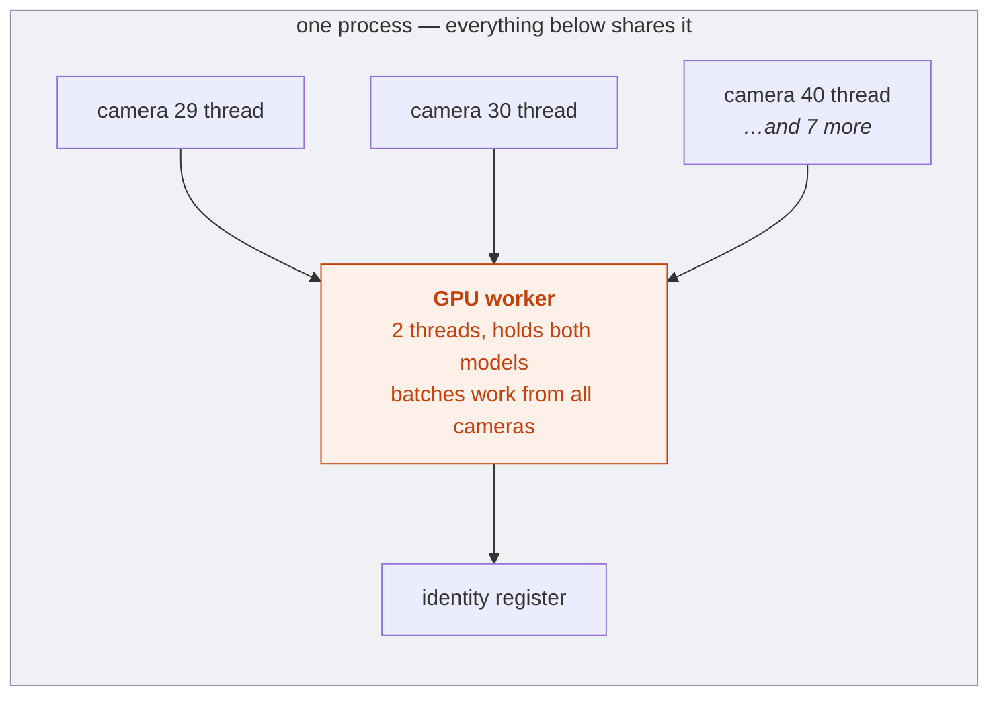

Each camera gets its own thread. They all share one GPU component that holds both models and batches
work across cameras. It is a reasonable design, and it worked.

**Its limit is Python itself.** In Python, threads in one process cannot truly run at the same time —
they take turns, because of a mechanism called the GIL. So ten camera threads, plus decoding, plus
tracking, plus both AI models, are all **taking turns on effectively one CPU core**. Adding cameras
doesn't add capacity; it just divides the same core more ways.

Separate *processes* have no such restriction. That is what this branch is for.

---

## Where we are going

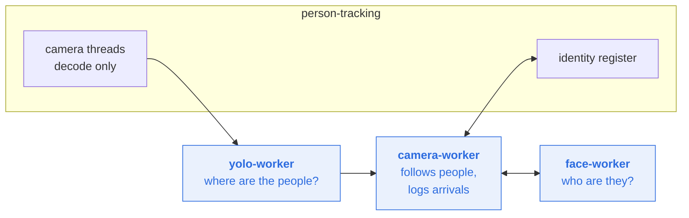

Five separate processes, each free to use its own CPU core. The decisions that follow are the
consequences of that split — because once processes are separate, nothing is shared automatically,
and every hand-off has to be designed.

---

# Decision 1 — Move the AI models into their own processes

## Before

Both AI models lived inside the main process, in a shared component that camera threads submitted
work to. Because everything was in one process, handing a picture to the model was free — just a
reference to memory both sides could already see.

But it inherited the GIL problem: the models, the decoding, and all ten camera threads were taking
turns on the same core.

## After

Each model gets its own process — `yolo-worker` and `face-worker` — that can genuinely run at the
same time as everything else.

That immediately raised a question that didn't exist before: **how does a picture get to another
process?** Separate processes share no memory. The obvious answer — send it through the message
queue — turns out to be unaffordable:

| What travels | Cost, **per item** |
|---|---|
| A small instruction | **~0.3 ms** |
| A full 720p picture | **~15.6 ms** |

That 15.6 ms is **one frame, one direction** — not a batch. Which is what makes it disqualifying:
ten cameras at 7.5 frames a second is 75 frames per second, so **~1.17 seconds of packing work per
second of video.** More than a whole CPU core doing nothing but copying pixels into a queue, before
any AI work starts.

Sending the picture would also cost **more than running the AI model on it.** So we don't. Pictures
go into shared memory; only a short note saying *where to look* travels through the queue.

**To be clear about what that number is:** it is the cost of the design we *rejected*. We never pay
it. And it is worth separating the two things it could have cost us, because only one of them
matters:

- **Latency alone is survivable.** A person detected 15 ms later is still detected correctly.
  Accuracy doesn't care about a small, *bounded* delay.
- **Accumulation is not.** If every frame costs more to transport than to process, the backlog grows
  without limit and the system drifts arbitrarily far behind — and *that* destroys accuracy, because
  you end up answering questions about a corridor as it was minutes ago.

The expiry stamp in Decision 4 is what guarantees the first case and forbids the second.

## An intermediate step worth knowing about

This branch reached its current shape in two stages, and the middle stage is visible in the commit
history.

The first attempt moved the models out but kept a **coordinator in the main process**: camera
workers asked it for detections, it batched the work, called the models, and matched each answer
back to whoever asked.

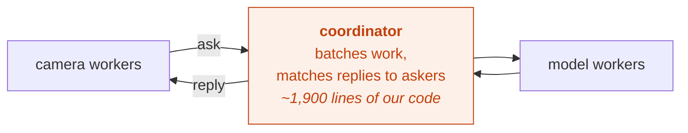

It worked, but it was ~1,900 lines of our own code doing something delicate: remembering which answer
belonged to which camera. Get that wrong and one person's identity attaches to another person's
track — silent and serious.

**We replaced it with a library.** A small extension to the queueing system already in use does the
grouping directly inside the model worker: as requests arrive they go into a buffer, which is handed
to the model when **8 have collected** or after **10 milliseconds**, whichever comes first. No
coordinator, no reply-matching — each worker just takes what's on its own queue.

Grouping requests to use a GPU efficiently is how every serious GPU serving system works; the idea is
standard. What we adopted is a 372-line third-party package implementing it, in place of ~1,900 lines
of ours.

**Net effect:** the models run in their own processes, and the coordinating machinery that briefly
existed to feed them is gone.

---

# Decision 2 — Give every camera its own lane

## Before

In the current design this problem cannot occur: one thread owns one camera for the life of the
process, so that camera's tracking history has exactly one home.

Splitting into processes put that guarantee at risk, and it took a failed attempt to see why.

## The attempt that failed

The natural way to use a queue is to let any available worker take the next item. We tried that —
one shared queue, several tracking workers, work handed to whoever was free.

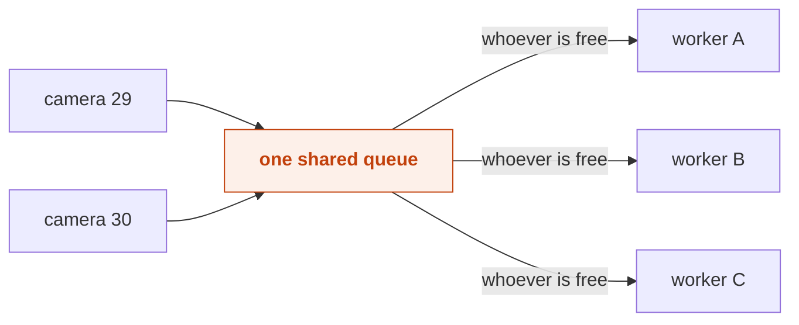

It is the standard pattern, and **for this system it was wrong.**

Following a person across frames requires memory. Worker A sees frame 99: a person near the left
edge. Frame 100 arrives — same person, one step right? To answer, the worker needs frame 99's
conclusion *in its own memory*.

Send frame 100 to worker B instead, and worker B knows nothing about frame 99 — that conclusion is
in another process's memory. So it concludes "a new person appeared" and assigns a new track. Both
workers now track the same human as two different people.

We measured it: the count of tracked people climbed **from 33 to 45 and never settled.** The system
believed there were more people in the building than there were.

## After

Each camera gets its own lane, read by **exactly one** worker. A camera's frames always land with the
same worker — restoring the property the thread design had for free.

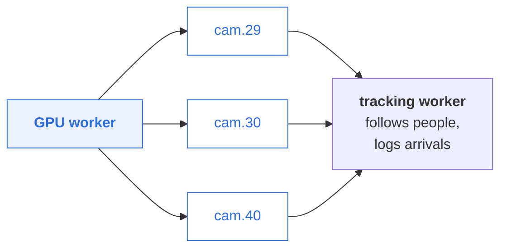

**What we got:** one source of truth per camera, and the ability to run several tracking workers
without them disagreeing. That combination is the whole point — the thread design had the first
property but could never have the second.

## Why only tracking is pinned — the rule behind the whole design

A fair question at this point: if per-camera lanes are so important, why doesn't the GPU worker get
them too?

Because the two jobs are fundamentally different, and one sentence separates them:

> **Stateless work can spread anywhere. Stateful work has to stay put.**

| Worker | Question it answers | Needs memory? | So it gets… |
|---|---|---|---|
| `yolo-worker` | "Where are the people in this picture?" | **No** | whatever arrives, from any camera |
| `face-worker` | "Whose face is this crop?" | **No** | whatever arrives, from any camera |
| `camera-worker` | "Is this the same person as last frame?" | **Yes** | **one fixed set of cameras** |

Asking "where are the people in this picture?" needs nothing but the picture. Any worker can answer
it, which is *exactly* what makes grouping frames from different cameras safe — and grouping is the
entire point of having a GPU worker.

Asking "is this the same person as last frame?" is impossible without last frame's conclusion. That
answer lives in one worker's memory, so the question has to go back to that same worker.

**This single rule explains the whole topology** — which components are pinned, which can be scaled
by adding replicas, and which can be batched. Everything else in this document follows from it.

---

# Decision 3 — Assign cameras by configuration, not automatically

We designed a system that would notice a dead worker and automatically move its cameras to a healthy
one. **We built it on paper, then cut it before writing the code.**

**What it would have bought us:** recovery in 15–30 seconds instead of an operator restarting a
container.

**What it would have cost:** it was the most complex and highest-risk part of the whole plan. It
needed to constantly poll every worker asking "which cameras do you have?", and handle the case
where a busy worker simply doesn't answer in time — without ever concluding a camera has no owner
when it actually does. Getting that wrong gives you *two* workers on one camera, which is precisely
the bug Decision 2 exists to eliminate.

**The judgement:** at ten cameras, that risk isn't worth a 15-second recovery window. Today a person
edits a config file and restarts a container.

The full design is written up and kept, so we can build it later if we find that workers actually
crash often enough to justify it.

### The consequence you should know about

| Change in the database | What happens |
|---|---|
| Rename a camera, change its address or its viewing area | **Fully automatic.** Picked up live, no restart |
| **Add a brand-new camera** | Picked up, **but** no worker is assigned to it yet — needs a config edit and restart |
| **Remove a camera** | Stops cleanly, but its now-unused lane is tidied up by the same edit |

Adding a camera is an operational step, not a code change. That's a direct trade for not building
the automatic system above.

---

# Decision 4 — Give every frame an expiry date

A picture of a corridor is useful for about a second. After that, the person has moved and the
answer is worthless.

The **original** single-process design handled this well: its internal queues had a fixed size, and
when they filled it simply threw frames away. Crude, but exactly right — it stayed responsive under
load.

Moving to Celery quietly lost that property. Celery's queues are **unbounded** — they grow until
memory runs out. Nothing dropped anything, so a system falling behind got further behind, forever.
Restoring the old behaviour was a requirement of this work, not a new idea.

Now **every frame carries an expiry stamp.** If it isn't processed in time, it's dropped. The system
degrades by skipping frames — which nobody notices at seven frames a second — instead of falling
further and further behind.

**We saw this work for real.** During testing, a misconfiguration left **33,000 frames** backed up.
When we corrected it, the backlog cleared itself to near zero **in seconds**, with no manual
cleanup. Under the old design that would have needed someone to manually purge the queue.

---

# How it all fits together

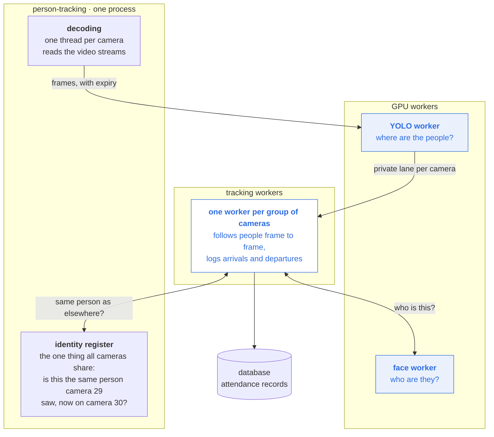

**Reading it:** video comes in on the left, becomes attendance records on the right. The GPU work
(blue) is split into two specialist workers. Tracking is separated per camera. The only genuinely
shared thing is the identity register — recognising that a person seen on camera 29 is the same
person now on camera 30. That has to be shared, so it deliberately stayed in one place.

---

# Video decoding — the expensive thing nobody sees

## What decoding is

A camera doesn't send pictures. It sends a compressed video stream, where most frames only describe
*what changed* since the previous one. Turning that back into ten individual, complete pictures per
second is called **decoding**, and it is pure CPU work — the GPU is not involved at all.

It is expensive: **roughly one full CPU core per 1440p camera.** With ten cameras that is most of a
machine, spent before any AI work has started.

We do it with one thread per camera, all inside the single `person-tracking` process. **This rebuild
did not change any of that** — it was deliberately out of scope.

## Why it never looked like a problem before

This is worth understanding properly, because it explains an odd fact: decoding cost exactly the
same in the old design, yet nothing seemed slow.

The reason is that **the old design had no deadlines.**

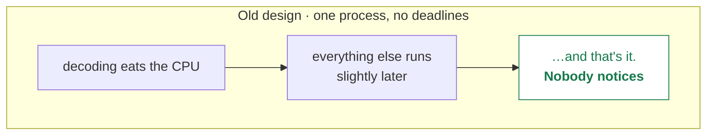

Everything ran in one process and competed for CPU. When decoding took more than its share, tracking
simply happened a little later. "A little later" has no failure mode — no alarm, no error, no
missing record. It degraded invisibly and gracefully.

## Why it became visible after the split

Splitting into separate processes meant work now had to travel *between* processes. And anything
that travels between processes needs an answer within some time limit — otherwise a stuck process
would hang everything behind it forever.

So we added timeouts. That's correct engineering. But it converts CPU pressure into something with
teeth:

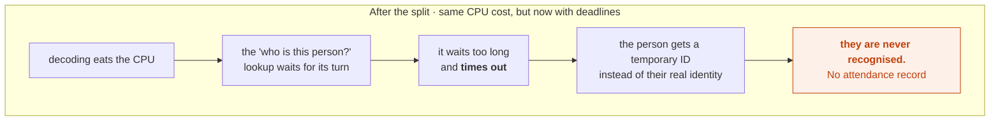

Same CPU pressure. Completely different outcome — a silent correctness failure instead of invisible
latency.

## Side by side

| | Old design | After the split |
|---|---|---|
| CPU cost of decoding | ~1 core per 1440p camera | **Identical — unchanged** |
| Has deadlines? | No | Yes, necessarily |
| When decoding hogs the CPU | Other work runs later | A lookup **times out** |
| What you'd observe | Nothing | People not recognised |

**This is not a regression introduced by the rebuild.** The cost was always there. The split made an
existing, invisible cost *consequential* — which is arguably an improvement, because a problem you
can see is one you can fix.

## We already hit this once, and fixed it

In testing we saw exactly the failure above: identity lookups timing out constantly, so almost
nobody was being recognised. Two fixes resolved it — we stopped opening a brand-new connection for
every single lookup (we now hold one open), which removed roughly **550–600 connection setups per
second** of pure overhead, and we relaxed one timeout to be more forgiving under load.

Recognition started working immediately and has been stable since.

**But the underlying CPU cost is untouched.** We removed the overhead *around* decoding, not
decoding itself.

## How to fix it, in the order that makes sense

**The problem is not that decoding is slow. It is that decoding sits in the same process as the
identity register**, and starves it. Two independent moves follow — and they combine.

### Move A — put decoding in its own process

Decoding is exactly the kind of work this branch has been relocating: heavy, independent, needing no
shared state. Give it its own process and it gets its own CPU core. The main process is then left
doing almost nothing but answering identity questions, quickly.

- Same library, same reconnect handling, writing into the same shared memory it already uses.
- Directly removes the starvation that causes the timeout failure.
- Small, compared with what this branch already did.

### Move B — decode on the GPU instead of the CPU

Modern NVIDIA cards carry a dedicated decoder chip — separate silicon from the part running the AI
models. CPU cost drops to near zero and the picture arrives already in GPU memory, removing the one
remaining copy.

**A caveat that decides the sequencing.** The obvious approach — "keep OpenCV, just use its GPU
decoder" — does not work with what we install today. We use the standard `opencv-python-headless`
package, and its pre-built wheels are **CPU-only**: no CUDA, no GPU decoder module. Verified on our
own environment:

```
cv2.__version__          4.11.0
has cudacodec            False
CUDA devices             0
```

Getting OpenCV's GPU decoder means **compiling OpenCV from source** with the CUDA toolkit and
NVIDIA's Video Codec SDK, then maintaining that custom build in our image. That is a real
undertaking, not a configuration flag. The realistic alternatives are NVIDIA's own decoder bindings,
or driving FFmpeg's hardware decoder directly — either way, **the video layer gets replaced**, along
with the reconnect handling we have invested in.

### They combine — and that is the destination

The two moves are independent, and doing both is the end state: **a decode worker that decodes on
the GPU.** Own process, own core, GPU silicon doing the work, frame handed onward without ever
touching CPU memory.

But they are very different sizes, and only one of them is urgent:

| | Fixes the timeout failure? | Effort | Replaces the video layer? |
|---|---|---|---|
| **A** — own process | **Yes** — removes the starvation | Small | No |
| **B** — GPU decode | Only as a side effect | Large | **Yes** |
| **A + B** | Yes, with the most headroom | Large | Yes |

**Recommendation: do A now, B when the machine runs out of CPU.** A is cheap, uses the machinery
this branch already built, and targets the failure we actually observe. B raises the ceiling — worth
doing, but it is a project with its own risk, and nothing in A has to be undone to get there. A
decode worker built now becomes the natural home for a GPU decoder later.

**One caveat on both:** neither is guaranteed to improve GPU grouping, because we have not
established that decoding is what limits it. If the GPU is simply fast enough at ten cameras that a
queue never forms, faster decoding will not create grouping — it will just mean the GPU finishes
sooner. That would be a *good* finding, but it is not what people expect from "we fixed batching."
The before/after measurement settles it, and it takes an afternoon.

---

# How things actually move between processes

Everything above describes *who does what*. This section covers *how the work physically gets
there* — because we use three different mechanisms, deliberately, and the reasons are measured.

## The problem: separate processes don't share anything

When everything ran in one process, passing a picture to another part of the code was free — you
passed a reference to memory both parts could already see. Splitting into separate processes removed
that. Each process has its own private memory. Nothing is shared by default.

So every hand-off needed an answer to: *how does this data get from process A to process B?*

We use three mechanisms, chosen by what's travelling.

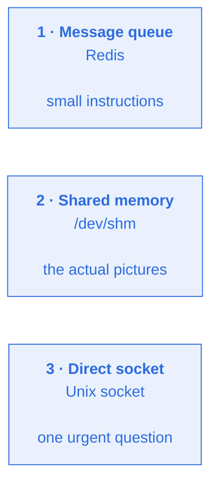

---

## 1. The message queue — for instructions

This is the Redis-backed queue everything above describes. It carries **small messages**: "camera 29,
frame 4471, here's where to find the picture, this expires at 14:22:07.

It is excellent at routing and durable under load. But it has one property that shaped the entire
design: **cost depends on payload size.**

| What travels | Cost through the queue |
|---|---|
| A small instruction | **~0.3 ms** |
| A full 720p picture | **~15.6 ms** |

Sending a picture through the queue costs **more than running the AI model on it.** The transport
would cost more than the work. So pictures never go through the queue — only instructions do.

## 2. Shared memory — for the pictures

Instead, we use a region of memory that multiple processes are explicitly allowed to read: **shared
memory** (on Linux, files under `/dev/shm`, which live in RAM rather than on disk).

The camera writes the picture there once. The queue message carries only a short note saying *where*
it is. The worker reads it directly from that region — no copying, no serialising.

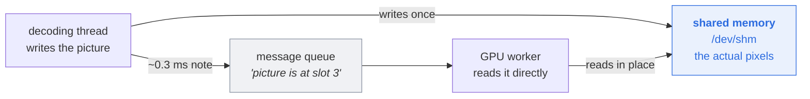

### The hard part: making sure you read the right picture

Shared memory has no safety rails. The camera keeps producing frames and reusing the same space, so
a slow worker can arrive to find the picture it was told about has been **overwritten by a newer
one**. It would read perfectly valid pixels — of the wrong moment.

Three defences, each added because the simpler version was measured failing:

**A ring of 8 slots, not one.** With a single slot, the producer overwrote it before the worker
arrived on *essentially every frame* — a measured lifetime of ~20ms against a queue round-trip
longer than that. Cycling through 8 slots gives each picture eight write-cycles to live instead of
one.

**A sequence number stamped inside the picture itself.** Not just on the note — *inside* the shared
memory. The worker compares what the note claims with what the memory says. If they disagree, the
picture was recycled, and the worker discards it rather than trusting it.

**A random ID that changes every restart.** Sequence numbers restart from zero when a process
restarts, so a restarted camera's first frame could stamp the *same* number a worker still had
cached — and the check would pass by coincidence, returning frozen pre-restart pixels. Each process
start generates a random ID stamped alongside the sequence number, so a restart can never be
mistaken for a match.

> The pattern to notice: none of these prevent a stale read. They make a stale read **detectable**,
> so it becomes a discarded frame — harmless — instead of a wrong answer.

## 3. The direct socket — for the one urgent question

One question doesn't fit the queue: **"is this person the same one camera 30 just saw?"**

Cross-camera identity is the one genuinely *shared* piece of knowledge in the system, so it lives in
one place — the main process. The tracking worker must ask, and must wait for the answer.

We use a **Unix domain socket** — a direct, private line between two processes on the same machine.
Not a network connection; nothing leaves the host.

**Why not the queue?** A queue reply arrives asynchronously, so you must match replies to questions
yourself. Get that wrong under timeout and you hand *one person's identity to another person's
track* — silent and serious. A socket is a direct call-and-response: the answer comes back on the
same line the question went out on. Nothing to correlate, nothing to get wrong.

**Measured:** p50 **0.16 ms**, p95 **0.34 ms** per call — against a per-frame budget of ~66 ms.

**When it fails** (timeout, or the main process being busy), the caller gets a temporary local ID
instead — negative, so it's distinguishable at a glance from a real one. The camera keeps tracking;
nothing blocks. This is the failure that decode-starvation triggers, described earlier.

---

## What travels at each hop, and how big it is

A frame changes form as it moves. Following the size is the clearest way to see whether the design
is efficient.

| Stage | Form | Size | Cost |
|---|---|---|---|
| Camera → us | compressed video (H.264) | ~50 KB | network |
| **Decode** | raw pixel array (numpy) | **~2.7 MB** | ~1 CPU core per camera |
| Into shared memory | same array, copied once | ~2.7 MB | ~0.1–0.3 ms memcpy |
| Through the queue | a note: *camera 29, slot 3, seq 4471* | **~200 bytes** | ~0.3 ms |
| Worker reads it | the same array, mapped in place | 0 extra | **no copy** |
| Detections back out | a list of boxes | ~1 KB | ~0.3 ms |
| Face crops | small cut-outs, packed together | ~50–200 KB | shared memory |

**The point:** the 2.7 MB array is written **once** and then read in place by every process that
needs it. Nothing large is ever serialised or sent. Everything crossing the queue is a few hundred
bytes.

**The one copy that remains.** We decode into OpenCV's buffer, then copy into shared memory —
because `cv2.VideoCapture` chooses where it decodes to. Decoding *directly into* the shared segment
would remove even that, and GPU decoding removes it entirely (the frame would never be in CPU memory
at all). At ~0.2 ms against a ~66 ms budget it is not urgent, but it is the honest remaining
inefficiency.

---

## What all this costs

None of these mechanisms exist in the current design, because a single process needs none of them —
passing data between parts of one program is just a reference to shared memory.

That is the honest price of the split:

| | Today (one process) | This branch |
|---|---|---|
| Passing a picture | free — a memory reference | shared memory + a handle, with three staleness defences |
| Asking for an identity | a normal function call | a socket round trip (measured 0.16 ms) |
| Things that can fail | the process | queues, sockets, shared segments |
| Processes to run and monitor | 1 | 5 |

**What we bought with it:** work that genuinely runs in parallel instead of taking turns on one
core, and the ability to add tracking capacity by adding processes.

The design work was in making each new failure mode *detectable and harmless* rather than silent:
a stale frame is discarded, a failed identity lookup falls back to a temporary ID and keeps
tracking, an overdue frame expires instead of queueing forever.

**One simplification did land.** The intermediate coordinator (Decision 1) had its own private
socket, used on every detection for every camera. Deleting the coordinator deleted that socket and
the second shared-memory layout that only it used — about 260 lines of memory-handling code. What
remains is one socket, for the one genuinely shared thing.

---

# Making it scale to more machines

Horizontal scaling was one of the reasons for moving to Celery. It is worth being precise about what
we have, because the answer differs sharply depending on the piece.

## What already scales, and what doesn't

| Component | Add more? | Why |
|---|---|---|
| `yolo-worker`, `face-worker` | ✅ freely | Stateless. Any worker can answer any request |
| `camera-worker` | ✅ by adding cameras to it | Stateful, but each camera is independent |
| Decoding | ⚠️ one thread per camera, one process | See the decode section above |
| Identity register | ❌ **one process, by design** | Genuinely shared state |

But there is a harder boundary underneath all of that.

## The same-machine boundary

Two of the three transport mechanisms **only work on one machine**:

- **Shared memory** is a region of one machine's RAM. A process on another host cannot map it.
- **A Unix socket** is a file on one machine. Nothing off-host can connect.

So today, `person-tracking`, `camera-worker`, `yolo-worker` and `face-worker` **must all run on the
same host.** Within that host we scale by adding worker processes. Across hosts, currently, we
don't.

## What actually caps how many cameras fit on one server

Three separate limits, not one, and none of them is a number written in the code — each is
arithmetic against something we measured.

| Limit | What it's bounded by | Roughly |
|---|---|---|
| Cameras per **tracking worker** | CPU: ~15 ms tracking + ~20 ms amortised face work per frame | **~3-4 cameras** at 7.5 fps |
| **Tracking workers** per server | Remaining CPU after decode | as many as cores allow |
| Cameras per server, total | Decode CPU: ~1 core per 1440p camera | usually the tightest limit |
| **Model workers** (`yolo-worker`, `face-worker`) per GPU | The GPU itself | see below |

**A gap worth knowing about: today, GPU workers aren't pinned to a specific GPU.** Both
`yolo-worker` and `face-worker` just request "a GPU," with no `device_ids` set. On a server with one
GPU that's correct — they're meant to share it. But on a server with **two GPUs**, neither service
tells Docker which one to use, so by default both would land on the same card and the second would
sit idle. Not a problem today because we run one GPU per host; it becomes one the moment that
changes, and the fix is a one-line addition per service, not a redesign.

## Does scaling out mean deleting shared memory and the socket?

**No — and this is the important part.** They stay. What changes is *what spans hosts.*

The wrong approach would be to make every worker reachable from anywhere, sending frames over the
network so any host can process any camera. That is precisely the **15.6 ms per frame** problem — the
transport would cost more than the inference. Frames should never leave the machine that decoded
them.

The right shape is **sharding**: each host runs a complete, self-contained stack for *its own*
cameras — its own decoding, its own workers, its own shared memory, its own socket. Cameras are
divided between hosts; frames stay local.

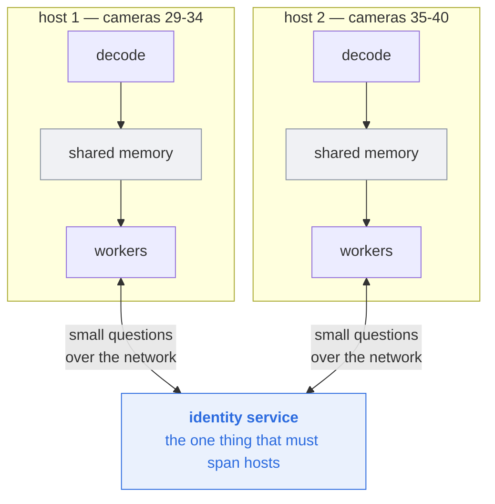

Shared memory and the socket keep working, **unchanged, inside each host.** Only one thing has to
become network-reachable — and it is the one thing that was always genuinely shared.

## The actual work required

**1. Make the identity register a real service.** This is the whole job. Today it is an object in
one process behind a local socket. It would need to be a service reachable over the network.

The difficulty is specific: `assign_global_id` runs a numpy similarity search over the entire
embedding gallery. That does not decompose into Redis operations — you cannot simply "put it in
Redis." It needs to stay one service that owns the gallery, exposed over the network instead of a
local socket. The RPC surface is already narrow and well-defined, which helps; the hard parts are
latency (a network call instead of 0.16 ms local) and it becoming a single point of failure for
every host rather than one.

**2. Decide how cameras map to hosts.** Cameras that watch the *same physical space* should sit on
the same host wherever possible — every person crossing between them causes identity traffic, and
keeping that local keeps it cheap.

**3. Extend camera assignment across hosts.** Today's per-host config would need to become a
fleet-wide view of which host owns which camera. This is the same problem as the automatic
reassignment work (Decision 3), one level up — which is a good argument for building that first, at
single-host scale, and learning from it.

## The honest summary

**We have not built horizontal scaling across machines. We have built the thing that makes it
possible.**

Frames stay local to the machine that decoded them — that is a permanent design property, not a
limitation to remove. Multi-host scaling means running more self-contained stacks and sharing one
piece of genuinely global state between them. The identity service is that piece, and it is the real
project.

---

# What happens when something breaks

Five processes means five things that can fail independently. That sounds worse than one process,
and in one sense it is — but the failures are *smaller*, and each was given a deliberate fallback
rather than being left to chance.

Every service runs with `restart: unless-stopped`, so Docker brings back anything that dies.

| If this dies | What stops | What keeps working | Recovery |
|---|---|---|---|
| `yolo-worker` | all detection | streams stay connected; frames **expire** rather than pile up | automatic restart, seconds |
| `face-worker` | recognition | tracking continues; people tracked as "unknown" | automatic restart |
| `camera-worker` | tracking for **its** cameras only | every other camera unaffected | automatic restart, but see Decision 3 |
| `person-tracking` | decoding — so everything | workers idle harmlessly, queues drain via expiry | automatic restart |
| Redis | all queueing | — | automatic restart; in-flight frames lost, next ones fine |

**The important column is the third one.** In the single-process design, any crash took down all ten
cameras. Now a `face-worker` crash costs you recognition but not tracking; a `camera-worker` crash
costs you some cameras but not all. **The blast radius got smaller, not bigger.**

Two fallbacks are worth naming because they were designed, not accidental:

- **Face embedding failure returns an empty result**, not an exception. The frame is tracked with no
  identity attached rather than being lost.
- **Identity lookup failure returns a temporary local ID** — negative, so it's distinguishable at a
  glance from a real one. The camera keeps tracking and voting locally; nothing blocks.

**The one genuine single point of failure is the identity register.** If it's down, cross-camera
identity stops — everyone gets local-only IDs. Tracking and attendance still work per camera. That
was a conscious trade: it holds shared state that genuinely cannot be duplicated without becoming
wrong.

---

# How we know it works

Worth being precise about what's verified and how, since "223 tests pass" and "we ran it" are very
different kinds of evidence.

| What | How it was checked | Confidence |
|---|---|---|
| Frame transport, staleness detection | Automated tests over real shared memory | **High** — the tricky races are pinned by tests |
| Batching logic | Automated tests with a fake model + recording dispatcher | **High** |
| Expiry / deadline handling | Automated tests, plus observed live (33k backlog self-cleared) | **High** |
| Identity RPC | Automated tests including failure paths | **High** |
| End-to-end pipeline | **Manual** — real cameras, real GPU, ~1 hour | **Medium** — worked, but one run |
| Sustained stability | Not tested | **Unknown** — longest observed run is under an hour |
| Performance vs. the old design | **Not measured** | **None** — this is the outstanding gap |

**The honest reading:** the mechanisms are well covered by tests; the *system* has one successful
manual run behind it. That run found a real bug (a missing worker flag), which is a point in its
favour — but it is one run, not a soak test.

Before this goes to a production site, the measurement and a longer stability run are both worth
doing. Neither is expensive.

---

# If it goes wrong in production

The rollback path is simple, and worth stating explicitly because it affects how much risk this
carries.

**This branch changes no database schema and no external interface.** Attendance records, the API,
and the frontend are untouched. That means rollback is just a deployment change:

1. Point the image tag back at the previous release.
2. `docker compose up -d`.

The old architecture is a single process and doesn't need the new queues, shared-memory segments, or
sockets — leftovers are harmless and disappear with the containers.

**What you would lose by rolling back:** nothing but the improvements. No data migration to undo, no
records written in a new format, no half-migrated state.

That is a deliberate property of how this was sequenced, and it is the main reason a change this
size is reasonable to deploy: **the exit is cheap.**

---

# Questions people ask

These came up in review. They are the natural objections — worth having the answers ready.

## "Why not just tag each frame with a camera ID and frame number? Then any worker could handle it."

We *do* tag every frame that way. But the problem was never *identifying* frames — it was that
**tracking has memory, and memory can't be split.**

Worker A sees frame 99: a person near the left edge. Frame 100 arrives — is that the same person, one
step to the right? To answer, the worker needs frame 99's conclusion *in its own memory*: that
person's position, their appearance, the track number it assigned them.

Now send frame 100 to worker B. Worker B has perfect metadata — "camera 29, frame 100" — and still
knows nothing about frame 99, because that conclusion lives in worker A's memory, in a different
process. So worker B concludes "a new person appeared" and assigns a new track. Both workers are now
tracking the same human as two different people.

**Metadata identifies data. It cannot transfer memory.** Sharing that memory between processes is a
genuinely hard problem — you would need shared storage plus coordination so two workers don't
overwrite each other mid-frame. Per-camera lanes make the problem *not exist*, which is cheaper than
solving it.

## "Isn't this just a problem you created by using multiple workers? One worker wouldn't have it."

Correct — and that is exactly the point.

| Approach | Correct? | Can it scale? |
|---|---|---|
| One tracking worker | ✅ | ❌ capped at a single CPU core, forever |
| Many workers, shared queue | ❌ split memory | ✅ |
| **Many workers, one lane each** | ✅ | ✅ |

Per-camera lanes are not a fix for a problem we invented. They are **what makes more than one worker
possible at all.** Someone did try the middle row — scaling to six workers for speed — and
correctness broke immediately (the 33 → 45 climb).

Worth knowing: today we are effectively running the top row. One worker owns all ten cameras; a
second sits idle, configured but unused. So we have single-worker correctness *right now*, plus the
ability to split the moment tracking becomes the constraint — by moving camera IDs between two lines
of configuration. That was deliberate: prove the new shape works before adding a second variable.

## "Frames wait for answers. Isn't the whole point of a queue to remove waiting?"

Queues remove waiting for work that doesn't need an answer — writing a record, sending a
notification. Those we fire and forget.

But when the tracking worker asks *"who is this person?"*, it cannot continue without the reply. It
can't log an arrival for an unknown person. A queue doesn't remove that wait; it only changes where
it happens. Some answers are genuinely required.

## "If the GPU worker groups frames, which does it take first — oldest or newest?"

Oldest first. It drains its buffer in arrival order.

For live video that is the *wrong* preference — a 900ms-old frame is nearly worthless next to the
fresh one behind it. This is exactly why the expiry stamp exists: stale frames are thrown away
*before* the model runs, so in practice we approximate "newest first" by discarding rather than
reordering.

Adequate at current load. If we ever want true newest-first under sustained overload, that is code
we would write ourselves.

## "Do we copy the picture, or move it? Do we still need the original afterwards?"

We copy — once — and it is the cheap kind of copy. What goes into shared memory is the **raw pixel
array**, not a re-encoded image: a straight memory copy of about 2.7 MB, on the order of 0.1-0.3 ms.
No JPEG, no PNG, no pickling.

**And you are right that moving would be better than copying.** The reason we copy at all is that
OpenCV decides where it decodes to — it hands us its own buffer, and we copy from there into the
shared segment. To truly *move*, we would have to decode **directly into** shared memory, which
means replacing the video library. That is the GPU-decode project, where the frame never lands in
CPU memory at all.

The original isn't needed once copied; it is reused by OpenCV for the next frame. At ~0.2 ms against
a ~66 ms per-frame budget this is not urgent — but it is the one genuine inefficiency left in the
transport path, and worth naming rather than glossing over.

## "For multiple servers — does that mean 10 cameras on server 1 and 10 on server 2?"

Yes, exactly that. Each server runs a **complete, self-contained stack** for its own cameras: its own
decoding, its own GPU workers, its own tracking workers, its own shared memory and socket. Cameras
are divided between servers; frames never cross between them.

The alternative — one shared pool of GPU workers serving cameras from both servers — would mean
frames travelling over the network to reach them. That is the ~15.6 ms-per-frame problem again, now
over a link slower than the local machine. Sharding avoids it completely.

The only thing that has to cross between servers is the **identity lookup** — small, occasional, and
the one piece of genuinely shared state. See "Making it scale to more machines" above for what that
requires.

## "Can't we just switch OpenCV to its GPU decoder?"

Not with what we install today. The standard `opencv-python-headless` package ships **CPU-only
wheels** — checked on our own environment:

```
cv2.__version__          4.11.0
has cudacodec            False
CUDA devices             0
```

There is no GPU decoder module in that build at all. Getting one means **compiling OpenCV from
source** against the CUDA toolkit and NVIDIA's Video Codec SDK, then maintaining that custom build in
our image — or switching to NVIDIA's own decoder bindings, or driving FFmpeg's hardware decoder
directly. Any of those replaces the video layer, including the RTSP reconnect handling we have
already invested in.

So it is a real project, not a configuration flag — which is why moving decoding into its own
process comes first: it fixes the failure we actually observe, at a fraction of the effort.

## "How standard is this batching library, really?"

The *idea* is completely standard — grouping requests to use a GPU efficiently is how every serious
GPU serving system works.

The *implementation* we adopted is a small third-party package: 372 lines, outside Celery itself. Being
straight about that trade: we deleted ~1,900 lines of our own code and took on a 372-line dependency
that is purpose-built and publicly maintained. If it were ever abandoned, our fallback is written
down and is roughly 40 lines. We consider that a good trade, but it is a dependency, not a Celery
built-in.

---

## Where it stands

This branch sits 32 commits ahead of `dev`, with no divergence — `dev` is fully contained, so no
merge or rebase is needed. It is a large single body of work; whether it merges as one unit or is
split for review is worth deciding deliberately.

| Item | State | Notes |
|---|---|---|
| Code | ✅ Done | 32 commits, ~7,300 lines added, ~1,500 removed |
| Automated tests | ✅ Passing | 223 / 223 |
| Running on real hardware | ✅ Verified | Real cameras, real GPU. Found and fixed one deployment bug during the run |
| GPU actually grouping frames | ⚠️ Not yet | Works mechanically, but sees roughly one frame at a time in practice |
| Before/after speed comparison | ⚠️ Not run | Measurement harness is ready; the baseline run hasn't been done |
| Documentation | ⚠️ Outstanding | Two internal documents still describe the old design |

---

## The honest caveat

Decision 1 was also meant to let the GPU process several cameras' frames **together** instead of one
at a time. That machinery is now in place and correct — **but at our current load it is mostly still
handling one frame per pass.**

The mechanism is straightforward: grouping only happens when frames pile up *while the GPU is busy*.
Right now the GPU finishes each frame before the next ones arrive, so there is rarely anything
waiting to be grouped with it.

**Why that is, we have not yet proven.** It may be that decoding can't supply frames fast enough, or
simply that at ten cameras the GPU is genuinely fast enough that a queue never forms — in which case
there is nothing to fix and the grouping machinery is just idle capacity for when we scale up. Those
have different answers, and we are not going to guess between them.

So the structural wins are real and already banked: the work runs in genuinely parallel processes
instead of taking turns on one core, cameras no longer contend over tracking state, and backlogs
self-clear instead of growing. The raw GPU-throughput win has not shown up yet. Two known levers
remain untried, and we have deliberately not pulled them until we have the before/after measurement
to judge against.

We would rather report this now than present a number we haven't earned.

---

# What we have agreed to do next

Decided in review. Each is a **separate piece of work** — deliberately not bundled into this
branch, which is already large.

Numbers below are the item numbers in [`FOLLOW_UPS.md`](FOLLOW_UPS.md), which holds the full
detail and is the source of truth. Ordering is by dependency, not by size.

## Before this merges

**1 · Update the two stale internal documents.** `CELERY_MIGRATION.md` and
`PIPELINE_OVERVIEW.md` still describe components this branch deletes, and link to files that
no longer exist.

**2 · Run the before/after measurement.** One afternoon; the harness is written and waiting.
It is the only thing that turns "we rebuilt it" into "here is what it bought" — and it
decides item 7. *Blocks items 5, 7 and 8.*

## Before a production site

**3 · Run it for 24–48 hours.** The longest verified run is under an hour. Slow leaks and
gradual drift are exactly what that cannot surface, and this runs an airport and a railway.

**4 · Find out why four cameras didn't connect.** The end-to-end run reached 6 of 10 cameras.
Worth resolving *before* item 2, so the baseline measures a full load rather than 60% of one.

## Next, as their own PRs — these two can run in parallel

**5 · Move decoding into its own process.** Fixes the failure we actually observe: decode
starving the identity register until lookups time out and people go unrecognised. Small, uses
machinery this branch already built, and becomes the natural home for GPU decoding later.

**6 · Automatic camera-to-worker reassignment.** Today a dead worker means its cameras are
dark until an operator notices. The design is complete and preserved — build it as specified,
since the subtle part (not mistaking a busy worker for a dead one) is what keeps two workers
off one camera.

## A decision, not a task

**7 · What to do about GPU batch size.** Currently ~1 frame per pass. Either decode can't
feed the GPU fast enough (→ item 5), or the GPU is simply fast enough at ten cameras that no
queue forms (→ nothing is wrong, and we have headroom). *Item 2 tells us which.* Tuning before
that would be guessing.

## Later, when the trigger fires

**8 · GPU decoding.** Raises the CPU ceiling substantially, but replaces the video layer
wholesale and needs an OpenCV build we do not have. Do item 5 first; this is where it leads.

**9 · Pin GPU workers to specific GPUs.** A one-line addition per service, needed only when a
host has more than one GPU. Harmless today, silently wasteful the day that changes.

**10 · Publish worker-side GPU timings.** Some dashboard gauges are blank because the timings
now happen in a different process from the collector.

**11 · An identity service, if we go multi-machine.** The one piece of genuinely shared state,
and the real work in scaling past one server.

## Order at a glance

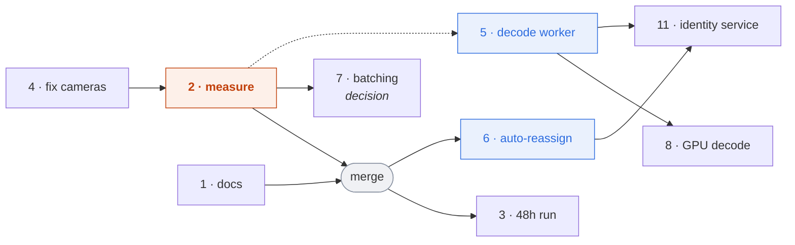

**The measurement is the hinge.** It is cheap, it is already built, and it changes what
several of the others are worth. Everything downstream of it is a real project — we would
rather start those knowing than assuming.

---

*Person-tracking service · branch  `refactor/lso-67-camera-frame-store` · figures from the design
document and the live run of 3 September 2026.*
