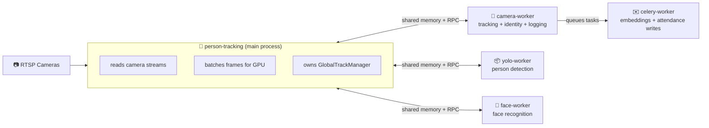
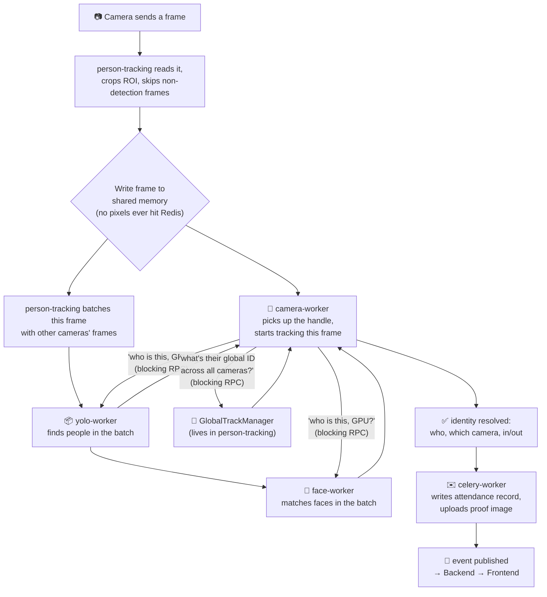

# Pipeline Overview — Plain-English Walkthrough

> Read this top to bottom once. It's written to be the single doc that gets you from "I don't
> know this codebase" to "I understand the shape of it" — everything else
> ([`CELERY_MIGRATION.md`](./CELERY_MIGRATION.md), [`SERVICE_ARCHITECTURE.md`](./SERVICE_ARCHITECTURE.md))
> is reference material to dip into afterward, once you know what you're looking for.

## 0. The one-sentence version

Before this PR: one Python process did everything — read cameras, ran the AI models, tracked
people, wrote to the database. After this PR: that got split into **5 separate processes**
because one process can't use more than one GPU worker efficiently, and the pieces now talk to
each other over shared memory (for big data, i.e. pixels) and small messages (for everything
else).

Everything complicated in this codebase is a consequence of that one split. Keep that in your
head and the rest stops feeling arbitrary.

---

## 1. Why split it up at all?

The old design had a problem: one process, reading N cameras, all fighting over one GPU. To keep
the GPU busy without loading N copies of the same model, they had ONE shared "GPU worker" that
all camera threads submitted frames to.

That's fine until you want to scale past what one process/one GPU can do, or until you want to
update the YOLO model without restarting the camera-reading code, or until one slow model call
starts blocking cameras that have nothing to do with it. So the GPU work got pulled out into its
own separate processes (Celery workers), each responsible for one job.

**The trade-off this creates:** things that used to be one function call inside one process are
now a message sent across a process boundary. That message-passing is where almost all the new
complexity in this PR lives.

---

## 2. The five processes

| Process | What it does | Does it hold AI models? |
|---|---|---|
| `person-tracking` | reads every camera's video stream; batches frames for GPU work; owns the one shared identity tracker (`GlobalTrackManager`) | no (models moved out) |
| `camera-worker` | per-frame tracking math, deciding "is this the same person as last frame," logging attendance | no |
| `yolo-worker` | runs the YOLO model: "where are the people in this image" | yes — YOLO only |
| `face-worker` | runs face detection + recognition: "whose face is this" | yes — face models only |
| `celery-worker` | the pre-existing worker (unchanged by this PR) — writes DB rows, uploads proof images | no |

**Rule of thumb:** only `person-tracking` ever talks to a camera. Everyone else only ever
receives frames that were handed to them — they never open an RTSP connection themselves.

---

## 3. One frame's journey, step by step

Walk it in words:

1. A camera hands `person-tracking` a raw frame.
2. `person-tracking` crops it to the region of interest and decides whether this frame is even
   worth running detection on (frame-skip — most frames are simply dropped here to save GPU
   time).
3. The surviving frame is written into shared memory (§4) — never sent as a Celery payload.
4. **The frame now splits into two independent paths** — this is the part people usually miss:
   - One copy's *handle* goes to `camera-worker`, which is going to do the tracking/identity
     work for this frame.
   - Separately, `person-tracking` also feeds this frame into its own internal batching queue,
     to be sent to `yolo-worker` (and `face-worker`) as part of a **cross-camera batch**, not
     tied to any one camera's request.
5. `camera-worker` needs the GPU results before it can finish, so it calls back into
   `person-tracking` and **blocks** waiting for an answer: "what did YOLO/face-worker see for my
   frame?"
6. It also blocks on a second question: "what's this person's identity across all cameras?" —
   answered by `GlobalTrackManager`, which still lives only in `person-tracking` (it wasn't
   moved, because its state doesn't split cleanly — see §6).
7. Once both answers are in, `camera-worker` knows who this is, logs the attendance event, and
   hands the DB write off to the (unchanged) `celery-worker`.

**The one sentence to remember:** `camera-worker` is the process doing the real "thinking" per
frame, but it owns none of the raw materials — it borrows pixels via shared memory and borrows
GPU answers and identity answers via blocking calls back to `person-tracking`.

---

## 4. Shared memory — the "whiteboard," in detail

### The problem

A video frame is heavy. Sending it through Redis (the way every other message in this system
travels) was measured at **~15.6ms per 720p frame** — slower than running the AI model on it.
Sending a tiny handle instead ("look at slot 5") costs **~0.3ms**.

So: think of it like a whiteboard in a hallway. Instead of photocopying a document and mailing
it to another office, you write it on the whiteboard and send a sticky note that just says
"board 5." Both offices can walk over and read the same whiteboard directly — nothing gets
copied through the mail system at all.

### The problem with that: the whiteboard gets erased

The producer (`person-tracking`) writes a new frame constantly — every detection cycle,
sometimes every ~30ms. By the time the sticky note ("board 5") reaches a worker and the worker
walks over to read it, the producer may have already erased board 5 and written something new
there. The worker would then read the *wrong* frame and have no way to know.

Four defenses exist specifically to close that gap. Each one exists because an earlier, simpler
version of this genuinely broke:

**Defense 1 — Use 8 boards in rotation, not 1.**
A single shared segment was tried first and measured live: it lost the race on *almost every
batch*. Its lifetime before being overwritten was ~20ms — shorter than a Celery round-trip. With
8 boards cycling in a ring, each frame survives 8 write-cycles instead of 1, comfortably longer
than the round-trip.

**Defense 2 — Stamp the frame's own number inside the memory block, not just on the sticky note.**
The note says "board 5, frame #100." The block *itself* also has "#100" written at the very top
of it. The reader checks: does the number written inside the block still say #100? If it now
says #108, the board was recycled — throw the read away. A bare size/existence check can't catch
this (a same-shape overwrite looks identical from the outside); only checking the number
actually written inside the block catches it.

**Defense 3 — Add a random ID per process, next to the frame number.**
Frame counters reset to 0 whenever a process restarts. If `person-tracking` crashes and comes
back, its very first frame after restart is numbered #1 again — the exact same number some
stale, disconnected worker might still be waiting on from *before* the crash. Without anything
else, that coincidence would let the worker accept old, frozen pixels as if they were fresh. The
random ID (regenerated at every process start) makes that collision essentially impossible —
even if the sequence number matches, the process ID won't.

**Defense 4 — Check the stamped number twice: before copying the pixels out, and again right
after.**
The producer can overwrite the block *while* a worker is mid-copy. That produces a torn frame —
half old pixels, half new — which would pass a single check done only before the copy started.
Checking again immediately after the copy finishes catches this: if the number changed
mid-copy, discard the result.

### Two more things worth knowing

- **Reads always return a copy, never a direct pointer.** The producer can be actively
  overwriting the block at any moment, so handing back a live reference into it would be unsafe.
- **When the same process is both the writer and a reader** (this genuinely happens — the RPC
  server that answers "what did YOLO see" runs *inside* `person-tracking`, the same process that
  owns the frame), there's a fast-path shortcut that skips Python's normal shared-memory
  bookkeeping. Skipping it isn't an optimization for its own sake — going through the normal
  path here actively corrupts that bookkeeping and can leak memory on a crash.

### The bug this was already caught preventing

One of the defenses (revalidating a cached mapping's *size*, not just its existence) has a
documented real incident behind it: face crops are variable-sized, and a worker's cached memory
mapping from an earlier, smaller batch would silently keep pointing at stale, too-small memory
once a bigger batch arrived — described in the code as *"the actual cause of every embed
silently returning blank results once any face-crop batch exceeded the first one this process
ever saw."* That's the shape of bug this whole file exists to prevent: not a crash, a **silent
wrong answer**.

---

## 5. Batching — where it happens and why it's inconsistent

### Where

YOLO batching happens in `person-tracking`, inside `GPUInferenceWorker._collect_batch` — **not**
inside `yolo-worker` itself. `yolo-worker` just runs the model over whatever batch it's handed;
the *decision* of what goes into that batch is made before it ever crosses into Celery.

### How it decides what goes in a batch

Each camera's frame lands in its own small queue. The collector loop does this, over and over:

1. Wait until **any single camera** has a frame ready.
2. The instant one is ready, immediately sweep every other camera's queue too, grabbing anything
   that happens to already be sitting there.
3. Whatever got grabbed in that one sweep — even if it's just that one camera — becomes the
   batch, sent immediately.

It never waits around hoping more cameras will show up. This is deliberate: waiting would add
latency to every frame, including ones that didn't need to wait.

### Why batches are often size 1, not "however many cameras exist"

Because of a deeper detail: each camera's request-and-wait cycle is **synchronous**. A camera
worker sends one frame, then blocks until it gets that frame's result back, before it's allowed
to send another. So at most, only cameras that happen to be "between send and receive" at that
exact instant can land in the same batch. If cameras drift out of sync with each other — one
camera's model call is slightly slower, one camera's video decode hiccups — they naturally stop
arriving at the same millisecond, and batches shrink toward 1.

### Why this matters (the real risk, not just "less efficient")

This creates a feedback loop that can get *worse* over time, not just stay mediocre:

1. Cameras start off roughly in sync → good batch sizes → fast round-trips.
2. Something perturbs one camera (a slow inference call, a network hiccup) → it falls out of
   sync with the others.
3. Once out of sync, its frames arrive at different moments than everyone else's → smaller
   batches for everyone.
4. Smaller batches mean **every** camera now pays full fixed overhead (task dispatch + shared
   memory + broker round-trip) per frame instead of sharing it — so round-trips get slower
   across the board.
5. Slower round-trips mean cameras stay out of sync. Nothing pulls them back into alignment.

So the system can settle into a stable *bad* state — many single-frame GPU calls instead of a
few batched ones — and there's no mechanism in the current code that self-corrects it. A common
fix elsewhere (not implemented here) is a small bounded wait — "collect for up to a few ms, or
until enough cameras are ready, whichever comes first" — which trades a little latency for much
more consistent, larger batches. Worth watching for if you see uneven GPU utilization in
production.

---

## 6. How processes "ask" each other things — three different mechanisms

This is the part that's easiest to get lost in, because there isn't just one way processes talk
to each other — there are three, chosen for different reasons.

| | Celery task (`.delay(...)`) | RPC over Unix socket | (for context) Redis pub/sub |
|---|---|---|---|
| Feels like | "queue this job, wait for the result" | a normal function call that happens to cross a process boundary | "shout into a channel, anyone listening might hear" |
| Used for | dispatching a **batch** of work to a worker pool (YOLO batch, ArcFace batch, DB writes) | one process asking another a **single, correlated question** and needing exactly that answer back | events with no reply expected (attendance recorded, embedding created) |
| Why used here | batching only pays off when a pool of workers processes a group of items together | building "send this, wait for exactly this reply" out of pub/sub means designing your own request-ID matching scheme — not worth it for something that fires every detection interval, per camera | this is what the rest of the system (Backend↔AI) already runs on, unrelated to this PR |

**Concretely, there are two separate RPC sockets, not one:**

- `gpu-rpc.sock` — `camera-worker` asks `person-tracking`'s `GlobalTrackManager`: "what's this
  person's ID across all cameras?"
- `gpu-worker-rpc.sock` — `camera-worker` asks `person-tracking`'s `GPUInferenceWorker`: "what
  did YOLO/face-worker find for my frame?"

They're kept separate because they talk to two genuinely different objects with different
method surfaces — not a stylistic choice, just no shared abstraction to unify them under.

**Why sockets instead of just also using Redis for these:** measured directly — a socket call
here round-trips in a fraction of a millisecond, negligible against the ~66ms-per-frame budget.
Rebuilding request/reply semantics on top of Redis pub/sub would have cost real design effort
(a correlation-ID scheme, timeout handling, matching stale replies) for something that's already
fast enough as a plain socket call. Not worth it.

**What happens when an RPC call fails or times out — by design, not as an afterthought:**
Every one of these calls degrades to an obviously-empty answer rather than pretending. A failed
identity lookup gets a locally-generated ID that's visibly different from a real one (negative
numbers vs. real IDs starting at 1000). A failed detection call returns "no detections this
frame," which the tracker already knows how to age gracefully. Nothing ever fabricates a
plausible-looking result — that's a deliberate rule, not a gap.

---

## 7. The one operational rule that isn't obvious from reading any single file

`camera-worker`, `yolo-worker`, and `face-worker` all run as **exactly one process each**
(`--pool=solo` in `compose.yml`). This looks like an arbitrary deployment default, but two
separate pieces of logic silently depend on it being true:

- The shared-memory code (§4) assumes one writer per camera. A second replica writing to the
  same camera's memory slot would corrupt reads for both.
- The RPC waiting logic in `person-tracking` assumes only **one** outstanding question per
  camera at a time. If two `camera-worker` replicas asked about the same camera simultaneously,
  each could consume the *other's* answer by mistake — and once that happens, the mismatch never
  self-corrects; it stays wrong indefinitely.

**If anyone ever proposes scaling these three services beyond one replica, both of the above
need to be redesigned first.** This isn't a "someone forgot to raise a config number" situation —
it's a load-bearing assumption baked into two different files.

---

## 8. What to actually go read next, in order

If you want to verify everything above against the real code rather than take this doc's word
for it:

1. [`src/workers/frame_store.py`](../src/workers/frame_store.py) — the shared-memory mechanism from §4. Its own comments explain every defense in more depth than this doc does.
2. [`src/pipeline/frame_pump.py`](../src/pipeline/frame_pump.py) vs. what it replaced — the smallest, clearest diff in the whole PR. Compare against `dev` to see exactly what moved out.
3. [`src/workers/camera_tasks.py`](../src/workers/camera_tasks.py) — where the tracking/identity logic landed after moving out of the old file.
4. [`src/pipeline/gpu_batch_dispatcher.py`](../src/pipeline/gpu_batch_dispatcher.py) — the batching logic from §5 (`_collect_batch`, `_yolo_loop`).
5. [`src/workers/global_track_rpc.py`](../src/workers/global_track_rpc.py) and [`src/workers/gpu_worker_rpc.py`](../src/workers/gpu_worker_rpc.py) — the two socket RPCs from §6.
6. [`compose.yml`](../compose.yml) — the `--pool=solo` services from §7, and the shared `/dev/shm` + RPC-socket volume wiring that makes all of the above physically possible.

For deeper detail on any of these (exact timeout values, the DLQ/serializer setup, the full RPC
method surface), see [`CELERY_MIGRATION.md`](./CELERY_MIGRATION.md) — it assumes you've already
read this page.
