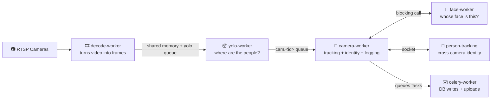
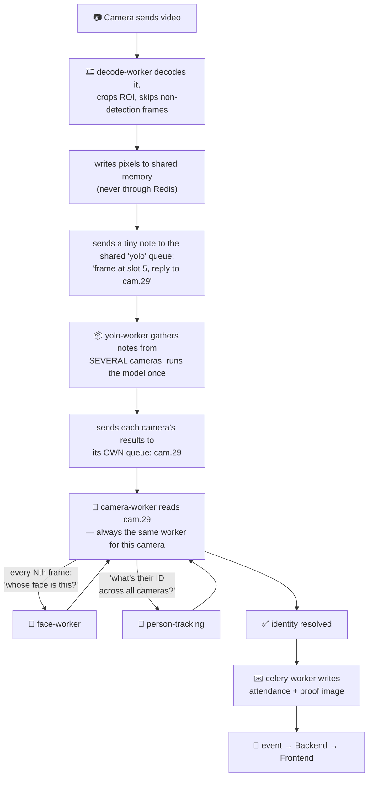

# Pipeline Overview — Plain-English Walkthrough

> Read this top to bottom once. It's written to be the single doc that gets you from "I don't
> know this codebase" to "I understand the shape of it" — everything else
> ([`CELERY_MIGRATION.md`](./CELERY_MIGRATION.md), [`SERVICE_ARCHITECTURE.md`](./SERVICE_ARCHITECTURE.md))
> is reference material to dip into afterward, once you know what you're looking for.
>
> For what's still outstanding, see [`FOLLOW_UPS.md`](./FOLLOW_UPS.md).

## 0. The one-sentence version

Originally one Python process did everything — read cameras, ran the AI models, tracked people,
wrote to the database. Now that's **six separate processes**, because one Python process can only
really use one CPU core at a time, and the pieces talk to each other over shared memory (for
pixels) and small queued messages (for everything else).

Everything complicated in this codebase is a consequence of that one split. Keep that in your
head and the rest stops feeling arbitrary.

---

## 1. Why split it up at all?

Two separate reasons, added at two different times.

**Reason one: the GPU work blocked everything else.** All camera threads shared one in-process
GPU batcher, so a slow model call stalled cameras that had nothing to do with it, and you
couldn't update the YOLO model without restarting the camera-reading code.

**Reason two: decoding starved the identity lookup.** Turning a camera's compressed video into
pictures costs roughly **one full CPU core per camera**, and it lived in the same process that
answered "is this the same person another camera saw?" That question is a *blocking call with a
timeout* — and it kept losing the CPU race. Every timeout meant the person got a temporary ID
instead of their real one, so **they were never recognised and no attendance row was written**.
A correctness bug, not a slowness bug.

**The trade-off both create:** things that used to be one function call inside one process are
now messages crossing a process boundary. That's where nearly all the complexity lives.

---

## 2. The six processes

| Process | What it does | Holds AI models? |
|---|---|---|
| `decode-worker` | opens each camera's RTSP stream, turns video into frames, hands them on | no |
| `yolo-worker` | runs YOLO: "where are the people in this image" | yes — YOLO only |
| `camera-worker` | per-frame tracking: "is this the same person as last frame", logging | no |
| `face-worker` | face detection + recognition: "whose face is this" | yes — face models only |
| `person-tracking` | the one shared identity register (`GlobalTrackManager`); calibration commands; metrics | no |
| `celery-worker` | pre-existing worker — writes DB rows, uploads proof images | no |

**Rule of thumb:** only `decode-worker` ever talks to a camera. Everyone else receives frames
that were handed to them; nobody else opens an RTSP connection.

---

## 3. One frame's journey, step by step

In words:

1. `decode-worker` turns the camera's video into a picture, crops it to the region of interest,
   and decides whether this frame is even worth detecting on (most are skipped, to save GPU).
2. The surviving frame's **pixels** go into shared memory; only a tiny **note** goes into the
   queue (§4).
3. That note goes to the **shared** `yolo` queue — shared on purpose, so YOLO can gather several
   cameras' frames and run the model once for all of them.
4. `yolo-worker` sends each frame's results onward to **that camera's own private queue**
   (`cam.29`), which exactly one `camera-worker` reads (§5).
5. `camera-worker` does the tracking. Every few frames it blocks on `face-worker` for
   recognition, and asks `person-tracking` for the person's cross-camera identity.
6. Once it knows who this is, it hands the DB write to the unchanged `celery-worker`.

**The sentence to remember:** `camera-worker` does the real per-frame thinking, but owns none of
the raw materials — it borrows pixels from shared memory and borrows answers from two other
processes.

---

## 4. Shared memory — the "whiteboard"

### The problem

A video frame is heavy. Sending one through Redis, using the same serializer this app actually
runs, was measured at **~175 ms per 720p frame** — far slower than running the AI model on it,
and slower even in the cheapest form Redis can manage (JPEG, ~19.8 ms). Sending it through shared
memory instead — writing it once, reading it once, the actual work either side does — costs
**~3.05 ms**. Measured head-to-head, same frames, same run:
[`benchmarks/transport/`](../benchmarks/transport/README.md).

So: like a whiteboard in a hallway. Rather than photocopying a document and mailing it, you write
it on the board and send a sticky note saying "board 5." Both offices read the same board;
nothing goes through the mail.

### The problem with that: the whiteboard gets erased

The producer keeps writing new frames. By the time the note reaches a worker and it walks over,
the producer may have erased board 5 and written something new. The worker would read the *wrong*
frame with no way to know.

Five defences exist. Each one is there because a simpler version genuinely broke:

**1 — Use 8 boards in rotation, not 1.** A single segment was tried and measured: it lost the
race on nearly every frame, surviving ~20 ms — shorter than a queue round-trip. Eight boards give
each frame eight write-cycles of life.

**2 — Stamp the frame's number inside the block, not just on the note.** The note says "board 5,
frame #100"; the block itself also says "#100" at the top. If the block now says #108, it was
recycled — discard. A size or existence check can't catch this; a same-shape overwrite looks
identical from outside.

**3 — Add a random per-process ID next to the number.** Frame counters reset to 0 when a process
restarts, so a restarted producer's first frame is #1 again — possibly the exact number a stale
worker is still waiting on. The random ID (new on every process start) makes that coincidence
essentially impossible.

**4 — Check the number twice: before copying the pixels out, and again right after.** The
producer can overwrite the block *mid-copy*, producing a torn frame — half old, half new — that
would pass a check done only beforehand.

**5 — Notice when the producer restarted, and re-attach.** Readers cache their mapping of each
block. If the producer restarts, it destroys its blocks and makes new ones under the same names,
and the cached mapping quietly points at dead memory. Because the new block is the same *size*,
nothing looked wrong — so the reader served stale memory **forever** and every read failed.
Observed live once `decode-worker` could restart on its own: essentially zero frames processed
until the reader was manually restarted. A mismatched process-ID now drops the cached mapping and
re-attaches once.

### Two more things worth knowing

- **Reads always return a copy, never a pointer.** The producer may be overwriting the block at
  any moment.
- **When the same process is both writer and reader**, there's a fast-path that skips Python's
  normal shared-memory bookkeeping — not a micro-optimisation; going through the normal path
  there corrupts that bookkeeping and can leak memory on a crash.

### Three separate boards, not one

| Board | Written by | Read by | Holds |
|---|---|---|---|
| `camframe_<id>` | `decode-worker` | `yolo-worker`, `camera-worker` | cropped, frame-skipped detection frames |
| `camraw_<id>` | `decode-worker` | `person-tracking` | full uncropped frames, every ~2s, for calibration |
| `camroi_<id>` | `camera-worker` | `face-worker` | person crops for face recognition |

---

## 5. Why each camera gets its own queue

`yolo-worker` takes frames from a **shared** queue; `camera-worker` reads a **private** queue per
camera. That asymmetry is the single most important design rule here:

> **Stateless work can spread anywhere. Stateful work has to stay put.**

"Where are the people in this picture?" needs nothing but the picture — any worker can answer, so
frames from different cameras can be gathered and batched freely.

"Is this the same person as last frame?" is impossible without last frame's conclusion, which
lives in one worker's memory. Send frame 100 to a different worker than frame 99 and it sees a
stranger — it starts a new track for someone already being tracked.

That isn't hypothetical: an earlier attempt used one shared queue for tracking too, and the count
of tracked people climbed **33 → 45 and never settled**. The system believed there were more
people in the building than there were.

---

## 6. How processes ask each other things

| | Celery queue | RPC over Unix socket | Redis (leases, health) |
|---|---|---|---|
| Feels like | "queue this job" | a function call crossing a process boundary | a shared noticeboard |
| Used for | passing frames along the pipeline | the one question that must be answered *now* | who owns which camera; stream health |
| Why | work can be batched and spread across workers | blocking question, and an uncorrelated reply could hand one person's identity to another person's track | small facts several processes need to agree on |

**There is exactly one RPC socket** (`gpu-rpc.sock`): `camera-worker` asking `person-tracking`
"what's this person's ID across all cameras?" An earlier second socket, for GPU inference, is
gone — batching moved into `yolo-worker` itself, so nothing needs to broker it.

Measured: that socket call round-trips in p50 **0.16 ms** against a ~66 ms per-frame budget.

**When any of these fail, they degrade to an obviously-empty answer rather than pretending.** A
failed identity lookup returns a local negative ID, visibly different from a real one (real IDs
start at 1000). A failed detection returns "nothing this frame," which the tracker already ages
gracefully. Nothing ever fabricates a plausible-looking result — a deliberate rule, not a gap.

---

## 7. Who decodes which camera

`decode-worker` replicas are **identical and interchangeable**. There's no list anywhere saying
which worker handles which camera. Instead each worker *claims* cameras up to its configured
capacity, by taking a short-lived lease in Redis and renewing it every couple of seconds.

- A new camera in the database gets picked up automatically, no config change.
- A crashed worker's leases simply expire; another worker with spare room claims those cameras.
- Adding capacity means running another replica — no camera lists to edit.

**Why this is safe here but deliberately *not* done for tracking:** decoding has no memory. Moving
a camera between decode workers costs a few dropped frames and nothing else. Moving it between
tracking workers splits one person into two identities (§5). Same reason, opposite conclusion.

Two things it deliberately does *not* do: it won't rebalance cameras off a worker that's already
healthy (a rolling restart does that), and it won't start new workers by itself — exceeding total
capacity logs a loud warning naming the unclaimed cameras instead.

---

## 8. Operational rules that aren't obvious from any single file

- **`camera-worker` must stay one process per queue.** Each camera's tracker state lives in the
  worker's memory (§5). Never let the same `cam.<id>` appear in two workers' queue lists — moving
  a camera means restarting both the losing and the gaining worker.
- **`yolo-worker` needs `--prefetch-multiplier=32`.** Its batching library only acknowledges a
  request after a flush, so it can never hold more unacknowledged requests than the prefetch
  count. At the default of 1, **every batch is size 1** and batching silently does nothing. This
  was shipped wrong once; the symptom was `avg_batch=0.00` and a 33,000-message backlog.
- **`decode-worker` replicas need none of this care** — see §7.

---

## 9. On batch sizes, if you go looking at the numbers

Batch size is an *output*, not a setting. It's governed by how fast frames arrive versus how fast
the GPU finishes: only frames that show up while the model is busy can join the next batch. More
cameras naturally produce bigger batches; a faster GPU produces smaller ones.

So a small batch number is not automatically a problem. The question that matters is whether
frames are being **dropped** — if the queue is empty, the GPU has headroom, and nothing is
expiring, then small batches just mean the GPU is comfortably keeping up.

Three things have actually caused bad batching here, all now fixed, and all worth recognising:

1. **Prefetch capped at 1** — batches structurally could not exceed one frame.
2. **Decode starved of CPU** — frames arrived too slowly to ever bunch up.
3. **Duplicate frames** — the producer re-sent frames it had already sent (~51% of them),
   inflating the apparent rate while wasting GPU on redundant work.

---

## 10. What to go read next, in order

1. [`src/workers/frame_store.py`](../src/workers/frame_store.py) — the shared-memory mechanism from §4. Its comments explain each defence in more depth than this doc.
2. [`src/pipeline/frame_pump.py`](../src/pipeline/frame_pump.py) — the producer: read, crop, skip, write, enqueue. Small and clear.
3. [`src/decode_main.py`](../src/decode_main.py) and [`src/pipeline/camera_lease.py`](../src/pipeline/camera_lease.py) — the decode daemon and the lease scheme from §7.
4. [`src/workers/yolo_tasks.py`](../src/workers/yolo_tasks.py) — batching (§9) and the deadline checks.
5. [`src/workers/camera_tasks.py`](../src/workers/camera_tasks.py) — the tracking/identity logic.
6. [`src/workers/global_track_rpc.py`](../src/workers/global_track_rpc.py) — the one socket RPC from §6.
7. [`compose.yml`](../compose.yml) — the service definitions, pools, and the shared `/dev/shm` and socket volumes that make all of the above physically possible.

For exact timeouts, the DLQ/serializer setup, and the full RPC method surface, see
[`CELERY_MIGRATION.md`](./CELERY_MIGRATION.md) — it assumes you've read this page.
