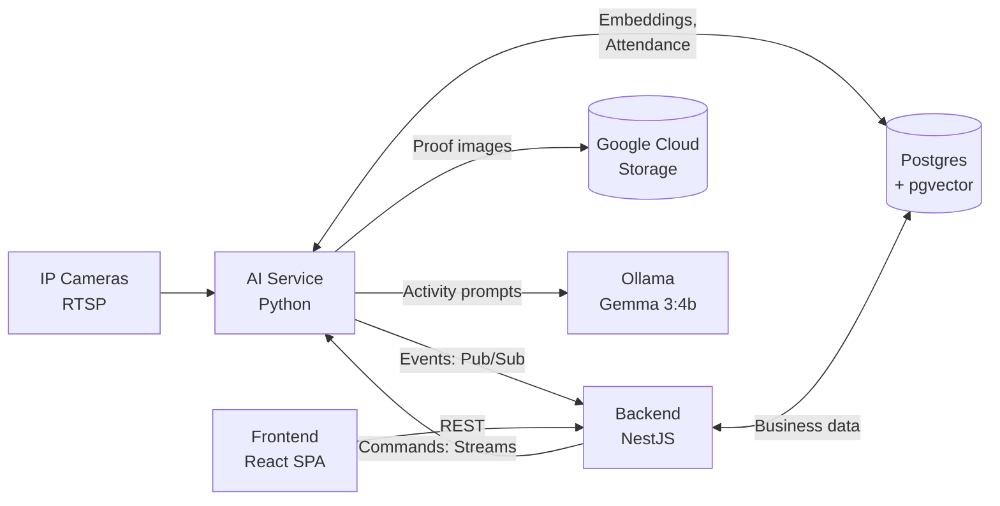
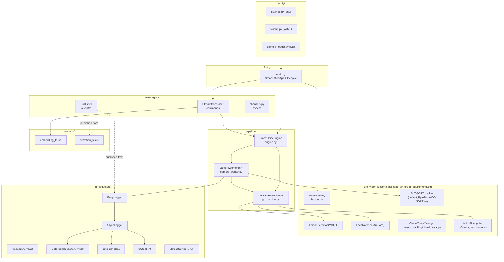
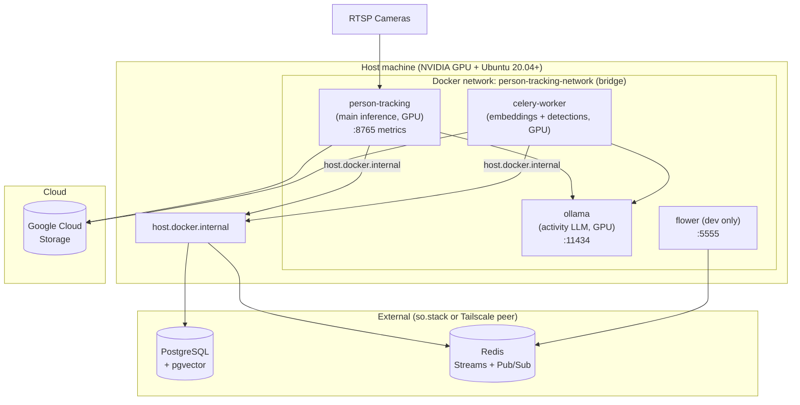
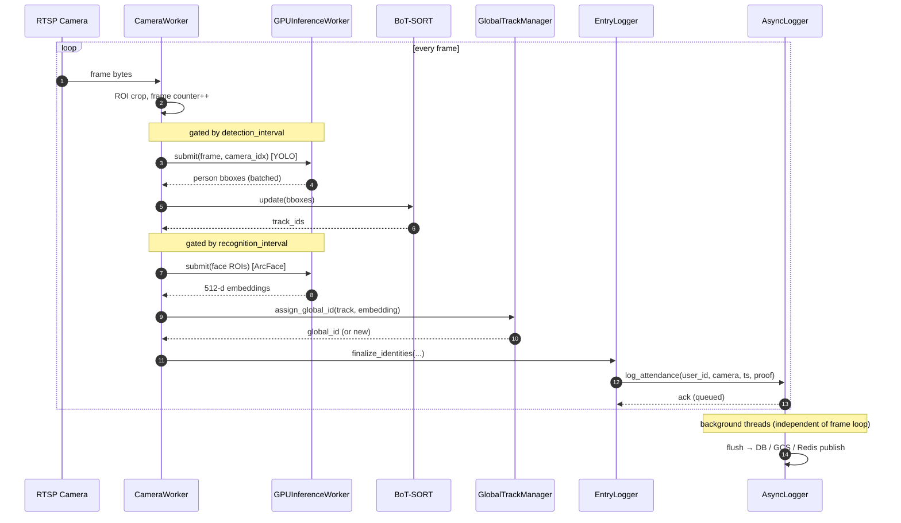
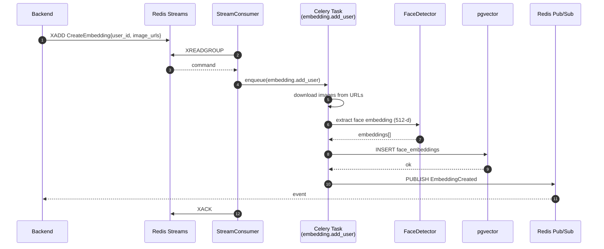
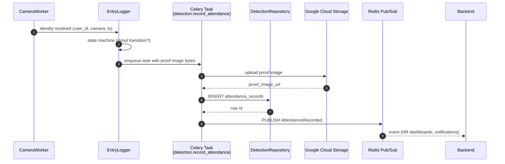
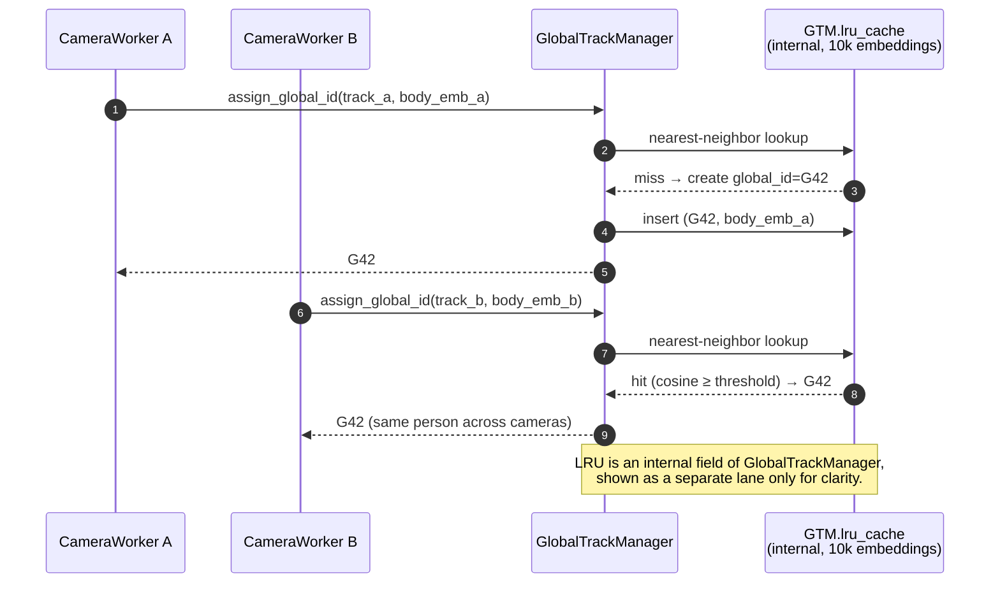
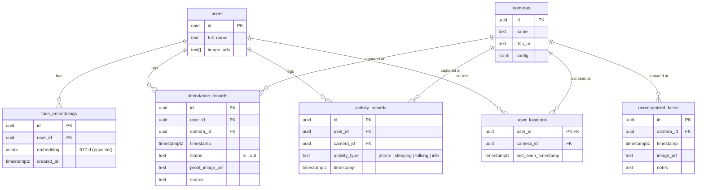
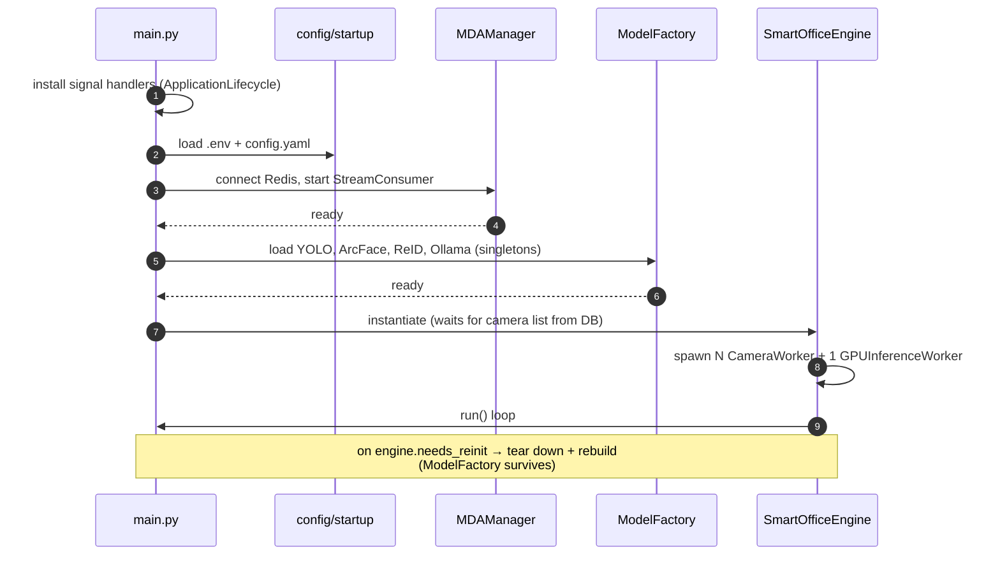

# Smart Office — AI Service: Service Architecture

> Internal architecture of `so.model-face-recognition` for new engineers joining the project.
> For the cross-repo (Backend / Frontend / AI) view, see [`ARCHITECTURE.md`](./ARCHITECTURE.md).
> For what each model takes in and returns, see [`MODELS.md`](./MODELS.md).

## Table of Contents

1. [Context & Scope](#1-context--scope)
2. [Component Architecture](#2-component-architecture)
3. [Deployment & Infrastructure](#3-deployment--infrastructure)
4. [Data Flow & Sequence Diagrams](#4-data-flow--sequence-diagrams)
5. [Data Model & Schemas](#5-data-model--schemas)
6. [Configuration & Bootstrap](#6-configuration--bootstrap)
7. [External Dependencies](#7-external-dependencies)
8. [Glossary](#8-glossary)

---

## 1. Context & Scope

The AI Service is a Python real-time inference system that:

- Pulls RTSP frames from N cameras
- Detects persons (YOLO), tracks them (BoT-SORT, with ByteTrack/OC-SORT as alternates), recognizes faces (InsightFace ArcFace)
- Re-identifies persons across cameras using body embeddings (OSNet ReID)
- Optionally classifies activities via a local Ollama LLM (Gemma 3:4b)
- Persists embeddings/attendance/activity rows to PostgreSQL + pgvector
- Exchanges commands & events with the Backend via Redis (Streams + Pub/Sub)
- Uploads proof images to Google Cloud Storage

It is **multi-tenant by schema** (`{client_slug}_ai`) and is currently deployed on a single GPU host per tenant; multi-host fan-out is possible by partitioning cameras across hosts (see §3.5).

### System context (zoomed out)

---

## 2. Component Architecture

### 2.1 Module map (`src/`)

### 2.2 Layer responsibilities

| Layer | Path | Responsibility | Key classes |
|---|---|---|---|
| **Entry** | `src/main.py` | Lifecycle, signal handling, wiring | `SmartOfficeApp`, `ApplicationLifecycle` |
| **Pipeline** | `src/pipeline/` | Real-time per-camera processing, GPU batching | `SmartOfficeEngine`, `CameraWorker`, `GPUInferenceWorker` |
| **Models** | [lum-model-vision](https://github.com/lumiohub-ai/lum-model-vision) | ML models & tracking logic, as its own package (`lum_vision`), pinned in `requirements.txt`. No DB, queue or cloud-storage dependency. See [`MODELS.md`](./MODELS.md) for input/output of each. | `ModelFactory`, `PersonDetector`, `FaceMatcher`, `PersonTracker` (BoT-SORT), `GlobalTrackManager`, `ActionRecognizer` |
| **Domain** | `src/domain/` | Camera calibration (DB-backed, so app-specific) | `CameraCalibrator`, `HomographyRegistry` |
| **Messaging** | `src/messaging/` | Redis Streams (commands) & Pub/Sub (events) | `StreamConsumer`, `Publisher`, channel/event types |
| **Workers** | `src/workers/` | Async Celery tasks (embeddings, detections) | `embedding_tasks`, `detection_tasks` |
| **Infrastructure** | `src/infrastructure/` | DB, vector store, GCS, logging, metrics | `Repository`, `DetectionRepository`, `pgvector`, `GcsClient`, `EntryLogger`, `AsyncLogger`, `MetricsServer` |
| **Config** | `src/config/` | Env/YAML/DB-driven configuration | `settings`, `startup`, `camera_loader` |

### 2.3 Key design patterns

- **Shared-GPU fan-in.** Each camera runs its own thread (`CameraWorker`) but submits inference requests to a **single** `GPUInferenceWorker`, which **batches** YOLO and ArcFace calls across cameras. This keeps GPU utilization high without N model copies.
- **Lazy model loading.** `ModelFactory` is a singleton: models load once and survive engine re-inits (e.g. when cameras are added/removed at runtime).
- **Read/Write repository split.** `Repository` reads Backend-owned tables (users, cameras); `DetectionRepository` writes AI-owned tables (attendance, activity, etc.). Prevents accidental writes to Backend's source-of-truth data.
- **Async-write offload.** The hot frame-processing path returns immediately; `AsyncLogger` flushes DB / GCS / Redis writes on dedicated background threads.
- **Message-Driven Architecture (MDA).** Backend → AI uses **Redis Streams** (durable, ack'd). AI → Backend uses **Redis Pub/Sub** (ephemeral, fire-and-forget for events).

---

## 3. Deployment & Infrastructure

### 3.1 Container topology

### 3.2 Services (`compose.yml`)

| Service | Image | GPU | Restart | Notes |
|---|---|---|---|---|
| `ollama` | `ollama/ollama:0.18.3` | yes | `unless-stopped` | Pulls `gemma3:4b` on start; healthcheck via `ollama list` |
| `person-tracking` | `humblebeeai/person-tracking-lumiohub:${SO_IMAGE_TAG}` | yes | `unless-stopped` | Main loop; depends on `ollama` healthy |
| `celery-worker` | same image | yes | `unless-stopped` | `-Q embeddings,detections`; depends on `person-tracking` |
| `flower` (dev override) | `humblebeeai/celery-flower-lumiohub` | no | — | Celery dashboard on `:5555` (host network) |

**Resource reservations:** each Python service reserves 1 NVIDIA GPU, 2 CPU, 2 GB RAM (limits 4 / 4 / 8 GB).

### 3.3 Networking & external services

- **Internal:** all services share `person-tracking-network` and address each other by service name (e.g. `ollama:11434`).
- **External Postgres / Redis** live in a sibling stack (`so.stack`) and are reached via:
  - `host.docker.internal` if same machine (mapped via `extra_hosts: host-gateway`)
  - Tailscale IP (e.g. `100.x.x.x`) if remote
- **Outbound:** Google Cloud Storage over the public internet, authenticated via the service-account JSON mounted at `/app/credentials/`.

### 3.4 Persistent volumes

| Path on host | Mount | Purpose |
|---|---|---|
| `./volumes/storage/person-tracking` | `/app/volumes/storage/person-tracking` | Local frame/proof scratch |
| `./volumes/models/insightface` | `/root/.insightface` | Cached face models |
| `./volumes/models/huggingface` | `/root/.cache/huggingface` | Cached HF/Ollama assets |
| `./volumes/models/weights` | `/app/volumes/models/weights` | YOLO / ReID checkpoints |
| `./credentials` | `/app/credentials` | GCS service account |
| `ollama-data` (named) | `/root/.ollama` | Ollama model store |

### 3.5 Scaling notes

- Horizontally scale **Celery workers** by raising `replicas` of `celery-worker` per queue.
- The inference container is **not** horizontally scalable as-is — there is a single shared `GPUInferenceWorker` per process. To scale beyond one host, partition cameras across multiple hosts (one process per GPU).

---

## 4. Data Flow & Sequence Diagrams

### 4.1 Per-frame inference loop (hot path)

### 4.2 Embedding creation (Backend → AI)

### 4.3 Attendance recording (AI → Backend)

### 4.4 Cross-camera global ID (ReID)

---

## 5. Data Model & Schemas

### 5.1 Multi-tenancy

Each tenant gets its own Postgres schema named `{SO_CLIENT_SLUG}_ai`. The AI service connects with `search_path={client_slug}_ai,public`. Backend owns tables in a separate schema; the AI service reads users/cameras from there but only writes into its own schema.

### 5.2 Tables (per tenant)

> `users` and `cameras` are owned by Backend. The AI service treats them as read-only.

### 5.3 Vector search

- Embeddings: **512-d ArcFace vectors** stored in pgvector.
- Lookup: cosine similarity (`<=>` operator) with `match_threshold` from `config.yaml` (default 0.3).
- Index: HNSW or IVFFlat — see the migration that creates `face_embeddings` for the exact choice.

### 5.4 Redis MDA contracts

#### Commands — Streams (Backend → AI, durable, consumer-group ack)

> Payloads below are illustrative — see `src/messaging/channels.py` for the wire-accurate schema.

| Command | Payload |
|---|---|
| `CreateEmbedding` | `{user_id, image_urls[]}` |
| `UpdateEmbedding` | `{user_id, image_urls[]}` |
| `DeleteEmbedding` | `{user_id}` |
| `ConfigureCamera` | `{camera_id, config}` |
| `StartCamera` / `StopCamera` | `{camera_id}` |
| `CaptureFrame` | `{camera_id}` |
| `CalibrateCamera` / `TestCalibration` | `{camera_id, params}` |
| `ComputeHomography` | `{camera_id, src_pts[][], dst_pts[][]}` |

#### Events — Pub/Sub (AI → Backend, ephemeral)

> Payloads below are illustrative — see `src/messaging/channels.py` for the wire-accurate schema.

| Event | Payload |
|---|---|
| `AttendanceRecorded` | `{user_id, camera_id, status, ts, proof_url}` |
| `UnrecognizedFaceSaved` | `{camera_id, ts, image_url}` |
| `ActivityDetected` | `{user_id, camera_id, activity_type, ts}` |
| `UserLocationUpdated` (entry/exit) | `{user_id, user_name, camera_id, camera_name, status, updated_at}` |
| `UserLocationUpdated` (position) | `{camera_id, map_id, track_id, user_id, user_name, position: {x, y}}` — high-rate (~5Hz/track) floor-plan position; consumers distinguish from the entry/exit variant by presence of `position` |
| `EmbeddingCreated` / `EmbeddingFailed` | `{user_id, error?}` |
| `FrameCaptured` / `CalibrationComplete` | `{camera_id, image_url|params}` |
| `HomographyCalibrated` | `{camera_id, src_pts: "JSON", dst_pts: "JSON", homography_matrix: "JSON", calibration_error: "JSON"}` — the four complex fields are JSON-encoded strings (backend does `JSON.parse(event.<field>)`); `calibration_error` decodes to `{per_point: [...], mean: float}` |
| `HomographyFailed` | `{camera_id, error}` |
| `SystemMetrics` / `SystemAlert` | `{metric, value}` |

#### Homography cache (Phase 2)

For the real-time position stream, AI keeps a lazy in-memory cache keyed by `(client_slug, camera_id) → (3x3 matrix, map_id)`. On a cache miss it queries `"org_<slug>".camera_map_positions` over the shared Postgres connection (no new env vars; uses the same `SO_POSTGRES_*` as the rest of the service). The cache is invalidated by a small background subscriber on `events:calibration` whenever a `HomographyCalibrated` event arrives — DB is the single source of truth, so the next emit re-queries.

#### Internal channels

- `internal:embedding:reload` — triggers in-process embedding cache refresh
- `internal:status:reload` — triggers camera-config refresh

### 5.5 Celery queues

| Queue | DLQ | Tasks |
|---|---|---|
| `embeddings` | `dlq.embeddings` | `embedding.add_user`, `embedding.update_user`, `embedding.delete_user` |
| `detections` | `dlq.detections` | `detection.record_attendance`, `detection.save_unrecognized`, `detection.record_activity`, `detection.update_user_location` |

Hard timeout 600 s, soft 540 s.

---

## 6. Configuration & Bootstrap

### 6.1 Configuration sources (precedence: top wins)

1. **DB-driven camera config** — fetched from Postgres at startup and on `ConfigureCamera`.
2. **`configs/config.yaml`** — pipeline tuning (intervals, thresholds, feature flags).
3. **Environment** — `.env` / process env (see `src/config/settings.py`).

#### Notable YAML knobs

| Key | Default | Effect |
|---|---|---|
| `match_threshold` | 0.3 | Cosine distance for face match |
| `person_detection_threshold` | 0.45 | YOLO confidence floor |
| `pipeline.detection_interval` | 2 | Run YOLO every N frames |
| `pipeline.recognition_interval` | 3 | Run ArcFace every N detections |
| `enable_global_tracking` | true | Cross-camera ReID toggle |
| `action_recognition.enabled` | varies | Enable Ollama activity classifier |

#### Required environment

`SO_CLIENT_SLUG`, `SO_POSTGRES_*`, `SO_REDIS_*`, `SO_CELERY_BROKER_URL`, `SO_CELERY_RESULT_BACKEND`, `SO_GCS_*`, `SO_OLLAMA_API_URL`, `SO_OLLAMA_MODEL`.

### 6.2 Startup sequence

---

## 7. External Dependencies

| Dependency | Version / Model | Used for |
|---|---|---|
| **PostgreSQL** | 15+ with `pgvector` | Embeddings, attendance, activity |
| **Redis** | 7.x | Streams (commands), Pub/Sub (events), Celery broker/backend |
| **Celery** | 5.x | Async tasks |
| **Google Cloud Storage** | — | Proof images, unrecognized face crops |
| **Ollama** | `gemma3:4b` | Activity classification |
| **InsightFace** | `buffalo_l` (RetinaFace + ArcFace) | Face detection & 512-d embeddings |
| **Ultralytics YOLO** | `yolo26` / `yolov8` | Person detection |
| **BoT-SORT** (via `boxmot`) | default | Per-camera tracking; ByteTrack & OC-SORT selectable via `tracker_type` |
| **OSNet** | `x0_25` | Body ReID for cross-camera matching |
| **OpenCV** | `opencv-python-headless` | RTSP, image ops |
| **Prometheus client** | — | `/metrics` on port 8765 |

---

## 8. Glossary

- **MDA** — Message-Driven Architecture: commands via Redis Streams, events via Pub/Sub.
- **Embedding** — 512-d ArcFace vector representing a face; stored in pgvector for similarity search.
- **Global ID** — Cross-camera person identity assigned by `GlobalTrackManager` from body ReID embeddings.
- **Tenant** — Isolated organization, addressed by `SO_CLIENT_SLUG`; each has its own Postgres schema `{slug}_ai`.
- **Hot path** — The synchronous per-frame loop that must stay under the camera frame budget; heavy I/O is offloaded to `AsyncLogger` / Celery.
- **Engine reinit** — When the camera set changes, the `SmartOfficeEngine` is torn down and rebuilt; `ModelFactory` survives so GPU models are not reloaded.
